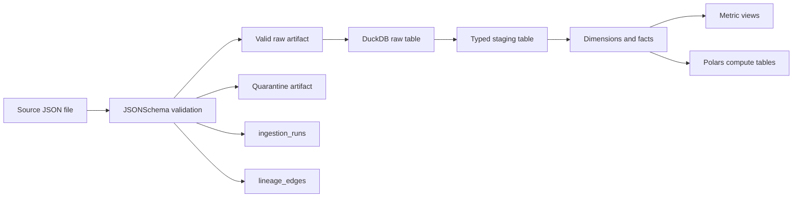
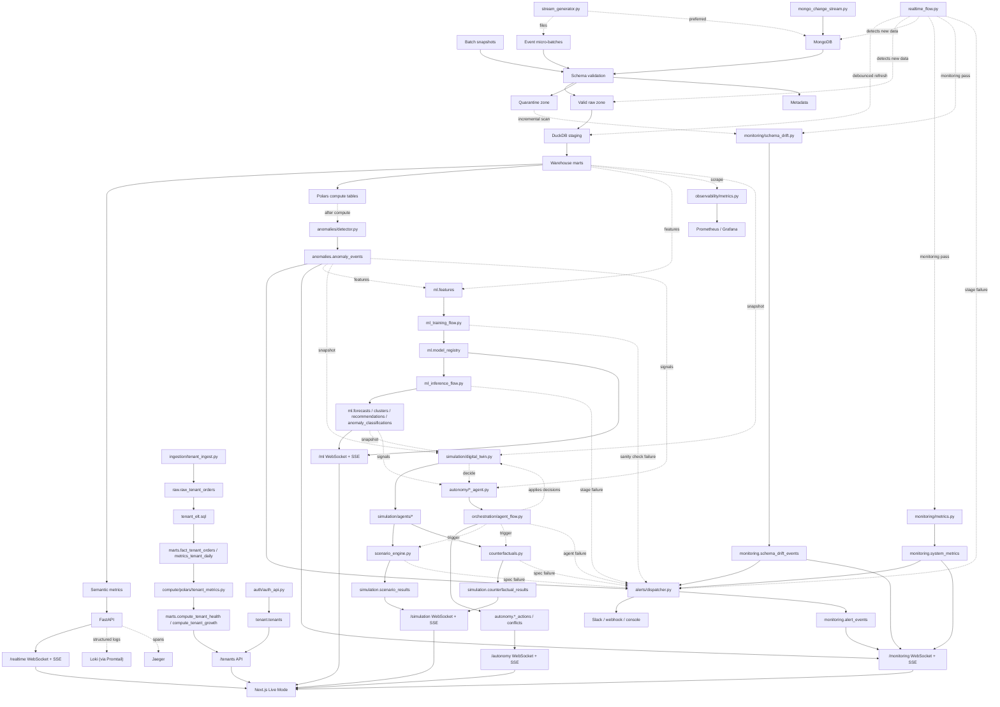

# Retail Marketplace Analytics Platform (RMAP) — Master Technical Guide

*Generated August 27, 2026 — compiled from this repository's README, governance/lineage documentation, and architecture diagrams into a single reference document.*

**Source code:** [github.com/troyclarke69/mini-faire](https://github.com/troyclarke69/mini-faire)

> **A note on naming.** This platform is branded **RMAP** (Retail Marketplace Analytics Platform) in its user interface and in this guide. The underlying repository, its Python package, and several internal infrastructure identifiers (the DuckDB warehouse file, Docker/Fly.io resource names, local file paths) retain their original project name, `mini-faire` — the name the codebase, its commit history, and the GitHub repository above were built under. Wherever this guide or the running application shows a `mini-faire`/`mini_faire` identifier (a file path, a database filename, a Fly.io app name), that is the same project as RMAP, not a different one.

RMAP is a compact retail marketplace analytics platform demo. It shows the major pieces of a staff-level data platform without requiring cloud infrastructure: JSON contracts, batch and event ingestion, validation with quarantine, metadata capture, DuckDB warehouse modeling, Polars compute, semantic metrics, and a small API.

---

## Table of Contents

1. [Overview & Quick Start](#part-1-overview--quick-start)
2. [Platform Capabilities, Phase by Phase](#part-2-platform-capabilities-phase-by-phase)
3. [API Reference](#part-3-api-reference)
4. [System Architecture & Operations](#part-4-system-architecture--operations)
5. [Data Governance & Lineage](#part-5-data-governance--lineage)
6. [Architecture Diagrams (Supplementary)](#part-6-architecture-diagrams-supplementary)
7. [Appendix A: Source Code](#appendix-a-source-code)
8. [Appendix B: Deployment](#appendix-b-deployment)

---

## Part 1: Overview & Quick Start

RMAP's baseline pipeline (batch + event ingestion, validation with quarantine, metadata capture, DuckDB warehouse modeling, Polars compute, and semantic metrics) is what the Quick Start below brings up with a single command. Everything described in Part 2 (Phases 4-9) layers on top of this same pipeline — nothing in a later phase replaces or forks it.

### Quick Start

```powershell
py -3.12 -m venv .venv
.\.venv\Scripts\python.exe -m pip install -e ".[dev]"
.\.venv\Scripts\python.exe scripts\run_demo.py

* Should see something like (exact counts depend on how many sample files exist under data/batch and data/events):
Batch ingestion runs: 15
Event ingestion runs: 105
DuckDB warehouse: C:\Projects\mini-faire\data\warehouse\mini_faire.duckdb
```

Python 3.10-3.12 is recommended on Windows. Python 3.13 can install a DuckDB package with a mismatched compiled extension, which appears as `ModuleNotFoundError: No module named '_duckdb'`.

The demo creates `data/warehouse/mini_faire.duckdb`, writes validated raw records under `data/raw/`, loads staging tables, builds dimensions/facts, and refreshes metric views.

Sample data spans four days (2026-08-15 through 2026-08-18) of retailers, products, orders, and the full event chain (`order_created`, `order_paid`, `orders_shipped`, `inventory_updated`, `price_changed`), including deliberately invalid records so quarantine has something to show. Multi-day charts on the dashboard (GMV trend) and the ingestion/lineage/quarantine pages read directly off this data - no separate flag needed.

#### Generating more data

Two additional upstream sources can feed the same pipeline:

```powershell
# Deterministic synthetic marketplace data (retailers, products, orders,
# the full event chain, price changes, inventory volatility, seasonality,
# and a configurable rate of deliberately-invalid records) - config in
# config/synthetic.yaml.
.\.venv\Scripts\python.exe -m orchestration.synthetic_flow

# Pull new/changed documents from the MongoDB `rmap` database - config in
# config/mongo.yaml. Requires the optional `mongo` extra and a
# MONGO_PASSWORD environment variable (never stored in the repo):
.\.venv\Scripts\python.exe -m pip install -e ".[mongo]"
$env:MONGO_PASSWORD = "your-atlas-password"
.\.venv\Scripts\python.exe -m orchestration.mongo_flow

# Optional: watch MongoDB change streams and ingest inserts/updates in
# near-real-time instead of polling.
.\.venv\Scripts\python.exe -m ingestion.mongo_ingest_change_stream

# Optional: write synthetic data straight into MongoDB instead of local
# files, so mongo_flow / the change-stream watcher pick it up like any
# other upstream document.
.\.venv\Scripts\python.exe -m synthetic.write_mongo
```

Both flows write through the exact same validate -> quarantine -> metadata -> lineage -> ELT -> compute pipeline as `scripts/run_demo.py`, so their output shows up in the same warehouse, API, and frontend.


---

## Part 2: Platform Capabilities, Phase by Phase

Each subsection below corresponds to one build phase of the platform, in the order it was built. Every phase is additive: running with zero configuration (the Quick Start above) still works exactly as it did after Phase 1, and everything below is optional depth on top of it.

#### Real-time streaming (Phase 4)

Three long-lived services extend the same pipeline into near-real time. Each is a separate process - run whichever combination you want alongside the API and frontend:

```powershell
# Streams order/inventory/price events at a configurable pace (config/synthetic.yaml's
# streaming: block). Prefers writing straight into MongoDB; falls back to local files
# under data/events/ if MONGO_PASSWORD isn't set or pymongo isn't installed.
.\.venv\Scripts\python.exe synthetic\stream_generator.py
.\.venv\Scripts\python.exe synthetic\stream_generator.py --duration-seconds 120   # bounded demo run
.\.venv\Scripts\python.exe synthetic\stream_generator.py --sink files             # force local files

# Watches MongoDB change streams (config/mongo.yaml's change_streams: block) with
# resume-token persistence and backoff/retry, ingesting inserts/updates/replaces as
# they happen and recording deletes for audit. Requires the `mongo` extra and
# MONGO_PASSWORD, same as mongo_flow above.
.\.venv\Scripts\python.exe -m ingestion.mongo_change_stream

# Detects new source files and (if configured) new MongoDB change-stream events, then
# refreshes staging/marts/compute on a debounced cadence instead of on every single
# event - runs continuously until interrupted.
.\.venv\Scripts\python.exe -m orchestration.realtime_flow
```

Each service writes a small heartbeat file under `data/state/` so `GET /realtime/health` can report whether it's actually running (see Endpoints below) - useful since they're independent processes with no shared in-memory state.

##### Running these together safely

You do not have to run all three at once - Live Mode in the browser works with any subset running, including none (it just won't have much new to show). But if you do run more than one at a time, keep two things in mind:

**`realtime_flow.py` already watches MongoDB itself.** Internally it opens its own `ChangeStreamWatcher` (the same class `mongo_change_stream.py` uses) unless you pass `--no-mongo`. So running standalone `mongo_change_stream.py` *and* `realtime_flow.py` together means two independent watchers doing the same work - redundant, not wrong, but usually unnecessary. Pick one:
- Recommended: just run `realtime_flow.py` (it watches Mongo *and* detects new files *and* rebuilds the warehouse) alongside `stream_generator.py`.
- Or: run `mongo_change_stream.py` standalone and start `realtime_flow.py` with `--no-mongo` so it only handles file detection + rebuilds.

**Every write to `mini_faire.duckdb` briefly locks the file.** DuckDB allows one writer at a time; a second process trying to open a write connection while another holds it waits (all writers in this codebase retry with backoff for this - see `ingestion/duckdb_utils.py`) rather than crashing, but it's still cleaner to avoid the contention. By default, `stream_generator.py` writes to DuckDB itself after every event (so its counts show up immediately even with nothing else running). When you're also running `realtime_flow.py`, add `--no-local-ingest` so `stream_generator.py` only writes event files/Mongo documents and lets `realtime_flow.py` - which is already polling for exactly this - do the DuckDB write on its debounced cadence instead:

```powershell
.\.venv\Scripts\python.exe synthetic\stream_generator.py --no-local-ingest
.\.venv\Scripts\python.exe -m orchestration.realtime_flow
```

That combination keeps `realtime_flow.py` as the sole writer, which is the safest way to run streaming + orchestration side by side.

#### Monitoring, anomalies, and alerts (Phase 5)

No separate process to run - the monitoring layer rides along inside `realtime_flow.py`. After every successful ingest -> ELT/warehouse rebuild -> Polars compute cycle, it also runs a monitoring pass: system metrics (ingestion/ELT/compute/streaming reliability), an incremental schema-drift scan of the quarantine zone, and statistical anomaly detection (rolling mean+std, EWMA, percentile thresholds, z-scores - no ML yet, that's a later phase) across GMV, order velocity, inventory, pricing, event lag, retailer health, ingestion volume, and quarantine rate. Each stage is isolated the same way ingestion/ELT/compute already are: a monitoring failure is logged and skipped, never allowed to take down the real-time process it's watching.

Anomalies, threshold breaches (see `config/alerts.yaml`'s `thresholds:` block), schema drift, and pipeline stage failures (`ingestion_failure` / `elt_failure` / `compute_failure`) all route through one place, `alerts/dispatcher.py`, which always records the alert to `monitoring.alert_events` first and then best-effort delivers it to whichever channels are configured - Slack webhook, generic webhook, and/or console (the guaranteed fallback, always on). Webhook URLs are never stored in the repo, same convention as `MONGO_PASSWORD`:

```powershell
$env:SLACK_WEBHOOK_URL = "https://hooks.slack.com/services/..."
$env:ALERT_WEBHOOK_URL = "https://example.com/webhooks/mini-faire-alerts"
```

Neither is required - an unset channel is skipped (not an error), and console output always fires, so alerting degrades gracefully with zero configuration. See `config/alerts.yaml` for per-alert-type default severity, the dashboard deep-link each alert type carries, and `minimum_severity` (alerts below it are still recorded, just not sent to a channel).

Run the API after the demo:

```powershell
.\.venv\Scripts\python.exe -m uvicorn api.metrics_api:app --reload
```

Then open `http://127.0.0.1:8000/metrics/retailer-daily`.

#### ML layer (Phase 6)

Two standalone entry points, run after the demo/warehouse is built (they read from `marts.*` and `anomalies.anomaly_events`, same as Phase 5's monitoring layer):

```powershell
# Build features (ml/features/build_features.py), train + evaluate all four model
# types (forecasting, clustering, recommendations, anomaly classifier), register
# each in the model registry (ml/registry.py), and promote a new version only if
# it beats the active version's eval metric by config/ml.yaml's
# model_promotion.min_relative_improvement. A version that fails its
# post-activation sanity check is rolled back automatically and an
# ml_training_failure alert is dispatched.
.\.venv\Scripts\python.exe orchestration\ml_training_flow.py

# Load whichever model version is active per model_name and refresh
# predictions - forecasts, cluster assignments, recommendations, and anomaly
# classifications - writing to warehouse and pushing updates to any connected
# /ml/ws or /ml/stream client. Meant to run more often than training (every
# real-time cycle, or its own short schedule) since it's much cheaper: no
# retraining, just inference from whatever model is currently active.
.\.venv\Scripts\python.exe orchestration\ml_inference_flow.py
```

Four model types, one registry `model_name` each (`ml/registry.py`'s versioning is per model_name, not per forecast_type/segment/etc. - see that module's docstring):

- **Forecasting** (`ml/models/forecasting.py`): GMV (daily/weekly/marketplace-wide and per-retailer), order velocity (per-product/per-retailer), inventory level (with stockout/reorder threshold flags), and price trend, each as a per-day horizon curve with an empirical ~80% confidence band. Tries statsmodels' Holt-Winters (optional), then scikit-learn's `RandomForestRegressor` over lag features (the default), then a numpy-only linear trend fallback for short series.
- **Clustering** (`ml/models/clustering.py`): retailer segments (high/low velocity, high/low GMV, anomaly-prone, stable) and product segments (fast/slow movers, high/low margin, volatile/stable inventory), via KMeans/DBSCAN/GMM (config-selectable) over standardized features from the shared `ml.features` store, reduced to 2D via PCA for the frontend's cluster map.
- **Recommendations** (`ml/models/recommendations.py`): product-similar, retailer-similar (cosine or NMF-factorized similarity over a retailer x product interaction matrix), products ordered alongside each other, trending-in-category, and retailers likely to grow. No ground-truth quality score exists in this synthetic dataset, so every newly-trained version is promoted unconditionally - see that module's docstring.
- **Anomaly classifier** (`ml/models/anomaly_classifier.py`): upgrades Phase 5's rule-based anomaly detection with an ML classifier (RandomForestClassifier/GradientBoostingClassifier, or XGBoost if installed) trained to predict `anomalies.anomaly_events`' own rule-derived `anomaly_type` label from an anomaly's numeric signature - a self-supervised setup, not ground-truth validation of whether the anomaly is real. This is the one model type with a genuinely persisted fitted object (pickled via `ml/registry.py`'s `save_artifact()`); the other three refit fresh from current warehouse state every time, matching this repo's existing "recompute rather than incrementally update" philosophy for the compute layer.

`ml/config.py` / `config/ml.yaml` control every tunable above (horizon days, lag count, top-N entities, clustering method/k, recommendation method/top-N, anomaly classifier method/min samples, and the promotion threshold). `numpy`/`scikit-learn` are hard requirements for the `ml/models/*.py` modules (install via the `ml` extra below); `statsmodels`/`xgboost`/`lightgbm`/`prophet` are optional enhancements, each guarded by its own `try`/`except ImportError` with a silent fallback to the sklearn/numpy default:

```powershell
pip install -e ".[ml]"        # numpy + scikit-learn - required
pip install -e ".[ml-extra]"  # statsmodels, xgboost, lightgbm, prophet - optional
```

Training/inference failures dispatch `ml_training_failure`/`ml_inference_failure` through the same `alerts/dispatcher.py` every other pipeline stage uses (see "Monitoring, anomalies, and alerts" above), deep-linking to `/ml/models`.

#### Cloud deployment & multi-tenant mode (Phase 7)

Everything through Phase 6 runs as one tenant against one local DuckDB file. Phase 7 adds a multi-tenant layer alongside that - not instead of it: running with zero configuration (`scripts/run_demo.py`, no login) still works exactly as before, and the pieces below are additive.

**Auth & tenants.** `auth/auth_api.py` (`/auth/signup`, `/auth/login`, `/auth/join`, `/auth/refresh`, `/auth/logout`, `/auth/me`) issues short-lived JWT access tokens (15 min) plus longer-lived, rotating refresh tokens (14 days) - see `config/auth.yaml` for both TTLs and the RBAC role ladder (`admin` > `tenant_admin` > `analyst` > `viewer`, admin-down). `auth/auth_middleware.py`'s `require_role()`/`require_tenant()` FastAPI dependencies gate the Phase 7 routes; every Phase 3-6 route stays open by design (this is still a local demo - see that module's docstring). Signing up creates a brand-new tenant (`multi_tenant/tenant_manager.py`) and makes you its first `tenant_admin`; `multi_tenant/tenant_manager.py` supports two isolation policies per tenant - `pooled` (a `tenant_id` column in shared tables, the default) and `silo` (a dedicated `tenant_<id>` DuckDB schema; schema creation exists, but mart/staging mirroring into a silo schema does not - a documented gap, not a silent one).

**Tenant-aware pipeline.** `ingestion/tenant_ingest.py` tags validated records with `tenant_id` and writes under `data/raw/tenants/<tenant_id>/...`, generic across every entity type. Downstream of ingestion, only `orders` is carried all the way through: `warehouse/duckdb/tenant_elt.sql` builds `marts.fact_tenant_orders` / `marts.metrics_tenant_daily`, and `compute/polars/tenant_metrics.py` computes `marts.compute_tenant_health` (order count, GMV, net revenue, a 0-100 health score) and `marts.compute_tenant_growth` (7-day GMV trend/trend label) from it. `ml/tenant_models/tenant_forecasting.py` forecasts each tenant's daily GMV the same way `ml/models/forecasting.py` forecasts a retailer's, registered under `ml.model_registry` alongside the Phase 6 model types.

**Storage & database abstraction.** `storage/cloud_storage.py` (`config/storage.yaml`) and `database/cloud_db.py` (`config/database.yaml`) each default to what this repo already uses - the local filesystem and DuckDB - with S3/Azure Blob/GCS and Postgres/MongoDB backends available behind guarded imports (`pip install -e ".[cloud]"`) for an actual cloud deployment. `database/migrations/postgres/*.sql` mirrors the existing DuckDB metadata/auth/tenant DDL for the Postgres path.

**Deploying it.** `infra/cloud/` has Dockerfiles for every process (backend/frontend/orchestration/streaming/ML), a `docker-compose.cloud.yaml` that runs them together plus an optional `docker-compose.observability.yaml` (Prometheus + Grafana + Loki/Promtail + Jaeger), Terraform modules for a from-scratch AWS deployment (VPC, RDS Postgres, MongoDB Atlas, S3, API Gateway, ALB, Secrets Manager), and ready-to-use manifests for three managed platforms (`fly.toml`, `render.yaml`, `azure-container-apps.*.yaml` - see `infra/cloud/MANAGED_SERVICES.md`). `infra/cloud/deploy.sh <fly|render|azure|docker-compose>` runs lint -> test -> build -> migrate -> deploy -> notify for whichever target you pick; `infra/cloud/ci_cd.yaml` is a GitHub Actions workflow that runs the same lint/test/build gate on every push and calls `deploy.sh` on pushes to `main` (copy it to `.github/workflows/ci_cd.yaml` to activate it - GitHub only picks up workflows from that path). None of this was deployable or build-testable from the sandbox that authored it (no Docker daemon, no cloud credentials, no network access to Terraform's provider registry) - every manifest was validated the ways that sandbox actually could: YAML/TOML parsing, `docker compose config`, and Terraform module variable/output cross-referencing by hand. Treat it as a complete, carefully-written starting point, not a deployment that's been run.

**Observability.** `observability/metrics.py` hand-rolls a small Prometheus client (no new dependency) and exposes `GET /observability/metrics`, refreshed on every scrape from tables Phase 5/6/7 already populate (`monitoring.system_metrics`, `elt_model_runs`, `anomalies.anomaly_events`, `marts.compute_tenant_health`) rather than recomputing anything. `observability/logging.py` configures JSON-structured stdout logging (`configure_json_logging()`), which `docker-compose.observability.yaml`'s Promtail service scrapes into Loki; `observability/tracing.py` wraps OpenTelemetry (`pip install -e ".[observability]"`) behind a `start_span()` context manager that degrades to a real no-op, not an error, when the extra isn't installed - wired into `api/metrics_api.py`'s request middleware and exporting to Jaeger. A starter Grafana dashboard (`infra/cloud/observability/grafana/dashboards/mini-faire-overview.json`) auto-provisions on stack startup.

**Frontend.** `frontend/lib/auth.ts` decodes the session cookie's JWT claims (display/routing only - the signature is never re-verified client-side; every real authorization decision still happens on the backend) and `frontend/lib/tenant.ts` resolves which tenant is "current" (an admin's chosen tenant, via `components/TenantSwitcher.tsx` in the header, or simply your own tenant for every other role). `/login` and `/signup` (a two-step onboarding wizard: create workspace -> confirmation) proxy through Next.js Route Handlers (`app/api/auth/*`) that set httpOnly session cookies - the browser never holds a JWT directly. `/tenants` is the one dashboard backed by genuinely tenant-scoped data (GMV, health score, 7-day trend, daily order table); it explicitly does **not** retrofit tenant filtering onto `/retailers`, `/products`, `/orders`, `/compute`, `/monitoring`, or `/ml` - those dashboards' marts have no `tenant_id` column (only `orders` was carried through the tenant-aware pipeline above), so faking a filter there would either return nothing or fabricate tenant assignment for rows that were never tenant-scoped. What those dashboards get instead is the same global header indicator (`components/TenantSwitcher.tsx`, wired into `app/layout.tsx`) every page already shares.

#### Marketplace simulation & digital twin (Phase 8)

Phase 8 adds a simulation layer on top of everything through Phase 7 - it reads the same warehouse and never writes to it except its own two result tables, and nothing about how an earlier phase runs changes.

**Digital twin.** `simulation/digital_twin.py`'s `load_digital_twin()` builds a `DigitalTwinState` snapshot by reading the warehouse tables Phases 3-7 already populate (`marts.dim_retailer`/`dim_product`/`compute_retailer_health`/`compute_product_reorder_risk`, `anomalies.anomaly_events`, `ml.forecasts`/`clusters`/`recommendations`/`anomaly_classifications`) rather than standing up a second state store that could drift from the real one. `tenant_id=None` loads the full nine-dimension classic twin; `tenant_id=<id>` loads a narrower twin scoped to that tenant's own tables, with fields no per-tenant table backs left `None` rather than fabricated - the same documented gap `multi_tenant/tenant_manager.py` already notes for silo schemas. `DigitalTwinState.clone()` deep-copies the snapshot so simulation code can mutate freely without ever touching the real warehouse mid-run.

**Agents.** `simulation/agents/` (`marketplace_agent.py`, `retailer_agent.py`, `product_agent.py`) model the marketplace, each retailer, and each product as an agent with its own strategy dataclass (pricing/inventory/promotion/fulfillment/anomaly-response for retailers; price elasticity/demand response/inventory decay for products; demand shocks/seasonal effects/category trends/competitor pressure marketplace-wide). `scenario_engine.py`'s `build_agents()` wires them together from real retailer-product order history and builds a fresh set - with its own `random.Random`, decaying demand multiplier, and category-trend walk - on every single simulation run; nothing agent-side is persisted between runs.

**Scenarios.** `simulation/scenario_engine.py`'s `run_scenario()` covers all nine scenario types the spec asks for (`price_change`, `inventory_change`, `demand_shock`, `supply_chain_delay`, `retailer_outage`, `product_launch`, `promotion_event`, `competitor_entry`, `competitor_exit` - see `SCENARIO_PARAM_SCHEMA` for each type's params). Every run clones the twin into a baseline branch and a scenario branch with the *same* seed, applies the scenario mutation to the scenario branch only, runs both forward the identical number of ticks, and diffs the two - isolating the scenario's own effect from simulated noise rather than comparing against pre-scenario history. Outputs cover predicted GMV/velocity/inventory/retailer health plus two intentionally lightweight heuristic proxies - predicted cluster movement and predicted recommendations - that are not re-fits of `ml/models/clustering.py`/`recommendations.py`, documented as such rather than silently overclaimed. Results persist to `simulation.scenario_results` with a `scenario_simulated` lineage edge; an optional `retailer_strategy_overrides`/`product_strategy_overrides` param lets one run override a single agent's default strategy without touching the rest.

**Counterfactuals.** `simulation/counterfactuals.py`'s `run_counterfactual()` covers four types - `remove_retailer_orders`, `remove_product_orders`, `modify_price`, `remove_anomaly_window` - by loading real `marts.fact_orders` rows, filtering/modifying them, re-aggregating actual vs. counterfactual, and replaying both forward through the same agent machinery `scenario_engine.py` uses. A retailer/product with zero matching orders in the window is a legitimate "changed nothing" answer, not an error; an unknown `anomaly_id` or type is. Counterfactuals hold each product's current `inventory_count` fixed at today's value rather than reconstructing what inventory would have looked like under retroactive divergence - a documented simplification, not an attempt at full historical replay. Results persist to `simulation.counterfactual_results` with a `counterfactual_simulated` lineage edge.

**Orchestration.** `orchestration/simulation_flow.py`'s `run_simulation_flow()` loads the twin, previews the agent set, runs a plain seeded baseline projection (`scenario_engine.run_baseline_projection()`), then a batch of scenarios and a batch of counterfactuals - each isolated in its own try/except so one bad spec never blocks the rest, dispatching `simulation_scenario_failure`/`simulation_counterfactual_failure` alerts through the same `alerts/dispatcher.py` every earlier phase uses. Called with no arguments (`python orchestration/simulation_flow.py`, per Section 8), it derives a small illustrative batch from whatever real retailer/product/anomaly IDs are already in the twin rather than hardcoding fixture IDs that could silently no-op against a different warehouse. Every scenario/counterfactual run - success or failure - appends one row to `elt_model_runs` (`load_strategy='simulation_scenario'`/`'simulation_counterfactual'`), same audit convention as every other flow in this repo.

**API.** `api/simulation_api.py` (mounted into `api/metrics_api.py` alongside the other routers, deliberately left open like `/ml`/`/monitoring`/`/realtime`) exposes `/simulation/run`, `/simulation/scenarios` (GET catalog / POST one ad-hoc run), `/simulation/counterfactuals` (same split), `/simulation/state`, `/simulation/agents`, and `/simulation/results` (plus per-id detail routes), with `/simulation/ws` / `/simulation/stream` diff-polling `simulation.scenario_results`/`simulation.counterfactual_results` for new rows every 2s, same pattern as `/realtime/ws`/`/monitoring/ws`/`/ml/ws`. Progress push is row-arrival granularity (a newly-completed scenario/counterfactual shows up), not a true intra-run percentage - each run resolves in one synchronous call with no natural mid-run checkpoint to report.

**Frontend.** Five pages under `/simulation` (Overview, Scenarios, Counterfactuals, Agents, Results) follow the same Server Component + Live Mode pattern as `/ml`, with a plum accent (`components/simulation/SimulationTabs.tsx`). `DigitalTwinVisualizer` charts the current twin's top retailers/products and recent anomalies; `ScenarioBuilder`/`CounterfactualBuilder` render schema-driven forms straight off `GET /simulation/scenarios`/`/simulation/counterfactuals`'s param catalogs and POST directly to the API; `AgentStrategyEditor` is a read-only reference view of the default strategy fields (agents are never persisted, so there is nothing durable to edit here - overriding one for a single run happens inline in `ScenarioBuilder` instead); `SimulationTimeline` merges recent scenario/counterfactual runs by completion time; `SimulationResultCharts` renders one selected run's full detail.

#### Autonomous agents (Phase 9)

Phase 9 adds an autonomous-agent decision layer on top of every earlier phase's warehouse/ML/anomaly/simulation infrastructure - it reads the live digital twin plus real ML predictions, anomaly history, and monitoring health, and, unlike Phase 8's ephemeral one-instance-per-entity ABM agents, decides and genuinely applies changes back to the twin, persisting every decision as an audit trail.

**Agent framework.** `autonomy/agent_framework.py`'s `BaseAutonomousAgent` is one instance per agent TYPE (not per entity - see that module's docstring for the full Phase 8 vs. Phase 9 "agent" distinction), decides across every relevant entity in one `decide()` call, and carries a shared lifecycle (idle -> observing -> deciding -> acting -> cooldown), a shared `AgentConstraints` safety gate (`enforce_constraints()` - price move caps, reorder multiplier caps, promotion discount caps, a per-run action cap), and a shared `AgentAction` persistence shape (`autonomy.<agent_type>_actions`, one table per agent type, `persist_actions()`).

**Five agents.** `autonomy/pricing_agent.py` (price anomaly reversion, high-reorder-risk promotions, ML price-trend-driven increase/decrease/freeze), `autonomy/inventory_agent.py` (reorder proposals sized off a `max(10, units_sold)` proxy - no `reorder_point`/`reorder_quantity` column exists in this schema - stockout alerts via `alerts/dispatcher.py`, ML velocity-trend-driven quantity adjustments), `autonomy/demand_agent.py` (trending-product promotions, high-growth retailer segment targeting, product cluster targeting/suppression), `autonomy/anomaly_response_agent.py` (price/inventory/promotion correction, tenant-admin notification, and the two action types that call directly into `simulation/scenario_engine.py`/`simulation/counterfactuals.py` to trigger a real what-if run in response to a detected anomaly), and `autonomy/retailer_strategy_agent.py` (operational strategy adjustments - pricing/inventory/promotion/fulfillment strategy field changes, applied via `scenario_engine.advance_twin()`'s `retailer_strategy_overrides` param, since `RetailerStrategy` has no `DigitalTwinState` field of its own to mutate directly - plus long-term structural recommendations for anomaly-prone retailers).

**Orchestration & conflict resolution.** `orchestration/agent_flow.py`'s `run_agent_flow()` runs all five agents in isolated try/except, resolves conflicts with a fixed, documented priority order (`anomaly_response > inventory > pricing > retailer_strategy > demand` - the first proposal to claim an entity wins, using `enforce_constraints()`'s existing cooldown-entity check rather than a second rejection mechanism), applies survivors to the twin, and persists every resolved action plus every conflict record (`autonomy.conflicts`) with a run-level reward (a baseline-projection GMV delta, attributed identically to every action from the run - except the two `trigger_simulation_scenario`/`trigger_counterfactual_analysis` action types, which get their own exact triggered-run GMV delta instead). Three run modes: `"live"` (one round against the live twin, the default), `"tick"` (N rounds interleaved with real `advance_twin()` calls - an agent's decision compounds with organic marketplace activity before the next round), and `"scenario"` (agents decide against a scenario-mutated twin via `scenario_engine.build_scenario_twin()`).

```powershell
.\.venv\Scripts\python.exe orchestration\agent_flow.py
```

**API.** `api/autonomy_api.py` (mounted into `api/metrics_api.py`, deliberately left open like `/ml`/`/monitoring`/`/simulation`) exposes `POST /autonomy/run`, `GET /autonomy/actions` (merged, or `/pricing`/`/inventory`/`/demand`/`/anomalies`/`/retailer-strategy` for one agent type), `GET /autonomy/conflicts`, `GET /autonomy/performance` (per-agent-type action counts and average reward), `GET /autonomy/state` (twin summary, priority order, default constraints, last run per agent type), and `/autonomy/ws` / `/autonomy/stream` diff-polling all five action tables plus conflicts, with a fresh performance snapshot on every non-empty update - same pattern as every earlier phase's WebSocket/SSE layer.

**Frontend.** Six pages under `/autonomy` (Overview, Decisions, Conflicts, Performance, Agents, Run) follow the same Server Component + Live Mode pattern as `/simulation`, with a marigold accent (`components/autonomy/AutonomyTabs.tsx`). `AgentDecisionTable` renders the shared `AgentAction` row shape (status badges, expandable rationale/params); `AgentConflictViewer` shows winner vs. rejected side by side for each resolved entity collision; `AgentPerformanceChart` ranks agent types by action volume and average reward; `AgentStateVisualizer` shows the fixed conflict-resolution priority order, default safety constraints, and last run per agent type; `AgentTimeline` is a chronological all-agent-types decision feed; `AgentRunTrigger` POSTs an ad-hoc `/autonomy/run` (mode/rounds/ticks/seed) and shows the result inline, including any conflicts that run resolved.


---

## Part 3: API Reference

Every endpoint the FastAPI backend exposes, grouped by the phase/router that introduced it. All routes below assume the local dev server (`http://127.0.0.1:8000`); see [Appendix B](#appendix-b-deployment) for production URLs.

- `http://127.0.0.1:8000/docs`
- `http://127.0.0.1:8000/health`
- `http://127.0.0.1:8000/metrics/retailer-daily`
- `http://127.0.0.1:8000/metrics/product-velocity`
- `http://127.0.0.1:8000/metrics/order-profitability`

/compute endpoints:
- `http://127.0.0.1:8000/compute/retailer-health`
- `http://127.0.0.1:8000/compute/product-reorder-risk`
- `http://127.0.0.1:8000/compute/brand-contribution`
- `http://127.0.0.1:8000/compute/retailer-cohort-retention`
- `http://127.0.0.1:8000/compute/event-lag-summary`
- `http://127.0.0.1:8000/compute/inventory-movement`
- `http://127.0.0.1:8000/compute/order-lifecycle`
- `http://127.0.0.1:8000/compute/model-runs`

/metadata endpoints:
- `http://127.0.0.1:8000/metadata/ingestion-runs`
- `http://127.0.0.1:8000/metadata/lineage-edges`
- `http://127.0.0.1:8000/metadata/elt-model-runs`
- `http://127.0.0.1:8000/metadata/quarantine-records`

/realtime endpoints (Phase 4 - see `api/realtime_api.py`):
- `ws://127.0.0.1:8000/realtime/ws` - WebSocket push of new ingestion/ELT/compute runs and lineage edges.
- `http://127.0.0.1:8000/realtime/stream` - the same updates as a Server-Sent Events stream (simpler client integration, no WebSocket library needed).
- `http://127.0.0.1:8000/realtime/health` - whether `stream_generator.py` / `mongo_change_stream.py` / `realtime_flow.py` are actually running, via their filesystem heartbeats.

/monitoring endpoints (Phase 5 - see `api/monitoring_api.py`):
- `http://127.0.0.1:8000/monitoring/system-metrics` - ingestion/ELT/compute/streaming reliability metrics.
- `http://127.0.0.1:8000/monitoring/anomalies` - detected anomalies across GMV, order velocity, inventory, pricing, event lag, retailer health, ingestion volume, and quarantine rate.
- `http://127.0.0.1:8000/monitoring/schema-drift` - classified schema drift events found in the quarantine zone.
- `http://127.0.0.1:8000/monitoring/alerts` - dispatched alert history, including which channel(s) each one reached.
- `http://127.0.0.1:8000/monitoring/health` - a monitoring-layer rollup (recent anomaly/alert counts, streaming heartbeat status).
- `http://127.0.0.1:8000/monitoring/streaming-status` - the same heartbeat data `/realtime/health` exposes, shaped for the monitoring dashboard.
- `ws://127.0.0.1:8000/monitoring/ws` / `http://127.0.0.1:8000/monitoring/stream` - WebSocket/SSE push of new anomalies, alerts, system metrics, and schema drift events (same diff-poll pattern as `/realtime/ws`).

/ml endpoints (Phase 6 - see `api/ml_api.py`):
- `http://127.0.0.1:8000/ml/forecasts` - GMV/velocity/inventory/price forecasts with confidence bounds.
- `http://127.0.0.1:8000/ml/clusters` - retailer and product segment assignments with 2D PCA plot coordinates.
- `http://127.0.0.1:8000/ml/recommendations` - product/retailer similarity, co-purchase, trending, and growth recommendations.
- `http://127.0.0.1:8000/ml/anomalies/classified` - ML-classified anomaly types layered on top of Phase 5's rule-based detections.
- `http://127.0.0.1:8000/ml/models` - every registered model version (`ml/registry.py`), with status, params, and eval metrics.
- `http://127.0.0.1:8000/ml/features` - the shared feature store (`ml/features/build_features.py`) every model type reads from.
- `ws://127.0.0.1:8000/ml/ws` / `http://127.0.0.1:8000/ml/stream` - WebSocket/SSE push of new forecasts, clusters, recommendations, and anomaly classifications (same diff-poll pattern as `/realtime/ws` and `/monitoring/ws`).

/auth endpoints (Phase 7 - see `auth/auth_api.py`):
- `POST http://127.0.0.1:8000/auth/signup` - create a new tenant + its first `tenant_admin` user; returns an access/refresh token pair.
- `POST http://127.0.0.1:8000/auth/join` - join an existing tenant via its invite token.
- `POST http://127.0.0.1:8000/auth/login`, `POST /auth/refresh` (rotates the refresh token), `POST /auth/logout` (revokes it).
- `GET http://127.0.0.1:8000/auth/me` - the caller's own user_id/email/role/tenant_id, from a valid access token.

/tenants endpoints (Phase 7 - see `api/tenant_api.py`, auth-gated via `require_tenant()`):
- `GET http://127.0.0.1:8000/tenants` - every tenant you can see (all of them for `admin`; just your own otherwise).
- `GET http://127.0.0.1:8000/tenants/{tenant_id}`, `/tenants/{tenant_id}/daily`, `/tenants/{tenant_id}/health`, `/tenants/{tenant_id}/growth` - tenant metadata and the tenant-scoped metrics `warehouse/duckdb/tenant_elt.sql` / `compute/polars/tenant_metrics.py` populate.

/observability endpoint (Phase 7 - see `observability/metrics.py`):
- `GET http://127.0.0.1:8000/observability/metrics` - Prometheus exposition-format text, refreshed from the warehouse on every scrape.

/simulation endpoints (Phase 8 - see `api/simulation_api.py`):
- `POST http://127.0.0.1:8000/simulation/run` - runs the full Section 5 orchestrated batch (twin load, agent load, baseline projection, a scenario batch, a counterfactual batch); an empty body uses the same data-derived defaults as `python orchestration/simulation_flow.py`.
- `GET`/`POST http://127.0.0.1:8000/simulation/scenarios` - the scenario type/param catalog, or run exactly one ad-hoc scenario (`scenario_engine.run_scenario()`).
- `GET`/`POST http://127.0.0.1:8000/simulation/counterfactuals` - the counterfactual type/param catalog, or run exactly one ad-hoc counterfactual (`counterfactuals.run_counterfactual()`).
- `GET http://127.0.0.1:8000/simulation/state` - the current digital twin snapshot (`simulation/digital_twin.py`'s `load_digital_twin()`).
- `GET http://127.0.0.1:8000/simulation/agents` - default agent strategies plus the twin's retailer/product ID set.
- `GET http://127.0.0.1:8000/simulation/results`, `/simulation/results/scenario/{scenario_id}`, `/simulation/results/counterfactual/{counterfactual_id}` - persisted run history and per-run detail.
- `ws://127.0.0.1:8000/simulation/ws` / `http://127.0.0.1:8000/simulation/stream` - WebSocket/SSE push of new scenario/counterfactual results (same diff-poll pattern as `/realtime/ws`, `/monitoring/ws`, `/ml/ws`).

/autonomy endpoints (Phase 9 - see `api/autonomy_api.py`):
- `POST http://127.0.0.1:8000/autonomy/run` - runs one full `orchestration/agent_flow.run_agent_flow()` pass (mode `"live"`/`"tick"`/`"scenario"`); returns per-agent action counts, resolved conflicts, and the run-level reward.
- `GET http://127.0.0.1:8000/autonomy/actions` - every agent's decisions merged and sorted by `created_at`; `/autonomy/pricing`, `/inventory`, `/demand`, `/anomalies`, `/retailer-strategy` are the same read scoped to one agent type.
- `GET http://127.0.0.1:8000/autonomy/conflicts` - every entity-level collision the conflict-resolution priority order has resolved (`autonomy.conflicts`).
- `GET http://127.0.0.1:8000/autonomy/performance` - per-agent-type action count/applied/rejected/advisory breakdown and average reward.
- `GET http://127.0.0.1:8000/autonomy/state` - twin summary, conflict-resolution priority order, default safety constraints, and last recorded run per agent type.
- `ws://127.0.0.1:8000/autonomy/ws` / `http://127.0.0.1:8000/autonomy/stream` - WebSocket/SSE push of new decisions/conflicts (six topics: five action tables plus conflicts), with a fresh performance snapshot on every non-empty update (same diff-poll pattern as `/realtime/ws`, `/monitoring/ws`, `/ml/ws`, `/simulation/ws`).

---

## Part 4: System Architecture & Operations

### Architecture

```mermaid
flowchart LR
  batch["Daily JSON snapshots"] --> validate["JSONSchema validation"]
  events["Event micro-batches"] --> validate
  synthetic["Synthetic generator"] --> batch
  synthetic --> events
  synthetic -.optional.-> mongo["MongoDB (rmap)"]
  stream["stream_generator.py"] -.files.-> events
  stream -.preferred.-> mongo
  changestream["mongo_change_stream.py"] --> mongo
  mongo --> validate
  validate --> valid["Raw valid zone"]
  validate --> quarantine["Raw quarantine"]
  validate --> metadata["ingestion_runs metadata"]
  valid --> staging["DuckDB staging"]
  staging --> warehouse["Dimensions and facts"]
  warehouse --> metrics["Semantic metric views"]
  warehouse --> polars["Polars compute"]
  metrics --> api["FastAPI metrics API"]
  api --> realtimeapi["/realtime WebSocket + SSE"]
  realtimeflow["realtime_flow.py"] -.debounced refresh.-> warehouse
  realtimeflow -.detects.-> valid
  realtimeflow -.detects.-> mongo
  realtimeapi --> frontend["Next.js Live Mode"]
  realtimeflow -.monitoring pass.-> monitoring["monitoring/metrics.py + schema_drift.py"]
  polars -.after compute.-> anomalies["anomalies/detector.py"]
  monitoring --> monitoringtables["monitoring.system_metrics / schema_drift_events"]
  anomalies --> anomalytable["anomalies.anomaly_events"]
  monitoringtables --> alertdispatch["alerts/dispatcher.py"]
  anomalytable --> alertdispatch
  realtimeflow -.stage failure.-> alertdispatch
  alertdispatch --> alertchannels["Slack / webhook / console"]
  alertdispatch --> alerttable["monitoring.alert_events"]
  monitoringtables --> monitoringapi["/monitoring WebSocket + SSE"]
  anomalytable --> monitoringapi
  alerttable --> monitoringapi
  monitoringapi --> frontend
  warehouse -.features.-> mlfeatures["ml.features"]
  anomalytable -.features.-> mlfeatures
  mlfeatures --> mltraining["ml_training_flow.py"]
  mltraining --> mlregistry["ml.model_registry"]
  mlregistry --> mlinference["ml_inference_flow.py"]
  mlinference --> mltables["ml.forecasts / clusters / recommendations / anomaly_classifications"]
  mltraining -.sanity check failure.-> alertdispatch
  mlinference -.stage failure.-> alertdispatch
  mltables --> mlapi["/ml WebSocket + SSE"]
  mlregistry --> mlapi
  mlapi --> frontend
  tenantauth["auth/auth_api.py"] --> tenanttbl["tenant.tenants"]
  tenantingest["ingestion/tenant_ingest.py"] --> tenantraw["raw.raw_tenant_orders"]
  tenantraw --> tenantelt["tenant_elt.sql"]
  tenantelt --> tenantmarts["marts.fact_tenant_orders / metrics_tenant_daily"]
  tenantmarts --> tenantcompute["compute/polars/tenant_metrics.py"]
  tenantcompute --> tenanthealth["marts.compute_tenant_health / compute_tenant_growth"]
  tenanthealth --> tenantapi["/tenants API"]
  tenanttbl --> tenantapi
  tenantapi --> frontend
  warehouse -.scrape.-> obsmetrics["observability/metrics.py"]
  obsmetrics --> prometheus["Prometheus / Grafana"]
  api -.structured logs.-> obslogs["Loki (via Promtail)"]
  api -.spans.-> obstrace["Jaeger"]
  warehouse -.snapshot.-> simtwin["simulation/digital_twin.py"]
  anomalytable -.snapshot.-> simtwin
  mltables -.snapshot.-> simtwin
  simtwin --> simagents["simulation/agents/*"]
  simagents --> simscenario["scenario_engine.py"]
  simagents --> simcf["counterfactuals.py"]
  simscenario --> simscenariotbl["simulation.scenario_results"]
  simcf --> simcftbl["simulation.counterfactual_results"]
  simscenario -.spec failure.-> alertdispatch
  simcf -.spec failure.-> alertdispatch
  simscenariotbl --> simapi["/simulation WebSocket + SSE"]
  simcftbl --> simapi
  simapi --> frontend
  simtwin -.decide.-> autoagents["autonomy/*_agent.py"]
  mltables -.signals.-> autoagents
  anomalytable -.signals.-> autoagents
  autoagents --> autoflow["orchestration/agent_flow.py"]
  autoflow --> autoactions["autonomy.*_actions / conflicts"]
  autoflow -.applies decisions.-> simtwin
  autoflow -.trigger.-> simscenario
  autoflow -.trigger.-> simcf
  autoflow -.agent failure.-> alertdispatch
  autoactions --> autoapi["/autonomy WebSocket + SSE"]
  autoapi --> frontend
```



### Repository Map

- `contracts/`: JSONSchema contracts for batch entities and events (retailers, products, orders, order_created, order_paid, orders_shipped, inventory_updated, price_changed).
- `data/batch/`, `data/events/`: sample source files spanning four days (2026-08-15 - 2026-08-18).
- `data/state/`: streaming service heartbeat files (`ingestion/heartbeat.py`), read by `GET /realtime/health`.
- `ingestion/`: validation, quarantine, metadata, and loading helpers, including `mongo_ingest.py` (poll-based MongoDB pull), `mongo_ingest_change_stream.py` (Phase 3's bounded-demo MongoDB change-stream ingestion), and `mongo_change_stream.py` (Phase 4's long-lived change-stream watcher with resume tokens and backoff).
- `synthetic/`: deterministic synthetic marketplace data generator (`generator.py`, `write_raw.py`, `write_mongo.py`, plus Phase 4's continuous `stream_generator.py`) and its ID registry.
- `config/synthetic.yaml`, `config/mongo.yaml`: generator and MongoDB source configuration, including Phase 4's `streaming:` and `change_streams:` blocks.
- `warehouse/duckdb/`: initialization, staging, warehouse, and metric SQL.
- `compute/polars/`: distributed-compute-style transforms using Polars.
- `POLARS.md`: compute-layer design, current Polars transforms, and extension guide.
- `orchestration/`: flow entry points - `synthetic_flow.py`, `mongo_flow.py`, Phase 4's `realtime_flow.py` - plus Prefect/Airflow examples.
- `governance/`: lineage and metadata schema documentation.
- `api/`: metric exposure through FastAPI (`metrics_api.py`), Phase 4's WebSocket/SSE/health layer (`realtime_api.py`), Phase 5's monitoring/alerts layer (`monitoring_api.py`), and their shared DuckDB query helper (`db.py`).
- `frontend/lib/realtime.ts`, `frontend/components/LiveMode*`: Phase 4's Live Mode client - see "Real-time streaming" above.
- `anomalies/`: Phase 5 statistical anomaly detection (`detector.py`) - rolling mean+std, EWMA, percentile thresholds, z-scores.
- `monitoring/`: Phase 5 system metrics (`metrics.py`) and schema drift detection (`schema_drift.py`).
- `alerts/`: Phase 5 alert dispatch (`dispatcher.py`) and its config (`config/alerts.yaml`).
- `frontend/app/monitoring/`, `frontend/components/monitoring/`: Phase 5's monitoring dashboards - see "Monitoring, anomalies, and alerts" above.
- `governance/monitoring.sql`: documentation-only mirror of the Phase 5 monitoring/alerting table DDL, same pattern as `governance/ingestion_runs.sql`.
- `scripts/run_demo.py`: one-command local pipeline runner.
- `ml/`: Phase 6 ML layer - `registry.py` (model registry: versioning, activate/rollback, artifact pickling), `config.py` + `config/ml.yaml` (tunables), `features/build_features.py` (the shared `ml.features` store every model type reads from), `models/forecasting.py`, `models/clustering.py`, `models/recommendations.py`, `models/anomaly_classifier.py`.
- `orchestration/ml_training_flow.py`, `orchestration/ml_inference_flow.py`: Phase 6 training (build features -> train -> evaluate -> register -> promote/rollback) and inference (load active model -> predict -> persist) entry points - see "ML layer" above.
- `api/ml_api.py`: Phase 6 REST + WebSocket/SSE layer for forecasts/clusters/recommendations/anomaly classifications/models/features, mounted into `api/metrics_api.py` alongside `realtime_api.py`/`monitoring_api.py`.
- `frontend/app/ml/`, `frontend/components/ml/`: Phase 6's ML dashboards (Overview, Forecasts, Clusters, Recommendations, Anomaly Classifications, Models) - see "Live Mode" below.
- `multi_tenant/`: Phase 7 tenant registry and isolation policy (`tenant_manager.py`) - pooled (shared tables + `tenant_id` column) or silo (dedicated `tenant_<id>` schema) per tenant.
- `auth/`: Phase 7 JWT auth + RBAC - `auth_models.py` (pure Python: hashing, JWT encode/decode, user/refresh-token persistence), `auth_api.py` (FastAPI routes), `auth_middleware.py` (`get_current_user`/`require_role`/`require_tenant` dependencies, plus the in-memory `RateLimitMiddleware`).
- `ingestion/tenant_ingest.py`, `warehouse/duckdb/tenant_elt.sql`, `compute/polars/tenant_metrics.py`, `ml/tenant_models/`: Phase 7's tenant-aware pipeline - see "Cloud deployment & multi-tenant mode" above for what's carried through (orders only) versus what isn't.
- `storage/cloud_storage.py`, `config/storage.yaml`: Phase 7 storage backend abstraction (local/S3/Azure Blob/GCS).
- `database/cloud_db.py`, `config/database.yaml`, `database/migrations/postgres/`: Phase 7 database backend abstraction (DuckDB/Postgres/MongoDB) and Postgres schema migrations.
- `api/tenant_api.py`: Phase 7 tenant-scoped REST routes, mounted into `api/metrics_api.py` alongside `auth/auth_api.py`'s router.
- `observability/`: Phase 7 metrics (`metrics.py` - hand-rolled Prometheus client), structured logging (`logging.py`), and tracing (`tracing.py` - OpenTelemetry, optional).
- `infra/cloud/`: Phase 7 deployment - Dockerfiles, `docker-compose.cloud.yaml` / `docker-compose.observability.yaml`, Terraform modules, `fly.toml`/`render.yaml`/`azure-container-apps.*.yaml`, `api_gateway.yaml`, `deploy.sh`, `ci_cd.yaml` - see "Cloud deployment & multi-tenant mode" above.
- `frontend/lib/auth.ts`, `frontend/lib/tenant.ts`, `frontend/app/login/`, `frontend/app/signup/`, `frontend/app/tenants/`, `frontend/components/TenantSwitcher.tsx`, `frontend/app/api/auth/*`: Phase 7's frontend auth/tenant layer - see "Cloud deployment & multi-tenant mode" above.
- `simulation/digital_twin.py`: Phase 8 digital twin snapshot builder (`load_digital_twin()`) - reads existing warehouse/anomaly/ML tables rather than duplicating state; `DigitalTwinState.clone()` for in-memory mutation.
- `simulation/agents/`: Phase 8 agent-based modeling layer - `marketplace_agent.py`, `retailer_agent.py`, `product_agent.py`; built fresh per simulation run via `scenario_engine.build_agents()`, never persisted.
- `simulation/scenario_engine.py`: Phase 8 what-if simulator (`run_scenario()`, nine scenario types) - baseline-vs-scenario clone/diff on the same seed; results in `simulation.scenario_results`.
- `simulation/counterfactuals.py`: Phase 8 counterfactual replay (`run_counterfactual()`, four types) - filters/modifies real `marts.fact_orders` rows and replays agents forward; results in `simulation.counterfactual_results`.
- `orchestration/simulation_flow.py`: Phase 8 orchestration entry point (`run_simulation_flow()`) - see "Marketplace simulation & digital twin" above.
- `api/simulation_api.py`: Phase 8 REST + WebSocket/SSE layer for scenarios/counterfactuals/state/agents/results, mounted into `api/metrics_api.py` alongside the other routers.
- `frontend/app/simulation/`, `frontend/components/simulation/`: Phase 8's simulation dashboards (Overview, Scenarios, Counterfactuals, Agents, Results) - see "Live Mode" below.
- `autonomy/agent_framework.py`: Phase 9 autonomous-agent base class/lifecycle/safety constraints (`BaseAutonomousAgent`, `AgentConstraints`, `AgentAction`) and shared `autonomy.*_actions` persistence - see "Autonomous agents" above for the Phase 8 vs. Phase 9 "agent" distinction.
- `autonomy/pricing_agent.py`, `autonomy/inventory_agent.py`, `autonomy/demand_agent.py`, `autonomy/anomaly_response_agent.py`, `autonomy/retailer_strategy_agent.py`: Phase 9's five autonomous agents - see "Autonomous agents" above.
- `orchestration/agent_flow.py`: Phase 9 orchestration entry point (`run_agent_flow()`) - conflict resolution, twin application, `autonomy.conflicts` persistence - see "Autonomous agents" above.
- `api/autonomy_api.py`: Phase 9 REST + WebSocket/SSE layer for agent runs/decisions/conflicts/performance/state, mounted into `api/metrics_api.py` alongside the other routers.
- `frontend/app/autonomy/`, `frontend/components/autonomy/`: Phase 9's autonomy dashboards (Overview, Decisions, Conflicts, Performance, Agents, Run) - see "Live Mode" below.

### Reliability Notes

Ingestion writes deterministic output paths based on source, entity, partition, and run ID. DuckDB staging and metric views are refreshable, while marts use incremental delete-insert patterns with deduplication by natural keys and event IDs. Invalid records are preserved with validation errors for auditability.

### Incremental ELT

Staging tables are rebuilt from validated raw JSON for local-demo simplicity. Mart tables use incremental delete-insert patterns:

- Dimensions replace rows by natural key: `retailer_id`, `product_id`.
- Facts replace rows by natural key/event ID and use high-watermark filters: `order_ts`, `event_ts`. This covers `marts.fact_orders`, `marts.fact_orders_events` (order_created/order_paid/orders_shipped), and `marts.fact_product_events` (inventory_updated/price_changed).
- Each model appends an audit row to `elt_model_runs` with strategy, affected key count, target row count, and high watermark.
- As of Phase 4, every Polars compute model also appends a row to `elt_model_runs` (`load_strategy = 'polars_full_refresh'`), not just to `marts.compute_model_runs`, so the frontend's ELT Model Runs view reflects compute activity too.

This keeps repeated runs idempotent while preserving a clear production-style control table. See `governance/lineage.md`'s "Phase 4 Real-Time Lineage" section for how `stream_generator.py`, `mongo_change_stream.py`, and `realtime_flow.py` fit into this without changing the underlying strategy - they change how often it runs and what triggers it, not the delete-insert/watermark mechanics themselves.

### Live Mode (frontend)

With the API running (`uvicorn api.metrics_api:app --reload`) and at least one streaming service active (see "Real-time streaming" above), open the frontend and click **Live Mode: OFF** in the header to turn it on. While on: a WebSocket connection to `/realtime/ws` drives a debounced auto-refresh of every page's Server-rendered tables/charts (falling back to a 10s interval if the socket drops), the Lineage page's graph pulses newly-arrived edges, and each of the six live pages (`/`, `/compute`, `/lineage`, `/orders`, `/products`, `/retailers`) shows a small live counter bar. The preference persists in the browser's local storage. Without any streaming service running, Live Mode still connects and refreshes on schedule - it just won't have much new to show.

The five `/monitoring/*` pages (index, `/monitoring/anomalies`, `/monitoring/system`, `/monitoring/schema-drift`, `/monitoring/alerts`) reuse the same Live Mode ON/OFF preference but open their own `/monitoring/ws` connection instead of `/realtime/ws` - its topic set (anomalies/alerts/system metrics/schema drift) is unrelated to the pipeline topics the app-wide socket carries, so it only connects while a monitoring page is actually mounted. Each page shows anomaly/drift/metric/alert history as charts and tables with severity indicators, lineage references, and timestamps; run `orchestration.realtime_flow` (see "Monitoring, anomalies, and alerts" above) to see them populate live, since that's what actually runs the monitoring pass.

The six `/ml/*` pages (Overview, `/ml/forecasts`, `/ml/clusters`, `/ml/recommendations`, `/ml/anomalies`, `/ml/models`) follow the identical pattern with their own `/ml/ws` connection: ForecastChart plots each forecast series with its confidence band, ClusterMap renders retailer/product segments on the PCA-reduced 2D scatter `ml/models/clustering.py` computes, RecommendationList groups recommendation edges by source entity, AnomalyClassificationTable shows the ML classifier's predicted type alongside Phase 5's rule-based `anomaly_type` with an agree/disagree badge, and ModelRegistryTable shows every model version's status (active/inactive/superseded/rolled_back) and eval metrics. Run `orchestration/ml_training_flow.py` then `orchestration/ml_inference_flow.py` (see "ML layer" above) to see these populate.

The five `/simulation/*` pages (Overview, `/simulation/scenarios`, `/simulation/counterfactuals`, `/simulation/agents`, `/simulation/results`) follow the same pattern with their own `/simulation/ws` connection: DigitalTwinVisualizer charts the current twin's top retailers/products and recent anomalies, ScenarioBuilder/CounterfactualBuilder render forms driven directly off each catalog endpoint's param schema and POST ad-hoc runs, AgentStrategyEditor shows the default strategy fields every agent starts from (read-only - agents are never persisted, so there's nothing durable to edit), and SimulationTimeline/SimulationResultCharts show recent runs and one run's full detail. Run `python orchestration/simulation_flow.py` (see "Marketplace simulation & digital twin" above) to see these populate, or use ScenarioBuilder/CounterfactualBuilder to trigger an ad-hoc run directly from the dashboard.

The six `/autonomy/*` pages (Overview, `/autonomy/decisions`, `/autonomy/conflicts`, `/autonomy/performance`, `/autonomy/agents`, `/autonomy/run`) follow the same pattern with their own `/autonomy/ws` connection: AgentDecisionTable/AgentTimeline show the shared `AgentAction` audit trail across all five agent types, AgentConflictViewer shows winner-vs-rejected for each resolved entity collision, AgentPerformanceChart ranks agent types by action volume and average reward, AgentStateVisualizer shows the fixed conflict-resolution priority order and default safety constraints, and AgentRunTrigger POSTs an ad-hoc `/autonomy/run` and shows the result inline. Run `python orchestration/agent_flow.py` (see "Autonomous agents" above) to see these populate, or use AgentRunTrigger to trigger a run directly from the dashboard.


---

## Part 5: Data Governance & Lineage

This document describes how RMAP tracks ingestion metadata, lineage, and impact analysis across the local data platform. The design is intentionally lightweight, but it mirrors production data platform patterns: immutable source fingerprints, deterministic run IDs, path-level audit artifacts, table-level lineage, and queryable metadata in DuckDB.

### Metadata Contract

Each ingestion run writes one JSON metadata file and upserts the same record into DuckDB table `ingestion_runs`.

Metadata grain: one row per source file per entity or event type.

Primary key: `run_id`.

Deterministic run IDs:

- Batch: `batch_<entity>_<YYYY>_<MM>_<DD>_<file_stem>`
- Events: `event_<event_type>_<YYYY>_<MM>_<DD>_<HH>_<file_stem>`
- Mongo: `mongo_<entity>_<started_at_compact>` (one run per collection per poll/change-stream document; there is no source file, so the run ID is time-based rather than path-based)

Core fields:

- `run_id`: stable ingestion run identifier.
- `source`: `batch`, `events`, or `mongo`.
- `entity`: batch entity such as `retailers`, `products`, `orders`, or event type such as `order_created`, `order_paid`, `orders_shipped`, `inventory_updated`, `price_changed`. Mongo-sourced runs use the same entity names (`price_changed` has no Mongo collection mapping and is batch/event-only).
- `source_path`: original file path.
- `source_content_sha256`: SHA-256 fingerprint of the original file content.
- `partition_path`: source partition relative to the entity root.
- `contract_name`: JSONSchema contract used for validation.
- `valid_count` and `invalid_count`: validation outcomes.
- `valid_path`, `quarantine_path`, `metadata_path`: emitted audit artifacts.
- `started_at`, `completed_at`, `duration_ms`: timing metadata.
- `status`: `success` or `completed_with_quarantine`.

### Lineage Contract

Lineage is written to DuckDB table `lineage_edges`.

Lineage grain: one directed edge per run and transformation boundary.

Primary key: `(run_id, source_node, target_node, edge_type)`.

Edge types emitted by ingestion:

- `validated_to_valid_raw`: source file to valid raw JSON artifact.
- `validated_to_quarantine`: source file to quarantine artifact.
- `loaded_to_raw_table`: valid raw JSON artifact to DuckDB raw table.

Additional edge types emitted by the Phase 4 real-time layer (see "Phase 4 Real-Time Lineage" below):

- `streamed_from_generator`: `synthetic/stream_generator.py` to the event's file or Mongo document target.
- `change_stream_ingested`: a MongoDB change-stream insert/update/replace, on top of the normal `validated_to_valid_raw`/`loaded_to_raw_table` edges the same ingest call already emits.
- `change_stream_delete_observed`: a MongoDB change-stream delete (no document body to validate - see `ingestion/mongo_change_stream.py`).
- `realtime_orchestration_refresh`: `orchestration/realtime_flow.py` to `marts.*`, one per debounced rebuild+compute cycle.

Additional edge types emitted by the Phase 5 monitoring layer (see "Phase 5 Monitoring Lineage" below):

- `anomaly_detected`: the source metric/table (e.g. `marts.compute_retailer_health`) to `anomalies.anomaly_events`, one per detected anomaly.
- `schema_drift_detected`: the scanned quarantine zone to `monitoring.schema_drift_events`, one per scan that finds drift (not one per record - see below).
- `monitoring_metric_recorded`: the source system (`ingestion`, `elt`, `compute`, or `streaming`) to `monitoring.system_metrics`, one per metrics pass.
- `alert_dispatched`: the triggering event (an anomaly, a drift scan, a metrics threshold breach, or a pipeline failure) to `monitoring.alert_events`, one per dispatched alert.

Additional edge types emitted by the Phase 6 ML layer (see "Phase 6 ML Lineage" below):

- `ml_feature_built`: the source warehouse table(s) a feature group reads (e.g. `marts.metrics_retailer_daily`) to `ml.features`, one per feature group per `build_all_features()` call (not one per row - see `ml/features/build_features.py`'s module docstring).
- `ml_model_registered`: `ml_training://<model_name>` to `ml.model_registry`, one per `register_model()` call (i.e. one per trained version, whether or not it gets promoted).
- `ml_forecast_generated`: the source warehouse tables forecasting reads to `ml.forecasts`, one per `persist_forecasts()` call.
- `ml_cluster_assigned`: `ml.features` to `ml.clusters`, one per `persist_clusters()` call.
- `ml_recommendation_generated`: `marts.fact_orders` to `ml.recommendations`, one per `persist_recommendations()` call.
- `ml_anomaly_classified`: `anomalies.anomaly_events` to `ml.anomaly_classifications`, one per `persist_classifications()` call.

Additional edge types emitted by the Phase 8 simulation layer (see "Phase 8 Simulation & Digital Twin Lineage" below):

- `scenario_simulated`: the digital twin snapshot to `simulation.scenario_results`, one per `run_scenario()` call.
- `counterfactual_simulated`: `marts.fact_orders` to `simulation.counterfactual_results`, one per `run_counterfactual()` call.

Additional edge types emitted by the Phase 9 autonomy layer (see "Phase 9 Autonomy Lineage" below):

- `autonomy_agent_decided`: the digital twin snapshot plus the ML/anomaly tables it already carries, to one agent type's own `autonomy.<agent_type>_actions` table, one per agent type per round.
- `autonomy_conflict_resolved`: the five `autonomy.*_actions` tables to `autonomy.conflicts`, one per `run_agent_flow()` run that resolved at least one entity-level collision.

Static transformation lineage is encoded by repository SQL file names and the DAG/flow definitions:

- `raw.raw_retailers` -> `staging.stg_retailers` -> `marts.dim_retailer`
- `raw.raw_products` -> `staging.stg_products` -> `marts.dim_product`
- `raw.raw_orders` -> `staging.stg_orders` -> `marts.fact_orders`
- `raw.raw_order_created_events` -> `staging.stg_order_created_events` -> `marts.fact_orders_events`
- `raw.raw_order_paid_events` + `raw.raw_orders` -> `staging.stg_order_paid_events` -> `marts.fact_orders_events`
- `raw.raw_orders_shipped_events` + `raw.raw_orders` -> `staging.stg_orders_shipped_events` -> `marts.fact_orders_events`
- `raw.raw_inventory_updated_events` -> `staging.stg_inventory_updated_events` -> `marts.fact_product_events`
- `raw.raw_price_changed_events` -> `staging.stg_price_changed_events` -> `marts.fact_product_events`
- `marts.fact_orders` -> `marts.metrics_retailer_daily`
- `marts.fact_orders` and `marts.dim_product` -> `marts.metrics_product_velocity`
- `marts.fact_orders` -> `marts.metrics_order_profitability`
- `marts.fact_orders` -> `marts.compute_retailer_health`
- `marts.fact_orders_events` -> `marts.compute_event_microbatch_summary`
- `marts.dim_product` and `marts.fact_orders` -> `marts.compute_product_reorder_risk`
- `marts.dim_product` and `marts.fact_orders` -> `marts.compute_brand_contribution`
- `marts.dim_retailer` and `marts.fact_orders` -> `marts.compute_retailer_cohort_retention`
- `marts.fact_orders_events` -> `marts.compute_event_lag_summary`
- `marts.fact_product_events` and `marts.dim_product` -> `marts.compute_inventory_movement`
- `marts.fact_orders_events` -> `marts.compute_order_lifecycle`

Mongo is an additional upstream for the batch entities and the full event chain, including `price_changed` (added in Phase 4 - see config/mongo.yaml). Its valid artifacts land in the same flat raw zone globbed by `ingestion/load_duckdb.py`'s `RAW_TABLE_SOURCES` alongside the batch/event zones, so `raw.raw_retailers` etc. are a union of whichever upstream(s) produced valid records - lineage still traces back through `lineage_edges` by `run_id` and `source_node` (`mongo://rmap.<collection>` for Mongo-sourced rows vs. a file path for batch/event rows).

### End-To-End Flow



### Batch Snapshot Lineage

`data/batch/retailers/YYYY/MM/DD/retailers.json`
-> `data/raw/batch/retailers/YYYY/MM/DD/<run_id>/valid/retailers.json`
-> `raw.raw_retailers`
-> `staging.stg_retailers`
-> `marts.dim_retailer`
-> `marts.metrics_retailer_daily`

`data/batch/products/YYYY/MM/DD/products.json`
-> `data/raw/batch/products/YYYY/MM/DD/<run_id>/valid/products.json`
-> `raw.raw_products`
-> `staging.stg_products`
-> `marts.dim_product`
-> `marts.metrics_product_velocity`

`data/batch/orders/YYYY/MM/DD/orders.json`
-> `data/raw/batch/orders/YYYY/MM/DD/<run_id>/valid/orders.json`
-> `raw.raw_orders`
-> `staging.stg_orders`
-> `marts.fact_orders`
-> `marts.metrics_retailer_daily`
-> `marts.metrics_order_profitability`
-> `marts.compute_retailer_health`
-> `marts.compute_product_reorder_risk`
-> `marts.compute_brand_contribution`

### Event Micro-Batch Lineage

`data/events/order_created/YYYY/MM/DD/HH/events.json`
-> `data/raw/events/order_created/YYYY/MM/DD/HH/<run_id>/valid/events.json`
-> `raw.raw_order_created_events`
-> `staging.stg_order_created_events`
-> `marts.fact_orders_events`
-> `marts.compute_event_microbatch_summary`
-> `marts.compute_event_lag_summary`

`data/events/inventory_updated/YYYY/MM/DD/HH/events.json`
-> `data/raw/events/inventory_updated/YYYY/MM/DD/HH/<run_id>/valid/events.json`
-> `raw.raw_inventory_updated_events`
-> `staging.stg_inventory_updated_events`
-> `marts.fact_product_events`
-> `marts.compute_inventory_movement`

### MongoDB Ingestion Lineage

Every document pulled from MongoDB (`ingestion/mongo_ingest.py`) or received via a change stream (`ingestion/mongo_ingest_change_stream.py`) is written to its own file and validated individually, since a Mongo pull has no single source file to point `source_path` at:

`mongo://rmap.retailers` (one document)
-> `data/raw/retailers/<run_id>/source/<uuid>.json` (pre-validation copy, `_id`/`updated_at` stripped before validation)
-> `data/raw/retailers/<run_id>/valid/<uuid>.json` or `data/raw/retailers/<run_id>/quarantine/<uuid>.json`
-> `raw.raw_retailers` (unioned with any batch-sourced valid files by `ingestion/load_duckdb.py`)
-> `staging.stg_retailers`
-> `marts.dim_retailer`

The event-chain collections (`order_created`, `order_paid`, `orders_shipped`, `inventory_updated`, `price_changed`) follow the same per-document pattern into `data/raw/<event_type>/<run_id>/...` and from there into `raw.raw_<event_type>_events`, unioned with their batch/event-file counterparts.

`ingestion/mongo_ingest.py` tracks a per-collection high watermark (the `updated_at` field, configured in `config/mongo.yaml`) in `data/raw/_mongo_watermarks.json` so repeated polls only pull new/changed documents. `synthetic/write_mongo.py` can stamp and insert synthetic records directly into these collections so the whole Mongo path - pull or change stream - can be exercised end to end without a real external writer.

### Synthetic Data Lineage

`synthetic/generator.py` produces the same shape of records as the hand-written sample data (including a configurable rate of deliberately-invalid records, see `config/synthetic.yaml`'s `anomalies.invalid_record_rate`). `orchestration/synthetic_flow.py` writes them through `synthetic/write_raw.py` into the normal `data/batch/**` / `data/events/**` source zones and then calls the same `ingest_all_batches()` / `ingest_all_events()` / `rebuild_warehouse()` / `persist_compute_metrics()` sequence as `scripts/run_demo.py`, so synthetic runs get identical `run_id`s, metadata, and lineage edges to hand-authored files - there is no separate "synthetic" edge type or table.

### Phase 4 Real-Time Lineage

Three long-lived services (`synthetic/stream_generator.py`, `ingestion/mongo_change_stream.py`, `orchestration/realtime_flow.py`) extend the same pipeline into near-real time. Each streamed event still goes through the identical validate -> quarantine -> metadata -> lineage path as a batch/event file or a Mongo poll - streaming changes *when* and *how often* ingestion runs, not the contract each record is checked against.

`synthetic/stream_generator.py` (files sink):

`synthetic/stream_generator.py` (heartbeat tick)
-> `data/events/<event_type>/YYYY/MM/DD/HH/<uuid>.json`
-> `ingestion/event_ingestion.py`'s normal per-file ingest (`validated_to_valid_raw` / `validated_to_quarantine` / `loaded_to_raw_table`)
-> an additional `streamed_from_generator` edge tagging the run as streaming-sourced
-> `raw.raw_<event_type>_events` -> ... (same as the Event Micro-Batch Lineage above)

`synthetic/stream_generator.py` (mongo sink, the spec's preferred path):

`synthetic/stream_generator.py` -> `mongo://rmap.<collection>` (one inserted document)
-> (by default, immediately) `ingestion/mongo_ingest.py`'s per-document ingest, exactly as a poll would produce
-> an additional `streamed_from_generator` edge
-> `raw.raw_<event_type>_events` -> ...

`ingestion/mongo_change_stream.py` independently watches the same collections and can pick up the identical insert via its own change-stream subscription - producing a second `ingestion_runs` row (different `run_id`, since Mongo watermarks/run IDs are time-based) plus a `change_stream_ingested` edge. This is expected, not a bug: `ingestion_runs` is keyed by `run_id` so both rows persist for audit, and `marts.*` tables delete-insert by natural/event key so re-ingesting the same document is a no-op downstream. Deletes have no document body to validate, so they get a `change_stream_delete_observed` edge plus a small audit-only JSON artifact under `data/raw/<entity>/<run_id>/deletes/` instead of going through the validate/quarantine path.

`orchestration/realtime_flow.py` polls for new source files and new Mongo change-stream events, debounces bursts, and - once triggered - runs the exact same `ingest_all_batches()` / `ingest_all_events()` / `rebuild_warehouse()` / `persist_compute_metrics()` sequence as `scripts/run_demo.py`, then emits one `realtime_orchestration_refresh` edge (`orchestration://realtime_flow` -> `marts.*`) per cycle so it's visible which warehouse refreshes were triggered by the real-time layer versus a manual `run_demo.py` invocation.

Each of the three services writes a small heartbeat JSON file under `data/state/` (`ingestion/heartbeat.py`) so `api/realtime_api.py`'s `/realtime/health` can report whether each is actually running - they run as separate OS processes, so there's no in-process object the API server could otherwise ask.

### Phase 5 Monitoring Lineage

The monitoring layer (`anomalies/detector.py`, `monitoring/metrics.py`, `monitoring/schema_drift.py`, `alerts/dispatcher.py`) watches the warehouse and the pipeline itself rather than an upstream source, so its lineage edges point from an internal system/table to a monitoring artifact instead of from a source file to a raw table.

**Anomaly detection** (`anomalies/detector.py`, run after each compute pass - see "Integration with realtime_flow.py" below):

`marts.compute_retailer_health` / `marts.fact_orders` / `marts.fact_orders_events` / `marts.fact_product_events` / `ingestion_runs` / quarantine zone (whichever the detector reads for that anomaly type)
-> rolling mean+std / EWMA / percentile / z-score check against a baseline (`data/state/_anomaly_baseline.json` for the EWMA retailer-health baseline; the rest recompute their window each pass)
-> `anomalies.anomaly_events` (one row per anomaly, `anomaly_detected` edge)
-> (unless `dispatch=False`) `alerts/dispatcher.py`'s `dispatch_alert("anomaly_detected", ...)` -> `monitoring.alert_events` (`alert_dispatched` edge) -> configured channels (Slack / generic webhook / console)

**System metrics** (`monitoring/metrics.py`, run after ingestion/ELT/compute and on its own pass over streaming heartbeats):

`ingestion_runs` / `elt_model_runs` / `marts.compute_model_runs` / `data/state/*.json` heartbeats
-> per-category aggregation (ingestion latency/throughput/error rate/quarantine rate/schema-drift frequency/change-stream lag; ELT run duration/failure rate/incremental volume/watermark lag; compute run duration/failure rate/incremental volume; streaming event rates/backlog/lag, the last diffed against `data/state/_monitoring_metrics_baseline.json`'s cumulative counters)
-> `monitoring.system_metrics` (one row per metric, `monitoring_metric_recorded` edge)
-> threshold checks (`config/alerts.yaml`'s `thresholds:` block) and heartbeat-staleness checks -> `dispatch_alert()` for `ingestion_latency_threshold_exceeded`, `quarantine_rate_spike`, `mongo_change_stream_disconnect`, `synthetic_generator_failure` as applicable -> `monitoring.alert_events`

**Schema drift** (`monitoring/schema_drift.py`, incremental scan of the quarantine zone via `data/state/_schema_drift_seen.json`, a path -> mtime map so already-scanned quarantine files aren't re-classified):

quarantine artifact (`errors` array from the original JSONSchema `ValidationError`)
-> classification into missing field / new field / type mismatch / enum violation / timestamp format issue, via `jsonschema.ValidationError.validator`/`.validator_value`/`.path`/`.message` (no new dependency - this reads the error object jsonschema already produces)
-> `monitoring.schema_drift_events` (one row per classified drift, `schema_drift_detected` edge)
-> at most one summary `dispatch_alert("schema_drift_detected", ...)` per scan call (not one per record - the synthetic generator's ~20% invalid rate would otherwise flood every channel) -> `monitoring.alert_events`

**Alert dispatch** (`alerts/dispatcher.py`, the single entry point every module above calls):

Every `dispatch_alert()` call always persists to `monitoring.alert_events` first (`alert_dispatched` edge from the triggering source to the alert row), then attempts delivery through whichever channels `config/alerts.yaml` enables (Slack webhook, generic webhook, console fallback) at or above `minimum_severity`, and never raises - a delivery failure is recorded in the persisted row's `dispatched_channels` rather than interrupting the caller. `orchestration/realtime_flow.py` also calls `dispatch_alert()` directly for `ingestion_failure`/`elt_failure`/`compute_failure` (the only place with direct visibility into an in-progress pipeline stage failing), so those three alert types have no separate detector module - the edge's source node is `orchestration://realtime_flow` rather than a warehouse table.

Every monitoring/alerting table is created defensively (`create schema if not exists` / `create table if not exists`) by its owning module the first time it runs, same as `marts.compute_model_runs` in `compute/polars/compute_metrics.py` - see `governance/monitoring.sql` for a documentation-only mirror of the DDL and `warehouse/duckdb/init.sql` for the `anomalies`/`monitoring` schema declarations.

### Phase 6 ML Lineage

The ML layer (`ml/features/build_features.py`, `ml/models/*.py`, `ml/registry.py`) reads the warehouse and Phase 5's anomaly table as training/inference input rather than an upstream source, so - like Phase 5's monitoring lineage - its edges point from an internal system/table to an ML artifact rather than from a source file to a raw table. Every table lives in the `ml` schema (`ml.features`, `ml.model_registry`, `ml.forecasts`, `ml.clusters`, `ml.recommendations`, `ml.anomaly_classifications`), each created defensively by its owning module on first use, same convention as the `monitoring`/`anomalies` schemas.

**Feature engineering** (`ml/features/build_features.py`'s `build_all_features()`, called once per `orchestration/ml_training_flow.py` run - every model type reads from the same snapshot):

`marts.metrics_retailer_daily` / `marts.fact_orders` / `marts.fact_orders_events` / `marts.fact_product_events` / `marts.dim_product` / `marts.compute_product_reorder_risk` / `anomalies.anomaly_events` (whichever a feature group reads)
-> retailer / product / order / event feature builders
-> `ml.features` (one `ml_feature_built` edge per feature group, not per row)

**Model training** (`orchestration/ml_training_flow.py`, one isolated pass per model type - forecasting, clustering, recommendations, anomaly_classifier):

`ml.features` (plus `anomalies.anomaly_events` directly, for the anomaly classifier - see `ml/models/anomaly_classifier.py`)
-> `evaluate_*()` (backtest MAE for forecasting, silhouette score for clustering, held-out accuracy/F1 for the anomaly classifier, a coverage metric with no promotion gate for recommendations)
-> `ml/registry.py`'s `register_model()` (new version, `status='inactive'`) -> `ml.model_registry` (`ml_model_registered` edge)
-> promotion gate (`_is_improvement()`: beats the active version's eval metric by `config/ml.yaml`'s `model_promotion.min_relative_improvement`, or there is no active version yet) -> `activate_model()` if promoted, demoting the previously active version to `status='superseded'`
-> post-activation sanity check: run the newly-activated version's real inference function and persist the result; on failure, `rollback_model()` reactivates the last genuinely-active version (`status='rolled_back'` on the one that just failed) and dispatches `ml_training_failure` via `alerts/dispatcher.py`
-> one `elt_model_runs` row per model type per training run (`load_strategy='ml_training'`, status one of `success` / `not_promoted` / `rolled_back` / `sanity_check_failed_no_rollback_target` / `skipped_insufficient_data`)

**Model inference** (`orchestration/ml_inference_flow.py`, run more often than training - each of the four model types isolated in its own try/except):

`ml.model_registry` (`get_active_model()` per model_name)
-> refit-from-warehouse (forecasting/clustering/recommendations) or load the pickled artifact via `load_artifact()` (anomaly classifier - the only model type with a persisted estimator, see `ml/models/anomaly_classifier.py`'s module docstring)
-> `ml.forecasts` (`ml_forecast_generated` edge) / `ml.clusters` (`ml_cluster_assigned` edge) / `ml.recommendations` (`ml_recommendation_generated` edge) / `ml.anomaly_classifications` (`ml_anomaly_classified` edge)
-> on failure, `alerts/dispatcher.py`'s `dispatch_alert("ml_inference_failure", ...)`, and that model type's predictions are simply left stale until the next successful pass

Forecast/cluster/recommendation/classification rows use deterministic entity-keyed IDs (e.g. `forecast_{forecast_type}_{entity_id}_{target_date}`, `cluster_{entity_type}_{entity_id}`) and `insert or replace`, so each inference pass updates the current prediction rather than accumulating history - unlike `ml.features`, `ml.model_registry`, `anomalies.anomaly_events`, and `monitoring.alert_events`, which all intentionally keep every row.

`api/ml_api.py`'s `/ml` WebSocket/SSE layer diff-polls the four prediction tables (not `ml.model_registry` or `ml.features` - registry changes are infrequent and already visible via a REST refetch, and features are an internal input rather than something a dashboard live-tails) and pushes new rows to the frontend's six `/ml/*` pages, same diff-poll pattern as `/realtime/ws` and `/monitoring/ws`.

### Phase 7 Tenant & Deployment Lineage

Phase 7 (`PHASE7-DEPLOYMENT.md`) adds a tenant-scoped lineage path that runs alongside the single-tenant lineage above, not in place of it - every edge type described earlier in this document still applies unchanged to the non-tenant pipeline. Every table below lives in either the `tenant` schema (`tenant.tenants`, created by `multi_tenant/tenant_manager.py`) or under the tenant-prefixed names `warehouse/duckdb/tenant_elt.sql` / `compute/polars/tenant_metrics.py` create, same defensive-create-on-first-use convention as the `monitoring`/`anomalies`/`ml` schemas before it.

**Tenant provisioning** (`auth/auth_api.py`'s `signup()`, one-time per new tenant):

`POST /auth/signup` -> `multi_tenant/tenant_manager.py`'s `generate_tenant_id()` + `create_tenant()` (`tenant_created` edge) -> `tenant.tenants` -> `auth/auth_models.py`'s `create_user()` creates the signing-up user as that tenant's first `tenant_admin` -> `auth.users`

**Tenant-aware ingestion** (`ingestion/tenant_ingest.py`, generic across every entity type - see that module's docstring for why only `orders` continues past this stage):

Source file (any entity, any tenant) -> `ingest_tenant_file()` validates via the same `contracts/*.json`/`ingestion/validate.py` every non-tenant ingestion path uses -> tenant-tagged valid/quarantine records under `data/raw/tenants/<tenant_id>/<entity>/<run_id>/` -> `ingestion_runs` + `lineage_edges` (`tenant_ingestion_run` edge), same metadata contract as the rest of this document, plus a `tenant_id` column

**Tenant ELT & compute** (orders only - `warehouse/duckdb/tenant_elt.sql`, `compute/polars/tenant_metrics.py`):

`ingestion/tenant_ingest.py`'s `refresh_tenant_raw_tables()` -> `raw.raw_tenant_orders` (every tenant's ingested order files, unioned)
-> `staging.stg_tenant_orders` (dedup by `tenant_id, order_id`)
-> `marts.fact_tenant_orders` (incremental delete-insert by `tenant_id, order_id` - same strategy as `marts.fact_orders`, see "Incremental ELT" below, just keyed with `tenant_id` in front)
-> `marts.metrics_tenant_daily` (view: per-tenant daily order count/GMV/net revenue/AOV)
-> `compute/polars/tenant_metrics.py`'s `tenant_health_frame()` / `tenant_growth_frame()` -> `marts.compute_tenant_health` / `marts.compute_tenant_growth` (`elt_model_runs` rows, `model_name='tenant_health'`/`'tenant_growth'`, same `insert_compute_audit()` bookkeeping every other Polars compute model uses)

**Tenant forecasting** (`ml/tenant_models/tenant_forecasting.py`, the tenant counterpart of Phase 6's per-retailer GMV forecast):

`marts.metrics_tenant_daily` -> `forecast_tenant_gmv()` -> `ml.model_registry` (`model_name` per tenant, via `tenant_forecasting_model_name()`) -> `ml.forecasts` (`forecast_type='tenant_gmv_daily'`, `entity_type='tenant'`) - same registry/promotion machinery Phase 6 established, not a parallel system.

**Serving** (`api/tenant_api.py`, auth-gated via `require_tenant()` - the first lineage-adjacent surface in this document that isn't open by default):

`tenant.tenants` / `marts.compute_tenant_health` / `marts.compute_tenant_growth` / `marts.metrics_tenant_daily` -> `GET /tenants`, `/tenants/{tenant_id}`, `/tenants/{tenant_id}/health`, `/tenants/{tenant_id}/growth`, `/tenants/{tenant_id}/daily` -> the frontend's `/tenants` page (`frontend/lib/api.ts`'s `authApi`, `frontend/lib/auth.ts`, `frontend/lib/tenant.ts`)

**What does not carry a `tenant_id`.** Every mart from Phase 1-6 (`marts.metrics_retailer_daily`, `marts.compute_retailer_health`, `marts.compute_product_reorder_risk`, `anomalies.anomaly_events`, `ml.forecasts` for non-tenant entity types, and so on) was built before tenancy existed and has no `tenant_id` column. This is a deliberate scope boundary, not an oversight: retrofitting one would mean either fabricating a tenant assignment for historical rows that were never tenant-scoped, or silently returning nothing. `frontend/app/tenants/page.tsx`'s header comment documents the same boundary on the frontend side.

**Observability lineage** (`observability/metrics.py`, `observability/logging.py`, `observability/tracing.py` - read-only with respect to everything above):

`monitoring.system_metrics` / `elt_model_runs` / `anomalies.anomaly_events` / `marts.compute_tenant_health` -> `refresh_from_warehouse()` (re-exposes existing values, does not recompute them) -> `GET /observability/metrics` (Prometheus exposition format) -> Prometheus -> Grafana. Every process's stdout (JSON, via `configure_json_logging()`) -> Promtail -> Loki -> Grafana. `api/metrics_api.py` request spans (via `observability/tracing.py`'s middleware, when the `observability` extra is installed) -> Jaeger.

### Phase 8 Simulation & Digital Twin Lineage

Phase 8 (`PHASE8-SIMULATION.md`) adds a simulation layer that reads the warehouse/anomaly/ML tables every earlier phase already builds as its input snapshot, the same "read existing state as input, don't duplicate it" posture Phase 6's ML lineage takes toward the warehouse. Both new tables live in the `simulation` schema (`simulation.scenario_results`, `simulation.counterfactual_results`), created defensively by their owning module on first use, same convention as `monitoring`/`anomalies`/`ml`/`tenant`.

**Digital twin snapshot** (`simulation/digital_twin.py`'s `load_digital_twin()`, called at the start of every scenario/counterfactual/orchestrated run - never persisted itself, purely an in-memory read):

`marts.dim_retailer` / `marts.dim_product` / `marts.compute_retailer_health` / `marts.compute_product_reorder_risk` / `anomalies.anomaly_events` / `ml.forecasts` / `ml.clusters` / `ml.recommendations` / `ml.anomaly_classifications` (classic twin, `tenant_id=None`) or `marts.fact_tenant_orders` / `marts.metrics_tenant_daily` / `marts.compute_tenant_health` / `marts.compute_tenant_growth` (tenant twin, `tenant_id=<id>`, narrower - see that module's docstring for which fields go `None` rather than fabricated)
-> `DigitalTwinState` (in-memory only; `clone()` deep-copies for any downstream mutation)

**Agent construction** (`simulation/scenario_engine.py`'s `build_agents()`, called fresh inside every single run - agents are never persisted, so there is no `agent_built`-style table or lineage edge for this step, only the scenario/counterfactual edges below that consume the agents' output):

`DigitalTwinState` + `marts.fact_orders`/`marts.fact_tenant_orders` (retailer-product order history, to wire each `RetailerAgent` to the products it actually carries)
-> one `MarketplaceAgent`, one `RetailerAgent` per retailer, one `ProductAgent` per product (`simulation/agents/*.py`), each with its own `random.Random` seeded from the run's seed

**Scenario simulation** (`simulation/scenario_engine.py`'s `run_scenario()`, one of nine `SCENARIO_TYPES`):

`DigitalTwinState.clone()` x2 (baseline branch, scenario branch, same seed) -> scenario mutation applied to the scenario branch only (`_apply_scenario_setup()`) -> both branches run forward identically via `_run_ticks()` -> diff (GMV/velocity/inventory/retailer health, plus the two documented heuristic proxies `_cluster_movement()`/`_predicted_recommendations()` - not re-fits of `ml/models/clustering.py`/`recommendations.py`) -> `ScenarioResult` -> `persist_scenario_result()` -> `simulation.scenario_results` (`scenario_simulated` edge)

**Counterfactual replay** (`simulation/counterfactuals.py`'s `run_counterfactual()`, one of four `COUNTERFACTUAL_TYPES`):

`marts.fact_orders` (real historical rows, optionally date-windowed) -> `_apply_counterfactual_filter()` (remove/modify, never mutates the source rows) -> `_aggregate_retailers()`/`_aggregate_products()` (actual vs. counterfactual) -> `_diff_retailer_aggregates()`/`_diff_product_aggregates()` -> `_build_twin_from_aggregates()` x2 (joined onto `marts.dim_retailer`/`dim_product` for descriptive fields; each product's `inventory_count` held at today's current value - a documented simplification, not retroactive reconstruction) -> both twins replayed forward via `scenario_engine.build_agents()`/`_run_ticks()` -> `CounterfactualResult` -> `persist_counterfactual_result()` -> `simulation.counterfactual_results` (`counterfactual_simulated` edge)

**Orchestration** (`orchestration/simulation_flow.py`'s `run_simulation_flow()` - the `python orchestration/simulation_flow.py` entry point Section 8 asks for):

`load_digital_twin()` -> agent preview (count only, not reused for the runs below) -> `scenario_engine.run_baseline_projection()` (a plain seeded forward projection, no scenario mutation - not persisted, logged only) -> a batch of `run_scenario()` calls (data-derived defaults, or explicit specs from a caller) -> a batch of `run_counterfactual()` calls (same) -> one `elt_model_runs` row per scenario/counterfactual attempt regardless of outcome (`load_strategy='simulation_scenario'`/`'simulation_counterfactual'`, `model_name`=the specific scenario_type/counterfactual_type) -> on any individual spec's failure, `simulation_scenario_failure`/`simulation_counterfactual_failure` dispatched through `alerts/dispatcher.py` (the same one every earlier phase uses), without blocking the rest of the batch

**Serving** (`api/simulation_api.py`, open by default like `/ml`/`/monitoring`/`/realtime` - `api/tenant_api.py`'s docstring already notes those three stay open):

`simulation.scenario_results` / `simulation.counterfactual_results` -> `GET /simulation/results`, `/simulation/results/scenario/{id}`, `/simulation/results/counterfactual/{id}` -> the frontend's `/simulation/results` page. `POST /simulation/scenarios` / `/simulation/counterfactuals` -> `run_scenario()`/`run_counterfactual()` directly (the interactive, single-run counterpart to `/simulation/run`'s batch). `/simulation/ws` / `/simulation/stream` diff-poll both result tables by `completed_at` every 2s (same pattern as `/realtime/ws`/`/monitoring/ws`/`/ml/ws`) and push new rows to the frontend's five `/simulation/*` pages - progress push is row-arrival granularity (a completed run shows up), not a true intra-run percentage, since each run resolves in one synchronous call with no natural mid-run checkpoint to report.

### Phase 9 Autonomy Lineage

Phase 9 (`PHASE9-AUTONOMY.md`) adds an autonomous-agent decision layer that reads the digital twin plus the ML/anomaly/monitoring tables every earlier phase already builds - the same "read existing state as input, don't duplicate it" posture Phase 6's ML lineage and Phase 8's simulation lineage both already take. Every table lives in the `autonomy` schema (`autonomy.pricing_actions`, `autonomy.inventory_actions`, `autonomy.demand_actions`, `autonomy.anomaly_actions`, `autonomy.retailer_strategy_actions`, `autonomy.conflicts`), each created defensively by its owning module on first use, same convention as `monitoring`/`anomalies`/`ml`/`tenant`/`simulation`. Unlike every schema before it, this is also the first layer whose lineage terminates by writing BACK into `simulation`'s own state (`DigitalTwinState`) rather than only producing new downstream tables - see "Decision application" below.

**Agent decision** (`autonomy/agent_framework.py`'s `BaseAutonomousAgent.decide()`, one call per agent type per round - never mutates the twin itself, only proposes):

`simulation/digital_twin.py`'s `DigitalTwinState` (already carrying `ml.forecasts`/`ml.clusters`/`ml.recommendations`/`ml.anomaly_classifications` and `anomalies.anomaly_events` - see `load_digital_twin()`) + `AgentContext.pipeline_healthy` (`monitoring.alert_events`, read directly since it's the one signal `DigitalTwinState` doesn't already carry)
-> each of the five agent modules' `_decide_one()`/`_decide_operational()` decision ladders
-> a list of `AgentAction` (`status='proposed'`, in-memory only at this point)

**Conflict resolution & application** (`orchestration/agent_flow.py`'s `_resolve_and_apply()`, one call per round):

proposed `AgentAction`s, sorted by the fixed `AGENT_TYPE_PRIORITY` order (`anomaly_response > inventory > pricing > retailer_strategy > demand`) and confidence
-> each agent's `enforce_constraints()` (safety-limit clamping, and the cooldown-entity check that rejects every later proposal for an entity a higher-priority agent already claimed - the conflict itself)
-> survivors: each agent's `act()` -> real `DigitalTwinState` mutation (`apply_price_change()`/`apply_inventory_delta()` for most action types; `retailer_strategy_agent.py`'s four operational action types instead call `scenario_engine.advance_twin(..., retailer_strategy_overrides={...})`, since `RetailerStrategy` has no twin field of its own to mutate directly; `anomaly_response_agent.py`'s two trigger action types call `scenario_engine.run_scenario()`/`counterfactuals.run_counterfactual()` directly, each producing its own ordinary `scenario_simulated`/`counterfactual_simulated` edge on top of this section's edges)
-> rejected proposals recorded as `status='rejected'`, each contested entity producing one conflict record (`conflict_id`/`run_id`/entity/winning action/rejected action)

**Persistence** (`orchestration/agent_flow.py`'s `_persist_round()`/`_persist_conflicts()`, once per round):

resolved `AgentAction`s (applied, advisory, and rejected alike - a rejected action is as much a real audit-trail row as an applied one) -> `persist_actions()` -> `autonomy.<agent_type>_actions` (`autonomy_agent_decided` edge, `simulation.digital_twin,ml.forecasts,ml.clusters,ml.recommendations,anomalies.anomaly_events` -> `autonomy.<agent_type>_actions`)
conflict records -> `_persist_conflicts()` -> `autonomy.conflicts` (`autonomy_conflict_resolved` edge, the five `autonomy.*_actions` tables -> `autonomy.conflicts`)
-> one `elt_model_runs` row per agent_type per round (`load_strategy='autonomy_agent'`, `model_name`=agent_type), same audit convention as every other flow in this repo
-> on any individual agent's `decide()` raising, `autonomy_agent_failure` dispatched through `alerts/dispatcher.py` (the same one every earlier phase uses) without blocking the other four agents' rounds

**Reward attribution** (`orchestration/agent_flow.py`'s `run_agent_flow()`, once per whole run - not per round):

`scenario_engine.run_baseline_projection()` before the run's first round and after its last round (`gmv_before`/`gmv_after`) -> `reward = gmv_after - gmv_before`, attributed identically via `agent.score_reward()` to every non-rejected action from the entire run - except `anomaly_response_agent.py`'s `trigger_simulation_scenario`/`trigger_counterfactual_analysis` action types, whose `score_reward()` override substitutes the triggered scenario/counterfactual's own exact `predicted_gmv_delta`/`counterfactual_gmv_delta` (stashed onto `action.params["result_gmv_delta"]` during `_apply_one()`) instead of this run-level approximation

**Serving** (`api/autonomy_api.py`, open by default like `/ml`/`/monitoring`/`/simulation`):

`autonomy.<agent_type>_actions` (all five, Python-merged rather than SQL `UNION ALL` - see that module's `_read_all_actions()` docstring for why a union would fail closed for every table the instant even one doesn't exist yet) -> `GET /autonomy/actions`, `/autonomy/pricing`, `/inventory`, `/demand`, `/anomalies`, `/retailer-strategy` -> the frontend's `/autonomy/decisions` page. `autonomy.conflicts` -> `GET /autonomy/conflicts` -> `/autonomy/conflicts`. `POST /autonomy/run` -> `run_agent_flow()` directly (the interactive, on-demand counterpart to `python orchestration/agent_flow.py`). `/autonomy/ws` / `/autonomy/stream` diff-poll all five action tables plus `autonomy.conflicts` by `created_at` every 2s (same pattern as `/realtime/ws`/`/monitoring/ws`/`/ml/ws`/`/simulation/ws`), attaching a freshly-recomputed `performance` snapshot to every non-empty update rather than treating "resolutions" as a seventh topic (every `autonomy.conflicts` row already names both the winning and rejected action, so it already is a resolution record).

### Quarantine Handling

Invalid records are never dropped. They are written to the matching quarantine path with:

- `record_index`: source record offset within the file.
- `record`: original invalid payload.
- `errors`: JSONSchema validation errors with path and message.

Operational rule: a run with invalid records can still complete as `completed_with_quarantine`, but downstream raw loads only read `valid` artifacts.

### Useful Audit Queries

Recent ingestion runs:

```sql
select
  run_id,
  source,
  entity,
  valid_count,
  invalid_count,
  duration_ms,
  status,
  completed_at
from ingestion_runs
order by completed_at desc;
```

Files loaded into raw tables:

```sql
select
  run_id,
  entity,
  source_node as valid_artifact,
  target_node as raw_table,
  created_at
from lineage_edges
where edge_type = 'loaded_to_raw_table'
order by created_at desc;
```

Quarantine summary:

```sql
select
  entity,
  count(*) as runs_with_quarantine,
  sum(invalid_count) as invalid_records
from ingestion_runs
where invalid_count > 0
group by entity
order by invalid_records desc;
```

Impact analysis for order data:

```sql
select *
from lineage_edges
where entity in ('orders', 'order_created')
order by run_id, edge_type;
```

### Data Quality Checks

Minimum ingestion checks:

- `invalid_count = 0` for strict production-like runs.
- `source_content_sha256` unchanged on retry for deterministic reruns.
- `valid_count + invalid_count` equals the number of source records.
- `duration_ms` remains within expected local demo bounds.
- `lineage_edges` contains `validated_to_valid_raw`, `validated_to_quarantine`, and `loaded_to_raw_table` for each run.

Warehouse checks:

- Staging tables deduplicate by natural key or event ID.
- Facts preserve source natural keys for traceability.
- Metrics are views over marts, not independent copies.

### Incremental ELT

RMAP uses a pragmatic local-demo incremental strategy:

- Raw tables are recreated from valid raw artifacts on each run.
- Staging tables are recreated from raw tables with type casting and deduplication.
- Mart tables are persistent and updated incrementally.
- Metric views are recreated because they are lightweight semantic projections over marts.

Dimension strategy:

- `marts.dim_retailer`: delete and reinsert rows matching `retailer_id`.
- `marts.dim_product`: delete and reinsert rows matching `product_id`.

Fact strategy:

- `marts.fact_orders`: read staging rows where `order_ts` is at or beyond the last successful `fact_orders` high watermark, delete matching `order_id`, then insert the delta.
- `marts.fact_orders_events`: read staging rows where `event_ts` is at or beyond the last successful `fact_orders_events` high watermark, delete matching `event_id`, then insert the delta.

The high-watermark comparison is inclusive. That means retrying the same maximum timestamp reprocesses the boundary records, and the delete-insert business-key step prevents duplicates.

Each SQL model run appends one row to `elt_model_runs`. As of Phase 4, every Polars compute model (`compute/polars/compute_metrics.py`'s `insert_compute_audit()`) also appends a row - `load_strategy = 'polars_full_refresh'`, `business_key = 'n/a'`, `high_watermark = null` (compute models recompute fully from marts each run rather than watermark-filtering, and have no natural key of their own) - so the frontend's ELT Model Runs table/API (which only ever read `elt_model_runs`) reflects Polars compute activity too, not only DuckDB SQL model runs. `marts.compute_model_runs` is unaffected and still gets its own richer row (row/column counts, source tables) per model.

```sql
select
  model_name,
  target_table,
  load_strategy,
  business_key,
  source_row_count,
  affected_key_count,
  target_row_count,
  high_watermark,
  completed_at,
  status
from elt_model_runs
order by completed_at desc;
```

Incremental correctness checks:

- Re-running the pipeline should not increase mart row counts unless source data changed.
- `affected_key_count` should reflect only the current model delta.
- `target_row_count` should remain stable on retries.
- `high_watermark` should move forward only when newer fact/event timestamps arrive.

### Ownership

- Contracts: `contracts/*.schema.json`, `contracts/events/*.schema.json`
- Ingestion metadata writer: `ingestion/metadata.py`
- Batch ingestion: `ingestion/batch_ingestion.py`
- Event ingestion: `ingestion/event_ingestion.py`
- MongoDB ingestion (poll): `ingestion/mongo_ingest.py`, `config/mongo.yaml`
- MongoDB ingestion (change stream, Phase 3, bounded demo watch): `ingestion/mongo_ingest_change_stream.py`
- MongoDB ingestion (change stream, Phase 4, long-lived with resume tokens + backoff): `ingestion/mongo_change_stream.py`, `config/mongo.yaml`'s `change_streams:` block
- Synthetic data generation (batch): `synthetic/generator.py`, `synthetic/write_raw.py`, `synthetic/write_mongo.py`, `config/synthetic.yaml`
- Synthetic data generation (continuous streaming): `synthetic/stream_generator.py`, `config/synthetic.yaml`'s `streaming:` block
- Orchestration entry points: `orchestration/synthetic_flow.py`, `orchestration/mongo_flow.py`, `orchestration/realtime_flow.py`
- Warehouse load and ELT: `ingestion/load_duckdb.py`
- Streaming service health: `ingestion/heartbeat.py`, `data/state/*.json`, `api/realtime_api.py`'s `/realtime/health`
- Governance DDL: `governance/ingestion_runs.sql`
- Runtime metadata tables: `ingestion_runs`, `lineage_edges`, `elt_model_runs`
- Anomaly detection (Phase 5): `anomalies/detector.py`, baseline state in `data/state/_anomaly_baseline.json`
- Monitoring metrics (Phase 5): `monitoring/metrics.py`, baseline state in `data/state/_monitoring_metrics_baseline.json`
- Schema drift detection (Phase 5): `monitoring/schema_drift.py`, incremental scan state in `data/state/_schema_drift_seen.json`
- Alert dispatch (Phase 5): `alerts/dispatcher.py`, `config/alerts.yaml`
- Monitoring/alerts API (Phase 5): `api/monitoring_api.py`
- Governance DDL (Phase 5): `governance/monitoring.sql`
- Runtime monitoring tables (Phase 5): `anomalies.anomaly_events`, `monitoring.system_metrics`, `monitoring.schema_drift_events`, `monitoring.alert_events`
- Model registry (Phase 6): `ml/registry.py`, `config/ml.yaml` / `ml/config.py`, pickled artifacts in `data/ml_models/` (`ingestion/paths.py`'s `ML_MODELS_DIR`)
- Feature engineering (Phase 6): `ml/features/build_features.py`
- Forecasting / clustering / recommendations / anomaly classification models (Phase 6): `ml/models/forecasting.py`, `ml/models/clustering.py`, `ml/models/recommendations.py`, `ml/models/anomaly_classifier.py`
- ML orchestration (Phase 6): `orchestration/ml_training_flow.py`, `orchestration/ml_inference_flow.py`
- ML API (Phase 6): `api/ml_api.py`
- Runtime ML tables (Phase 6): `ml.features`, `ml.model_registry`, `ml.forecasts`, `ml.clusters`, `ml.recommendations`, `ml.anomaly_classifications`
- Digital twin (Phase 8): `simulation/digital_twin.py`
- Agent-based modeling (Phase 8): `simulation/agents/marketplace_agent.py`, `simulation/agents/retailer_agent.py`, `simulation/agents/product_agent.py`
- Scenario engine (Phase 8): `simulation/scenario_engine.py`
- Counterfactual engine (Phase 8): `simulation/counterfactuals.py`
- Simulation orchestration (Phase 8): `orchestration/simulation_flow.py`
- Simulation API (Phase 8): `api/simulation_api.py`
- Runtime simulation tables (Phase 8): `simulation.scenario_results`, `simulation.counterfactual_results`
- Simulation frontend (Phase 8): `frontend/app/simulation/`, `frontend/components/simulation/`, `frontend/lib/simulationRealtime.ts`
- Agent framework (Phase 9): `autonomy/agent_framework.py`
- Autonomous agents (Phase 9): `autonomy/pricing_agent.py`, `autonomy/inventory_agent.py`, `autonomy/demand_agent.py`, `autonomy/anomaly_response_agent.py`, `autonomy/retailer_strategy_agent.py`
- Autonomy orchestration (Phase 9): `orchestration/agent_flow.py`
- Autonomy API (Phase 9): `api/autonomy_api.py`
- Runtime autonomy tables (Phase 9): `autonomy.pricing_actions`, `autonomy.inventory_actions`, `autonomy.demand_actions`, `autonomy.anomaly_actions`, `autonomy.retailer_strategy_actions`, `autonomy.conflicts`
- Autonomy frontend (Phase 9): `frontend/app/autonomy/`, `frontend/components/autonomy/`, `frontend/lib/autonomyRealtime.ts`


---

## Part 6: Architecture Diagrams (Supplementary)

A second, more compact rendering of the same system architecture covered in Part 4, maintained alongside it in the repository's `diagrams/` folder.



Phase 4 (`PHASE4-REALTIME&STREAMING.md`) adds the dashed edges: `stream_generator.py` produces events continuously (into Mongo or local files), `mongo_change_stream.py` watches MongoDB for changes in real time, `realtime_flow.py` detects new work from either path and triggers a debounced staging/marts/compute refresh, and `/realtime`'s WebSocket/SSE layer pushes the resulting ingestion/ELT/compute/lineage updates to the frontend's Live Mode.

Phase 5 (`PHASE5-MONITORING.md`) adds the monitoring layer, which rides along inside `realtime_flow.py`'s existing cycle rather than running as a separate process: after each successful refresh, a monitoring pass runs `monitoring/metrics.py` (ingestion/ELT/compute/streaming reliability metrics), `monitoring/schema_drift.py` (an incremental scan of the quarantine zone, classifying `jsonschema` validation errors into drift types), and, right after Polars compute, `anomalies/detector.py` (rolling mean+std, EWMA, percentile thresholds, and z-scores across GMV, order velocity, inventory, pricing, event lag, retailer health, ingestion volume, and quarantine rate - purely statistical, no ML yet at that phase). Each writes to its own warehouse table with a lineage edge (`monitoring_metric_recorded`, `schema_drift_detected`, `anomaly_detected`), and anything that crosses a threshold or represents a pipeline stage failure (`ingestion_failure` / `elt_failure` / `compute_failure`) routes through `alerts/dispatcher.py` (`alert_dispatched` edge), which always persists to `monitoring.alert_events` first and then best-effort delivers to whichever of Slack webhook / generic webhook / console is configured in `config/alerts.yaml`. `api/monitoring_api.py`'s `/monitoring` WebSocket/SSE layer pushes new anomalies, alerts, metrics, and drift events to the same Next.js Live Mode frontend, on the five `/monitoring/*` pages.

Phase 6 (`PHASE6-ML.md`) adds the ML layer on top of Phase 5's statistical monitoring, as two standalone entry points rather than another stage inside `realtime_flow.py`'s cycle (training is comparatively expensive - refitting several models - so it runs on its own cadence, not on every debounced refresh). `ml/features/build_features.py` reads `marts.*` and `anomalies.anomaly_events` into a shared `ml.features` store; `ml_training_flow.py` builds features, trains and evaluates all four model types (forecasting, clustering, recommendations, the anomaly classifier), and registers/promotes/rolls back versions in `ml.model_registry` (`ml/registry.py`) based on each type's eval metric versus the currently active version; `ml_inference_flow.py` loads whichever version is active per model type and refreshes `ml.forecasts` / `ml.clusters` / `ml.recommendations` / `ml.anomaly_classifications`, meant to run far more often than training since it's just inference, not a refit. Both flows isolate each model type in its own try/except (one bad model type never blocks the others) and dispatch `ml_training_failure`/`ml_inference_failure` alerts through the same `alerts/dispatcher.py` Phase 5 established. `api/ml_api.py`'s `/ml` WebSocket/SSE layer pushes new forecasts, clusters, recommendations, and anomaly classifications to the same Next.js Live Mode frontend, on the six `/ml/*` pages.

Phase 7 (`PHASE7-DEPLOYMENT.md`) adds two things that don't change any of the above: a parallel, opt-in tenant pipeline, and a deployment/observability layer around the whole app. `auth/auth_api.py` issues JWTs against `multi_tenant/tenant_manager.py`'s tenant registry; `ingestion/tenant_ingest.py` tags records with `tenant_id` generically across every entity type, but only `orders` is carried further, through `tenant_elt.sql` -> `compute/polars/tenant_metrics.py` -> the `/tenants` API `api/tenant_api.py` exposes (auth-gated, unlike every route above it). This is deliberately not a second copy of the Phase 3-6 pipeline - it's a narrower, orders-only path that coexists with the single-tenant one, which keeps running exactly as it did through Phase 6. Separately, `observability/metrics.py` exposes a `/observability/metrics` Prometheus endpoint (re-reading tables the pipeline above already populates, not a second collection layer), `observability/logging.py` structures every process's stdout as JSON for Loki/Promtail to scrape, and `observability/tracing.py` wraps OpenTelemetry (optional) around API requests, exporting to Jaeger. `infra/cloud/` packages all of the above - and everything from Phase 1 on - into Dockerfiles, Terraform, and platform-specific deploy manifests; none of it changes what runs when you follow this repo's own Quick Start.

Phase 8 (`PHASE8-SIMULATION.md`) adds a simulation layer that reads the warehouse/anomaly/ML state every earlier phase already builds, rather than a second parallel pipeline: `simulation/digital_twin.py` snapshots it into a `DigitalTwinState`, `simulation/agents/*` builds a fresh marketplace/retailer/product agent set from it on every run (never persisted), and `scenario_engine.py`/`counterfactuals.py` clone that twin to run forward - a scenario clones baseline-vs-scenario branches on the same seed and diffs them, a counterfactual filters/modifies real `marts.fact_orders` rows and replays agents from the point of divergence. `orchestration/simulation_flow.py` is the `python orchestration/simulation_flow.py` entry point Section 8 asks for: load twin -> baseline projection -> a scenario batch -> a counterfactual batch, each spec isolated in its own try/except and appending to `elt_model_runs` regardless of outcome, dispatching `simulation_scenario_failure`/`simulation_counterfactual_failure` through the same `alerts/dispatcher.py` on failure. `api/simulation_api.py`'s `/simulation` WebSocket/SSE layer pushes new scenario/counterfactual results to the same Next.js Live Mode frontend, on the five `/simulation/*` pages.

Phase 9 (`PHASE9-AUTONOMY.md`) adds an autonomous-agent decision layer on top of the digital twin Phase 8 built, rather than a second parallel pipeline: five `autonomy/*_agent.py` modules (pricing, inventory, demand, anomaly response, retailer strategy) - each one instance per agent TYPE, not per entity like Phase 8's ABM agents - read the twin plus `ml.forecasts`/`clusters`/`recommendations`/`anomaly_classifications` and `anomalies.anomaly_events`, and propose `AgentAction`s. `orchestration/agent_flow.py` is the `python orchestration/agent_flow.py` entry point Section 10 asks for: collect proposals from all five agents (isolated in their own try/except, dispatching `autonomy_agent_failure` through the same `alerts/dispatcher.py` on failure) -> resolve conflicts with a fixed priority order (`anomaly_response > inventory > pricing > retailer_strategy > demand` - the first proposal to claim an entity wins) -> apply survivors back to the live `DigitalTwinState` (most action types mutate price/inventory directly; `retailer_strategy_agent.py`'s four operational types go through `scenario_engine.advance_twin()`'s strategy-override param instead, since `RetailerStrategy` has no twin field to mutate directly; `anomaly_response_agent.py`'s two trigger types call `scenario_engine.run_scenario()`/`counterfactuals.run_counterfactual()` directly) -> persist every resolved action and every conflict record to `autonomy.*_actions`/`autonomy.conflicts`, plus one `elt_model_runs` row per agent type per round. `api/autonomy_api.py`'s `/autonomy` WebSocket/SSE layer pushes new decisions and conflicts (with a fresh performance snapshot on every update) to the same Next.js Live Mode frontend, on the six `/autonomy/*` pages.

---

## Appendix A: Source Code

The full source for RMAP — every phase, its tests, and its infrastructure manifests — is available at:

**[github.com/troyclarke69/mini-faire](https://github.com/troyclarke69/mini-faire)**

---

## Appendix B: Deployment

Fly.io (backend) and Netlify (frontend) deployment steps, environment variables, secrets, and the considerations around which orchestration scripts need to run continuously versus on a schedule versus on demand, are covered in a dedicated document: **`DEPLOYMENT.md`**, at the root of the repository above.
