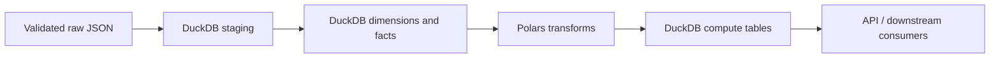

# Mini Faire Polars Compute Layer

Polars is the local distributed-compute analogue in Mini Faire. DuckDB owns durable storage, SQL modeling, and semantic views; Polars owns dataframe-style transformations that are easier to express as grouped feature engineering, scoring, windowing, and micro-batch summaries.

The goal is not to pretend this local demo is a cluster. The goal is to show a clean compute boundary that could later move to Spark, Ray, Dask, or a managed dataframe service without changing the ingestion contracts or warehouse marts.

## Where Polars Fits



Current flow:

1. `scripts/run_demo.py` ingests source files and rebuilds DuckDB raw/staging objects.
2. SQL models incrementally update `marts.dim_*` and `marts.fact_*`.
3. `compute/polars/compute_metrics.py` reads mart tables into Polars.
4. Polars computes derived metrics.
5. Results are written back to DuckDB tables in the `marts` schema.

## Current Transforms

### Retailer Health

File: `compute/polars/transform_orders.py`

Input table: `marts.fact_orders`

Output table: `marts.compute_retailer_health`

Grain: one row per `retailer_id`

Metrics:

- `order_count`
- `net_revenue`
- `estimated_profit`
- `last_order_ts`
- `retailer_health_score`

Current scoring formula:

```text
(order_count * 10) + (net_revenue / 50) + (estimated_profit / 25)
```

This is intentionally simple and transparent. It gives reviewers a concrete place to discuss scoring design, feature weighting, and evolution toward a richer model.

### Event Micro-Batch Summary

File: `compute/polars/transform_events.py`

Input table: `marts.fact_orders_events`

Output table: `marts.compute_event_microbatch_summary`

Grain: one row per five-minute `microbatch_window` and `event_type`

Metrics:

- `event_count`
- `event_gmv`
- `event_units`

Windowing logic:

```python
events.with_columns(pl.col("event_ts").dt.truncate("5m").alias("microbatch_window"))
```

## Persistence Contract

File: `compute/polars/compute_metrics.py`

Polars frames are persisted back to DuckDB using explicit table DDL and `executemany`. This avoids optional Arrow, pandas, numpy, or ConnectorX dependencies, which keeps the demo install lean and predictable on Windows.

Current output tables:

```sql
marts.compute_retailer_health
marts.compute_event_microbatch_summary
marts.compute_product_reorder_risk
marts.compute_brand_contribution
marts.compute_retailer_cohort_retention
marts.compute_event_lag_summary
marts.compute_model_runs
```

The compute tables are replaceable derived tables. Their sources are already durable in DuckDB facts, so recomputing them is safe and idempotent for this demo.

## Running Polars Compute

Run the whole platform:

```powershell
.\.venv\Scripts\python.exe scripts\run_demo.py
```

Run only the Polars persistence step after the warehouse exists:

```powershell
.\.venv\Scripts\python.exe -m compute.polars.compute_metrics
```

Inspect individual frames:

```powershell
.\.venv\Scripts\python.exe -m compute.polars.transform_orders
.\.venv\Scripts\python.exe -m compute.polars.transform_events
```

Query outputs in DuckDB:

```powershell
.\.venv\Scripts\python.exe -c "import duckdb; con=duckdb.connect('data/warehouse/mini_faire.duckdb'); print(con.execute('select * from marts.compute_retailer_health').fetchall())"
```

## Why Polars Here

Polars is useful in this project because it gives the platform a separate compute layer without requiring a heavy runtime:

- Dataframe expressions are compact for feature engineering and scoring.
- Grouped aggregations and time-window transformations are easy to read.
- The compute boundary mirrors a production pattern where SQL marts feed model features or operational aggregates.
- The implementation stays local and fast for a portfolio/demo project.

DuckDB remains the system of record. Polars is used for derived compute outputs, not for source-of-truth storage.

## Design Rules

Use Polars when:

- The transformation is easier to express with dataframe operations than SQL.
- You are building feature-like metrics, scores, or event-window summaries.
- The output can be derived from existing marts.
- Recomputing the output is acceptable.

Prefer DuckDB SQL when:

- The logic is core dimensional modeling.
- The table is a source-of-truth dimension or fact.
- You need SQL-first semantic views.
- The transformation is a straightforward projection, join, or aggregate already covered by warehouse models.

## Adding A New Polars Transform

Recommended pattern:

1. Read from a stable DuckDB mart table.
2. Select only the columns the transform needs.
3. Cast timestamps to plain `timestamp` when fetching from DuckDB to avoid timezone dependency surprises.
4. Build a Polars `DataFrame` from fetched rows and cursor metadata.
5. Return a dataframe from a pure transform function.
6. Persist in `compute/polars/compute_metrics.py`.
7. Add the output table to lineage docs if it becomes part of the platform contract.
8. Add a test that verifies row grain and JSON/API-safe values if exposed.

Example skeleton:

```python
from __future__ import annotations

import duckdb
import polars as pl

from ingestion.paths import DUCKDB_PATH


def product_reorder_frame(db_path=DUCKDB_PATH) -> pl.DataFrame:
    with duckdb.connect(str(db_path), read_only=True) as con:
        result = con.execute(
            """
            select
              product_id,
              quantity,
              cast(order_ts as timestamp) as order_ts
            from marts.fact_orders
            """
        )
        orders = pl.DataFrame(
            result.fetchall(),
            schema=[column[0] for column in result.description],
            orient="row",
        )

    return (
        orders.group_by("product_id")
        .agg(
            pl.col("quantity").sum().alias("units_sold"),
            pl.col("order_ts").max().alias("last_sold_at"),
        )
        .sort("units_sold", descending=True)
    )
```

## Implemented Enhancements

The following enhancement ideas are now implemented:

- Product reorder risk score using units sold, inventory count, and recent velocity.
- Retailer cohort retention features by signup month.
- Brand-level GMV and margin contribution.
- Event lag summary using `event_ts` versus warehouse load timestamps.
- API endpoints for compute outputs.
- A compute audit table similar to `elt_model_runs`.

API endpoints:

```text
GET /compute/retailer-health
GET /compute/product-reorder-risk
GET /compute/brand-contribution
GET /compute/retailer-cohort-retention
GET /compute/event-lag-summary
GET /compute/model-runs
```

## Operational Notes

The current code avoids `pl.read_database_uri()` because that path requires optional packages such as ConnectorX. It also avoids DuckDB `.pl()` registration paths that can require Arrow. The project instead uses the smallest reliable bridge:

```python
result = con.execute(sql)
frame = pl.DataFrame(
    result.fetchall(),
    schema=[column[0] for column in result.description],
    orient="row",
)
```

That tradeoff is deliberate for a tiny local demo. For larger data volumes, use Arrow-backed exchange, partitioned Parquet, or Polars lazy scans over exported files.
