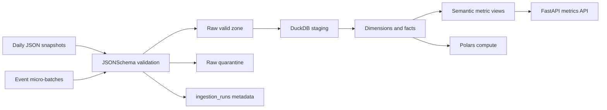

# Mini Faire

Mini Faire is a compact retail marketplace analytics platform demo. It shows the major pieces of a staff-level data platform without requiring cloud infrastructure: JSON contracts, batch and event ingestion, validation with quarantine, metadata capture, DuckDB warehouse modeling, Polars compute, semantic metrics, and a small API.

## Quick Start

```powershell
python -m venv .venv
.\.venv\Scripts\python.exe -m pip install -e ".[dev]"
.\.venv\Scripts\python.exe scripts\run_demo.py
```

The demo creates `data/warehouse/mini_faire.duckdb`, writes validated raw records under `data/raw/`, loads staging tables, builds dimensions/facts, and refreshes metric views.

Run the API after the demo:

```powershell
.\.venv\Scripts\python.exe -m uvicorn api.metrics_api:app --reload
```

Then open `http://127.0.0.1:8000/metrics/retailer-daily`.

## Architecture



## Repository Map

- `contracts/`: JSONSchema contracts for batch entities and events.
- `data/batch/`, `data/events/`: small sample source files.
- `ingestion/`: validation, quarantine, metadata, and loading helpers.
- `warehouse/duckdb/`: initialization, staging, warehouse, and metric SQL.
- `compute/polars/`: distributed-compute-style transforms using Polars.
- `orchestration/`: Prefect flows and Airflow DAG examples.
- `governance/`: lineage and metadata schema documentation.
- `api/`: optional metric exposure through FastAPI.
- `scripts/run_demo.py`: one-command local pipeline runner.

## Reliability Notes

Ingestion writes deterministic output paths based on source, entity, partition, and run ID. DuckDB staging and metric views are refreshable, while marts use incremental delete-insert patterns with deduplication by natural keys and event IDs. Invalid records are preserved with validation errors for auditability.

## Incremental ELT

Staging tables are rebuilt from validated raw JSON for local-demo simplicity. Mart tables use incremental delete-insert patterns:

- Dimensions replace rows by natural key: `retailer_id`, `product_id`.
- Facts replace rows by natural key/event ID and use high-watermark filters: `order_ts`, `event_ts`.
- Each model appends an audit row to `elt_model_runs` with strategy, affected key count, target row count, and high watermark.

This keeps repeated runs idempotent while preserving a clear production-style control table.
