# Mini Faire

Mini Faire is a compact retail marketplace analytics platform demo. It shows the major pieces of a staff-level data platform without requiring cloud infrastructure: JSON contracts, batch and event ingestion, validation with quarantine, metadata capture, DuckDB warehouse modeling, Polars compute, semantic metrics, and a small API.

## Quick Start

```powershell
py -3.12 -m venv .venv
.\.venv\Scripts\python.exe -m pip install -e ".[dev]"
.\.venv\Scripts\python.exe scripts\run_demo.py

* Should see something like (exact counts depend on how many sample files exist under data/batch and data/events):
Batch ingestion runs: 15
Event ingestion runs: 105
DuckDB warehouse: C:\Projects\mini-faire\data\warehouse\mini_faire.duckdb
```

Python 3.10-3.12 is recommended on Windows. Python 3.13 can install a DuckDB package with a mismatched compiled extension, which appears as `ModuleNotFoundError: No module named '_duckdb'`.

The demo creates `data/warehouse/mini_faire.duckdb`, writes validated raw records under `data/raw/`, loads staging tables, builds dimensions/facts, and refreshes metric views.

Sample data spans four days (2026-08-15 through 2026-08-18) of retailers, products, orders, and the full event chain (`order_created`, `order_paid`, `orders_shipped`, `inventory_updated`, `price_changed`), including deliberately invalid records so quarantine has something to show. Multi-day charts on the dashboard (GMV trend) and the ingestion/lineage/quarantine pages read directly off this data - no separate flag needed.

### Generating more data

Two additional upstream sources can feed the same pipeline:

```powershell
# Deterministic synthetic marketplace data (retailers, products, orders,
# the full event chain, price changes, inventory volatility, seasonality,
# and a configurable rate of deliberately-invalid records) - config in
# config/synthetic.yaml.
.\.venv\Scripts\python.exe -m orchestration.synthetic_flow

# Pull new/changed documents from the MongoDB `rmap` database - config in
# config/mongo.yaml. Requires the optional `mongo` extra and a
# MONGO_PASSWORD environment variable (never stored in the repo):
.\.venv\Scripts\python.exe -m pip install -e ".[mongo]"
$env:MONGO_PASSWORD = "your-atlas-password"
.\.venv\Scripts\python.exe -m orchestration.mongo_flow

# Optional: watch MongoDB change streams and ingest inserts/updates in
# near-real-time instead of polling.
.\.venv\Scripts\python.exe -m ingestion.mongo_ingest_change_stream

# Optional: write synthetic data straight into MongoDB instead of local
# files, so mongo_flow / the change-stream watcher pick it up like any
# other upstream document.
.\.venv\Scripts\python.exe -m synthetic.write_mongo
```

Both flows write through the exact same validate -> quarantine -> metadata -> lineage -> ELT -> compute pipeline as `scripts/run_demo.py`, so their output shows up in the same warehouse, API, and frontend.

### Real-time streaming (Phase 4)

Three long-lived services extend the same pipeline into near-real time. Each is a separate process - run whichever combination you want alongside the API and frontend:

```powershell
# Streams order/inventory/price events at a configurable pace (config/synthetic.yaml's
# streaming: block). Prefers writing straight into MongoDB; falls back to local files
# under data/events/ if MONGO_PASSWORD isn't set or pymongo isn't installed.
.\.venv\Scripts\python.exe synthetic\stream_generator.py
.\.venv\Scripts\python.exe synthetic\stream_generator.py --duration-seconds 120   # bounded demo run
.\.venv\Scripts\python.exe synthetic\stream_generator.py --sink files             # force local files

# Watches MongoDB change streams (config/mongo.yaml's change_streams: block) with
# resume-token persistence and backoff/retry, ingesting inserts/updates/replaces as
# they happen and recording deletes for audit. Requires the `mongo` extra and
# MONGO_PASSWORD, same as mongo_flow above.
.\.venv\Scripts\python.exe -m ingestion.mongo_change_stream

# Detects new source files and (if configured) new MongoDB change-stream events, then
# refreshes staging/marts/compute on a debounced cadence instead of on every single
# event - runs continuously until interrupted.
.\.venv\Scripts\python.exe -m orchestration.realtime_flow
```

Each service writes a small heartbeat file under `data/state/` so `GET /realtime/health` can report whether it's actually running (see Endpoints below) - useful since they're independent processes with no shared in-memory state.

#### Running these together safely

You do not have to run all three at once - Live Mode in the browser works with any subset running, including none (it just won't have much new to show). But if you do run more than one at a time, keep two things in mind:

**`realtime_flow.py` already watches MongoDB itself.** Internally it opens its own `ChangeStreamWatcher` (the same class `mongo_change_stream.py` uses) unless you pass `--no-mongo`. So running standalone `mongo_change_stream.py` *and* `realtime_flow.py` together means two independent watchers doing the same work - redundant, not wrong, but usually unnecessary. Pick one:
- Recommended: just run `realtime_flow.py` (it watches Mongo *and* detects new files *and* rebuilds the warehouse) alongside `stream_generator.py`.
- Or: run `mongo_change_stream.py` standalone and start `realtime_flow.py` with `--no-mongo` so it only handles file detection + rebuilds.

**Every write to `mini_faire.duckdb` briefly locks the file.** DuckDB allows one writer at a time; a second process trying to open a write connection while another holds it waits (all writers in this codebase retry with backoff for this - see `ingestion/duckdb_utils.py`) rather than crashing, but it's still cleaner to avoid the contention. By default, `stream_generator.py` writes to DuckDB itself after every event (so its counts show up immediately even with nothing else running). When you're also running `realtime_flow.py`, add `--no-local-ingest` so `stream_generator.py` only writes event files/Mongo documents and lets `realtime_flow.py` - which is already polling for exactly this - do the DuckDB write on its debounced cadence instead:

```powershell
.\.venv\Scripts\python.exe synthetic\stream_generator.py --no-local-ingest
.\.venv\Scripts\python.exe -m orchestration.realtime_flow
```

That combination keeps `realtime_flow.py` as the sole writer, which is the safest way to run streaming + orchestration side by side.

### Monitoring, anomalies, and alerts (Phase 5)

No separate process to run - the monitoring layer rides along inside `realtime_flow.py`. After every successful ingest -> ELT/warehouse rebuild -> Polars compute cycle, it also runs a monitoring pass: system metrics (ingestion/ELT/compute/streaming reliability), an incremental schema-drift scan of the quarantine zone, and statistical anomaly detection (rolling mean+std, EWMA, percentile thresholds, z-scores - no ML yet, that's a later phase) across GMV, order velocity, inventory, pricing, event lag, retailer health, ingestion volume, and quarantine rate. Each stage is isolated the same way ingestion/ELT/compute already are: a monitoring failure is logged and skipped, never allowed to take down the real-time process it's watching.

Anomalies, threshold breaches (see `config/alerts.yaml`'s `thresholds:` block), schema drift, and pipeline stage failures (`ingestion_failure` / `elt_failure` / `compute_failure`) all route through one place, `alerts/dispatcher.py`, which always records the alert to `monitoring.alert_events` first and then best-effort delivers it to whichever channels are configured - Slack webhook, generic webhook, and/or console (the guaranteed fallback, always on). Webhook URLs are never stored in the repo, same convention as `MONGO_PASSWORD`:

```powershell
$env:SLACK_WEBHOOK_URL = "https://hooks.slack.com/services/..."
$env:ALERT_WEBHOOK_URL = "https://example.com/webhooks/mini-faire-alerts"
```

Neither is required - an unset channel is skipped (not an error), and console output always fires, so alerting degrades gracefully with zero configuration. See `config/alerts.yaml` for per-alert-type default severity, the dashboard deep-link each alert type carries, and `minimum_severity` (alerts below it are still recorded, just not sent to a channel).

Run the API after the demo:

```powershell
.\.venv\Scripts\python.exe -m uvicorn api.metrics_api:app --reload
```

Then open `http://127.0.0.1:8000/metrics/retailer-daily`.

### ML layer (Phase 6)

Two standalone entry points, run after the demo/warehouse is built (they read from `marts.*` and `anomalies.anomaly_events`, same as Phase 5's monitoring layer):

```powershell
# Build features (ml/features/build_features.py), train + evaluate all four model
# types (forecasting, clustering, recommendations, anomaly classifier), register
# each in the model registry (ml/registry.py), and promote a new version only if
# it beats the active version's eval metric by config/ml.yaml's
# model_promotion.min_relative_improvement. A version that fails its
# post-activation sanity check is rolled back automatically and an
# ml_training_failure alert is dispatched.
.\.venv\Scripts\python.exe orchestration\ml_training_flow.py

# Load whichever model version is active per model_name and refresh
# predictions - forecasts, cluster assignments, recommendations, and anomaly
# classifications - writing to warehouse and pushing updates to any connected
# /ml/ws or /ml/stream client. Meant to run more often than training (every
# real-time cycle, or its own short schedule) since it's much cheaper: no
# retraining, just inference from whatever model is currently active.
.\.venv\Scripts\python.exe orchestration\ml_inference_flow.py
```

Four model types, one registry `model_name` each (`ml/registry.py`'s versioning is per model_name, not per forecast_type/segment/etc. - see that module's docstring):

- **Forecasting** (`ml/models/forecasting.py`): GMV (daily/weekly/marketplace-wide and per-retailer), order velocity (per-product/per-retailer), inventory level (with stockout/reorder threshold flags), and price trend, each as a per-day horizon curve with an empirical ~80% confidence band. Tries statsmodels' Holt-Winters (optional), then scikit-learn's `RandomForestRegressor` over lag features (the default), then a numpy-only linear trend fallback for short series.
- **Clustering** (`ml/models/clustering.py`): retailer segments (high/low velocity, high/low GMV, anomaly-prone, stable) and product segments (fast/slow movers, high/low margin, volatile/stable inventory), via KMeans/DBSCAN/GMM (config-selectable) over standardized features from the shared `ml.features` store, reduced to 2D via PCA for the frontend's cluster map.
- **Recommendations** (`ml/models/recommendations.py`): product-similar, retailer-similar (cosine or NMF-factorized similarity over a retailer x product interaction matrix), products ordered alongside each other, trending-in-category, and retailers likely to grow. No ground-truth quality score exists in this synthetic dataset, so every newly-trained version is promoted unconditionally - see that module's docstring.
- **Anomaly classifier** (`ml/models/anomaly_classifier.py`): upgrades Phase 5's rule-based anomaly detection with an ML classifier (RandomForestClassifier/GradientBoostingClassifier, or XGBoost if installed) trained to predict `anomalies.anomaly_events`' own rule-derived `anomaly_type` label from an anomaly's numeric signature - a self-supervised setup, not ground-truth validation of whether the anomaly is real. This is the one model type with a genuinely persisted fitted object (pickled via `ml/registry.py`'s `save_artifact()`); the other three refit fresh from current warehouse state every time, matching this repo's existing "recompute rather than incrementally update" philosophy for the compute layer.

`ml/config.py` / `config/ml.yaml` control every tunable above (horizon days, lag count, top-N entities, clustering method/k, recommendation method/top-N, anomaly classifier method/min samples, and the promotion threshold). `numpy`/`scikit-learn` are hard requirements for the `ml/models/*.py` modules (install via the `ml` extra below); `statsmodels`/`xgboost`/`lightgbm`/`prophet` are optional enhancements, each guarded by its own `try`/`except ImportError` with a silent fallback to the sklearn/numpy default:

```powershell
pip install -e ".[ml]"        # numpy + scikit-learn - required
pip install -e ".[ml-extra]"  # statsmodels, xgboost, lightgbm, prophet - optional
```

Training/inference failures dispatch `ml_training_failure`/`ml_inference_failure` through the same `alerts/dispatcher.py` every other pipeline stage uses (see "Monitoring, anomalies, and alerts" above), deep-linking to `/ml/models`.

### Cloud deployment & multi-tenant mode (Phase 7)

Everything through Phase 6 runs as one tenant against one local DuckDB file. Phase 7 adds a multi-tenant layer alongside that - not instead of it: running with zero configuration (`scripts/run_demo.py`, no login) still works exactly as before, and the pieces below are additive.

**Auth & tenants.** `auth/auth_api.py` (`/auth/signup`, `/auth/login`, `/auth/join`, `/auth/refresh`, `/auth/logout`, `/auth/me`) issues short-lived JWT access tokens (15 min) plus longer-lived, rotating refresh tokens (14 days) - see `config/auth.yaml` for both TTLs and the RBAC role ladder (`admin` > `tenant_admin` > `analyst` > `viewer`, admin-down). `auth/auth_middleware.py`'s `require_role()`/`require_tenant()` FastAPI dependencies gate the Phase 7 routes; every Phase 3-6 route stays open by design (this is still a local demo - see that module's docstring). Signing up creates a brand-new tenant (`multi_tenant/tenant_manager.py`) and makes you its first `tenant_admin`; `multi_tenant/tenant_manager.py` supports two isolation policies per tenant - `pooled` (a `tenant_id` column in shared tables, the default) and `silo` (a dedicated `tenant_<id>` DuckDB schema; schema creation exists, but mart/staging mirroring into a silo schema does not - a documented gap, not a silent one).

**Tenant-aware pipeline.** `ingestion/tenant_ingest.py` tags validated records with `tenant_id` and writes under `data/raw/tenants/<tenant_id>/...`, generic across every entity type. Downstream of ingestion, only `orders` is carried all the way through: `warehouse/duckdb/tenant_elt.sql` builds `marts.fact_tenant_orders` / `marts.metrics_tenant_daily`, and `compute/polars/tenant_metrics.py` computes `marts.compute_tenant_health` (order count, GMV, net revenue, a 0-100 health score) and `marts.compute_tenant_growth` (7-day GMV trend/trend label) from it. `ml/tenant_models/tenant_forecasting.py` forecasts each tenant's daily GMV the same way `ml/models/forecasting.py` forecasts a retailer's, registered under `ml.model_registry` alongside the Phase 6 model types.

**Storage & database abstraction.** `storage/cloud_storage.py` (`config/storage.yaml`) and `database/cloud_db.py` (`config/database.yaml`) each default to what this repo already uses - the local filesystem and DuckDB - with S3/Azure Blob/GCS and Postgres/MongoDB backends available behind guarded imports (`pip install -e ".[cloud]"`) for an actual cloud deployment. `database/migrations/postgres/*.sql` mirrors the existing DuckDB metadata/auth/tenant DDL for the Postgres path.

**Deploying it.** `infra/cloud/` has Dockerfiles for every process (backend/frontend/orchestration/streaming/ML), a `docker-compose.cloud.yaml` that runs them together plus an optional `docker-compose.observability.yaml` (Prometheus + Grafana + Loki/Promtail + Jaeger), Terraform modules for a from-scratch AWS deployment (VPC, RDS Postgres, MongoDB Atlas, S3, API Gateway, ALB, Secrets Manager), and ready-to-use manifests for three managed platforms (`fly.toml`, `render.yaml`, `azure-container-apps.*.yaml` - see `infra/cloud/MANAGED_SERVICES.md`). `infra/cloud/deploy.sh <fly|render|azure|docker-compose>` runs lint -> test -> build -> migrate -> deploy -> notify for whichever target you pick; `infra/cloud/ci_cd.yaml` is a GitHub Actions workflow that runs the same lint/test/build gate on every push and calls `deploy.sh` on pushes to `main` (copy it to `.github/workflows/ci_cd.yaml` to activate it - GitHub only picks up workflows from that path). None of this was deployable or build-testable from the sandbox that authored it (no Docker daemon, no cloud credentials, no network access to Terraform's provider registry) - every manifest was validated the ways that sandbox actually could: YAML/TOML parsing, `docker compose config`, and Terraform module variable/output cross-referencing by hand. Treat it as a complete, carefully-written starting point, not a deployment that's been run.

**Observability.** `observability/metrics.py` hand-rolls a small Prometheus client (no new dependency) and exposes `GET /observability/metrics`, refreshed on every scrape from tables Phase 5/6/7 already populate (`monitoring.system_metrics`, `elt_model_runs`, `anomalies.anomaly_events`, `marts.compute_tenant_health`) rather than recomputing anything. `observability/logging.py` configures JSON-structured stdout logging (`configure_json_logging()`), which `docker-compose.observability.yaml`'s Promtail service scrapes into Loki; `observability/tracing.py` wraps OpenTelemetry (`pip install -e ".[observability]"`) behind a `start_span()` context manager that degrades to a real no-op, not an error, when the extra isn't installed - wired into `api/metrics_api.py`'s request middleware and exporting to Jaeger. A starter Grafana dashboard (`infra/cloud/observability/grafana/dashboards/mini-faire-overview.json`) auto-provisions on stack startup.

**Frontend.** `frontend/lib/auth.ts` decodes the session cookie's JWT claims (display/routing only - the signature is never re-verified client-side; every real authorization decision still happens on the backend) and `frontend/lib/tenant.ts` resolves which tenant is "current" (an admin's chosen tenant, via `components/TenantSwitcher.tsx` in the header, or simply your own tenant for every other role). `/login` and `/signup` (a two-step onboarding wizard: create workspace -> confirmation) proxy through Next.js Route Handlers (`app/api/auth/*`) that set httpOnly session cookies - the browser never holds a JWT directly. `/tenants` is the one dashboard backed by genuinely tenant-scoped data (GMV, health score, 7-day trend, daily order table); it explicitly does **not** retrofit tenant filtering onto `/retailers`, `/products`, `/orders`, `/compute`, `/monitoring`, or `/ml` - those dashboards' marts have no `tenant_id` column (only `orders` was carried through the tenant-aware pipeline above), so faking a filter there would either return nothing or fabricate tenant assignment for rows that were never tenant-scoped. What those dashboards get instead is the same global header indicator (`components/TenantSwitcher.tsx`, wired into `app/layout.tsx`) every page already shares.

### Marketplace simulation & digital twin (Phase 8)

Phase 8 adds a simulation layer on top of everything through Phase 7 - it reads the same warehouse and never writes to it except its own two result tables, and nothing about how an earlier phase runs changes.

**Digital twin.** `simulation/digital_twin.py`'s `load_digital_twin()` builds a `DigitalTwinState` snapshot by reading the warehouse tables Phases 3-7 already populate (`marts.dim_retailer`/`dim_product`/`compute_retailer_health`/`compute_product_reorder_risk`, `anomalies.anomaly_events`, `ml.forecasts`/`clusters`/`recommendations`/`anomaly_classifications`) rather than standing up a second state store that could drift from the real one. `tenant_id=None` loads the full nine-dimension classic twin; `tenant_id=<id>` loads a narrower twin scoped to that tenant's own tables, with fields no per-tenant table backs left `None` rather than fabricated - the same documented gap `multi_tenant/tenant_manager.py` already notes for silo schemas. `DigitalTwinState.clone()` deep-copies the snapshot so simulation code can mutate freely without ever touching the real warehouse mid-run.

**Agents.** `simulation/agents/` (`marketplace_agent.py`, `retailer_agent.py`, `product_agent.py`) model the marketplace, each retailer, and each product as an agent with its own strategy dataclass (pricing/inventory/promotion/fulfillment/anomaly-response for retailers; price elasticity/demand response/inventory decay for products; demand shocks/seasonal effects/category trends/competitor pressure marketplace-wide). `scenario_engine.py`'s `build_agents()` wires them together from real retailer-product order history and builds a fresh set - with its own `random.Random`, decaying demand multiplier, and category-trend walk - on every single simulation run; nothing agent-side is persisted between runs.

**Scenarios.** `simulation/scenario_engine.py`'s `run_scenario()` covers all nine scenario types the spec asks for (`price_change`, `inventory_change`, `demand_shock`, `supply_chain_delay`, `retailer_outage`, `product_launch`, `promotion_event`, `competitor_entry`, `competitor_exit` - see `SCENARIO_PARAM_SCHEMA` for each type's params). Every run clones the twin into a baseline branch and a scenario branch with the *same* seed, applies the scenario mutation to the scenario branch only, runs both forward the identical number of ticks, and diffs the two - isolating the scenario's own effect from simulated noise rather than comparing against pre-scenario history. Outputs cover predicted GMV/velocity/inventory/retailer health plus two intentionally lightweight heuristic proxies - predicted cluster movement and predicted recommendations - that are not re-fits of `ml/models/clustering.py`/`recommendations.py`, documented as such rather than silently overclaimed. Results persist to `simulation.scenario_results` with a `scenario_simulated` lineage edge; an optional `retailer_strategy_overrides`/`product_strategy_overrides` param lets one run override a single agent's default strategy without touching the rest.

**Counterfactuals.** `simulation/counterfactuals.py`'s `run_counterfactual()` covers four types - `remove_retailer_orders`, `remove_product_orders`, `modify_price`, `remove_anomaly_window` - by loading real `marts.fact_orders` rows, filtering/modifying them, re-aggregating actual vs. counterfactual, and replaying both forward through the same agent machinery `scenario_engine.py` uses. A retailer/product with zero matching orders in the window is a legitimate "changed nothing" answer, not an error; an unknown `anomaly_id` or type is. Counterfactuals hold each product's current `inventory_count` fixed at today's value rather than reconstructing what inventory would have looked like under retroactive divergence - a documented simplification, not an attempt at full historical replay. Results persist to `simulation.counterfactual_results` with a `counterfactual_simulated` lineage edge.

**Orchestration.** `orchestration/simulation_flow.py`'s `run_simulation_flow()` loads the twin, previews the agent set, runs a plain seeded baseline projection (`scenario_engine.run_baseline_projection()`), then a batch of scenarios and a batch of counterfactuals - each isolated in its own try/except so one bad spec never blocks the rest, dispatching `simulation_scenario_failure`/`simulation_counterfactual_failure` alerts through the same `alerts/dispatcher.py` every earlier phase uses. Called with no arguments (`python orchestration/simulation_flow.py`, per Section 8), it derives a small illustrative batch from whatever real retailer/product/anomaly IDs are already in the twin rather than hardcoding fixture IDs that could silently no-op against a different warehouse. Every scenario/counterfactual run - success or failure - appends one row to `elt_model_runs` (`load_strategy='simulation_scenario'`/`'simulation_counterfactual'`), same audit convention as every other flow in this repo.

**API.** `api/simulation_api.py` (mounted into `api/metrics_api.py` alongside the other routers, deliberately left open like `/ml`/`/monitoring`/`/realtime`) exposes `/simulation/run`, `/simulation/scenarios` (GET catalog / POST one ad-hoc run), `/simulation/counterfactuals` (same split), `/simulation/state`, `/simulation/agents`, and `/simulation/results` (plus per-id detail routes), with `/simulation/ws` / `/simulation/stream` diff-polling `simulation.scenario_results`/`simulation.counterfactual_results` for new rows every 2s, same pattern as `/realtime/ws`/`/monitoring/ws`/`/ml/ws`. Progress push is row-arrival granularity (a newly-completed scenario/counterfactual shows up), not a true intra-run percentage - each run resolves in one synchronous call with no natural mid-run checkpoint to report.

**Frontend.** Five pages under `/simulation` (Overview, Scenarios, Counterfactuals, Agents, Results) follow the same Server Component + Live Mode pattern as `/ml`, with a plum accent (`components/simulation/SimulationTabs.tsx`). `DigitalTwinVisualizer` charts the current twin's top retailers/products and recent anomalies; `ScenarioBuilder`/`CounterfactualBuilder` render schema-driven forms straight off `GET /simulation/scenarios`/`/simulation/counterfactuals`'s param catalogs and POST directly to the API; `AgentStrategyEditor` is a read-only reference view of the default strategy fields (agents are never persisted, so there is nothing durable to edit here - overriding one for a single run happens inline in `ScenarioBuilder` instead); `SimulationTimeline` merges recent scenario/counterfactual runs by completion time; `SimulationResultCharts` renders one selected run's full detail.

### Autonomous agents (Phase 9)

Phase 9 adds an autonomous-agent decision layer on top of every earlier phase's warehouse/ML/anomaly/simulation infrastructure - it reads the live digital twin plus real ML predictions, anomaly history, and monitoring health, and, unlike Phase 8's ephemeral one-instance-per-entity ABM agents, decides and genuinely applies changes back to the twin, persisting every decision as an audit trail.

**Agent framework.** `autonomy/agent_framework.py`'s `BaseAutonomousAgent` is one instance per agent TYPE (not per entity - see that module's docstring for the full Phase 8 vs. Phase 9 "agent" distinction), decides across every relevant entity in one `decide()` call, and carries a shared lifecycle (idle -> observing -> deciding -> acting -> cooldown), a shared `AgentConstraints` safety gate (`enforce_constraints()` - price move caps, reorder multiplier caps, promotion discount caps, a per-run action cap), and a shared `AgentAction` persistence shape (`autonomy.<agent_type>_actions`, one table per agent type, `persist_actions()`).

**Five agents.** `autonomy/pricing_agent.py` (price anomaly reversion, high-reorder-risk promotions, ML price-trend-driven increase/decrease/freeze), `autonomy/inventory_agent.py` (reorder proposals sized off a `max(10, units_sold)` proxy - no `reorder_point`/`reorder_quantity` column exists in this schema - stockout alerts via `alerts/dispatcher.py`, ML velocity-trend-driven quantity adjustments), `autonomy/demand_agent.py` (trending-product promotions, high-growth retailer segment targeting, product cluster targeting/suppression), `autonomy/anomaly_response_agent.py` (price/inventory/promotion correction, tenant-admin notification, and the two action types that call directly into `simulation/scenario_engine.py`/`simulation/counterfactuals.py` to trigger a real what-if run in response to a detected anomaly), and `autonomy/retailer_strategy_agent.py` (operational strategy adjustments - pricing/inventory/promotion/fulfillment strategy field changes, applied via `scenario_engine.advance_twin()`'s `retailer_strategy_overrides` param, since `RetailerStrategy` has no `DigitalTwinState` field of its own to mutate directly - plus long-term structural recommendations for anomaly-prone retailers).

**Orchestration & conflict resolution.** `orchestration/agent_flow.py`'s `run_agent_flow()` runs all five agents in isolated try/except, resolves conflicts with a fixed, documented priority order (`anomaly_response > inventory > pricing > retailer_strategy > demand` - the first proposal to claim an entity wins, using `enforce_constraints()`'s existing cooldown-entity check rather than a second rejection mechanism), applies survivors to the twin, and persists every resolved action plus every conflict record (`autonomy.conflicts`) with a run-level reward (a baseline-projection GMV delta, attributed identically to every action from the run - except the two `trigger_simulation_scenario`/`trigger_counterfactual_analysis` action types, which get their own exact triggered-run GMV delta instead). Three run modes: `"live"` (one round against the live twin, the default), `"tick"` (N rounds interleaved with real `advance_twin()` calls - an agent's decision compounds with organic marketplace activity before the next round), and `"scenario"` (agents decide against a scenario-mutated twin via `scenario_engine.build_scenario_twin()`).

```powershell
.\.venv\Scripts\python.exe orchestration\agent_flow.py
```

**API.** `api/autonomy_api.py` (mounted into `api/metrics_api.py`, deliberately left open like `/ml`/`/monitoring`/`/simulation`) exposes `POST /autonomy/run`, `GET /autonomy/actions` (merged, or `/pricing`/`/inventory`/`/demand`/`/anomalies`/`/retailer-strategy` for one agent type), `GET /autonomy/conflicts`, `GET /autonomy/performance` (per-agent-type action counts and average reward), `GET /autonomy/state` (twin summary, priority order, default constraints, last run per agent type), and `/autonomy/ws` / `/autonomy/stream` diff-polling all five action tables plus conflicts, with a fresh performance snapshot on every non-empty update - same pattern as every earlier phase's WebSocket/SSE layer.

**Frontend.** Six pages under `/autonomy` (Overview, Decisions, Conflicts, Performance, Agents, Run) follow the same Server Component + Live Mode pattern as `/simulation`, with a marigold accent (`components/autonomy/AutonomyTabs.tsx`). `AgentDecisionTable` renders the shared `AgentAction` row shape (status badges, expandable rationale/params); `AgentConflictViewer` shows winner vs. rejected side by side for each resolved entity collision; `AgentPerformanceChart` ranks agent types by action volume and average reward; `AgentStateVisualizer` shows the fixed conflict-resolution priority order, default safety constraints, and last run per agent type; `AgentTimeline` is a chronological all-agent-types decision feed; `AgentRunTrigger` POSTs an ad-hoc `/autonomy/run` (mode/rounds/ticks/seed) and shows the result inline, including any conflicts that run resolved.

# Endpoints
- `http://127.0.0.1:8000/docs`
- `http://127.0.0.1:8000/health`
- `http://127.0.0.1:8000/metrics/retailer-daily`
- `http://127.0.0.1:8000/metrics/product-velocity`
- `http://127.0.0.1:8000/metrics/order-profitability`

/compute endpoints:
- `http://127.0.0.1:8000/compute/retailer-health`
- `http://127.0.0.1:8000/compute/product-reorder-risk`
- `http://127.0.0.1:8000/compute/brand-contribution`
- `http://127.0.0.1:8000/compute/retailer-cohort-retention`
- `http://127.0.0.1:8000/compute/event-lag-summary`
- `http://127.0.0.1:8000/compute/inventory-movement`
- `http://127.0.0.1:8000/compute/order-lifecycle`
- `http://127.0.0.1:8000/compute/model-runs`

/metadata endpoints:
- `http://127.0.0.1:8000/metadata/ingestion-runs`
- `http://127.0.0.1:8000/metadata/lineage-edges`
- `http://127.0.0.1:8000/metadata/elt-model-runs`
- `http://127.0.0.1:8000/metadata/quarantine-records`

/realtime endpoints (Phase 4 - see `api/realtime_api.py`):
- `ws://127.0.0.1:8000/realtime/ws` - WebSocket push of new ingestion/ELT/compute runs and lineage edges.
- `http://127.0.0.1:8000/realtime/stream` - the same updates as a Server-Sent Events stream (simpler client integration, no WebSocket library needed).
- `http://127.0.0.1:8000/realtime/health` - whether `stream_generator.py` / `mongo_change_stream.py` / `realtime_flow.py` are actually running, via their filesystem heartbeats.

/monitoring endpoints (Phase 5 - see `api/monitoring_api.py`):
- `http://127.0.0.1:8000/monitoring/system-metrics` - ingestion/ELT/compute/streaming reliability metrics.
- `http://127.0.0.1:8000/monitoring/anomalies` - detected anomalies across GMV, order velocity, inventory, pricing, event lag, retailer health, ingestion volume, and quarantine rate.
- `http://127.0.0.1:8000/monitoring/schema-drift` - classified schema drift events found in the quarantine zone.
- `http://127.0.0.1:8000/monitoring/alerts` - dispatched alert history, including which channel(s) each one reached.
- `http://127.0.0.1:8000/monitoring/health` - a monitoring-layer rollup (recent anomaly/alert counts, streaming heartbeat status).
- `http://127.0.0.1:8000/monitoring/streaming-status` - the same heartbeat data `/realtime/health` exposes, shaped for the monitoring dashboard.
- `ws://127.0.0.1:8000/monitoring/ws` / `http://127.0.0.1:8000/monitoring/stream` - WebSocket/SSE push of new anomalies, alerts, system metrics, and schema drift events (same diff-poll pattern as `/realtime/ws`).

/ml endpoints (Phase 6 - see `api/ml_api.py`):
- `http://127.0.0.1:8000/ml/forecasts` - GMV/velocity/inventory/price forecasts with confidence bounds.
- `http://127.0.0.1:8000/ml/clusters` - retailer and product segment assignments with 2D PCA plot coordinates.
- `http://127.0.0.1:8000/ml/recommendations` - product/retailer similarity, co-purchase, trending, and growth recommendations.
- `http://127.0.0.1:8000/ml/anomalies/classified` - ML-classified anomaly types layered on top of Phase 5's rule-based detections.
- `http://127.0.0.1:8000/ml/models` - every registered model version (`ml/registry.py`), with status, params, and eval metrics.
- `http://127.0.0.1:8000/ml/features` - the shared feature store (`ml/features/build_features.py`) every model type reads from.
- `ws://127.0.0.1:8000/ml/ws` / `http://127.0.0.1:8000/ml/stream` - WebSocket/SSE push of new forecasts, clusters, recommendations, and anomaly classifications (same diff-poll pattern as `/realtime/ws` and `/monitoring/ws`).

/auth endpoints (Phase 7 - see `auth/auth_api.py`):
- `POST http://127.0.0.1:8000/auth/signup` - create a new tenant + its first `tenant_admin` user; returns an access/refresh token pair.
- `POST http://127.0.0.1:8000/auth/join` - join an existing tenant via its invite token.
- `POST http://127.0.0.1:8000/auth/login`, `POST /auth/refresh` (rotates the refresh token), `POST /auth/logout` (revokes it).
- `GET http://127.0.0.1:8000/auth/me` - the caller's own user_id/email/role/tenant_id, from a valid access token.

/tenants endpoints (Phase 7 - see `api/tenant_api.py`, auth-gated via `require_tenant()`):
- `GET http://127.0.0.1:8000/tenants` - every tenant you can see (all of them for `admin`; just your own otherwise).
- `GET http://127.0.0.1:8000/tenants/{tenant_id}`, `/tenants/{tenant_id}/daily`, `/tenants/{tenant_id}/health`, `/tenants/{tenant_id}/growth` - tenant metadata and the tenant-scoped metrics `warehouse/duckdb/tenant_elt.sql` / `compute/polars/tenant_metrics.py` populate.

/observability endpoint (Phase 7 - see `observability/metrics.py`):
- `GET http://127.0.0.1:8000/observability/metrics` - Prometheus exposition-format text, refreshed from the warehouse on every scrape.

/simulation endpoints (Phase 8 - see `api/simulation_api.py`):
- `POST http://127.0.0.1:8000/simulation/run` - runs the full Section 5 orchestrated batch (twin load, agent load, baseline projection, a scenario batch, a counterfactual batch); an empty body uses the same data-derived defaults as `python orchestration/simulation_flow.py`.
- `GET`/`POST http://127.0.0.1:8000/simulation/scenarios` - the scenario type/param catalog, or run exactly one ad-hoc scenario (`scenario_engine.run_scenario()`).
- `GET`/`POST http://127.0.0.1:8000/simulation/counterfactuals` - the counterfactual type/param catalog, or run exactly one ad-hoc counterfactual (`counterfactuals.run_counterfactual()`).
- `GET http://127.0.0.1:8000/simulation/state` - the current digital twin snapshot (`simulation/digital_twin.py`'s `load_digital_twin()`).
- `GET http://127.0.0.1:8000/simulation/agents` - default agent strategies plus the twin's retailer/product ID set.
- `GET http://127.0.0.1:8000/simulation/results`, `/simulation/results/scenario/{scenario_id}`, `/simulation/results/counterfactual/{counterfactual_id}` - persisted run history and per-run detail.
- `ws://127.0.0.1:8000/simulation/ws` / `http://127.0.0.1:8000/simulation/stream` - WebSocket/SSE push of new scenario/counterfactual results (same diff-poll pattern as `/realtime/ws`, `/monitoring/ws`, `/ml/ws`).

/autonomy endpoints (Phase 9 - see `api/autonomy_api.py`):
- `POST http://127.0.0.1:8000/autonomy/run` - runs one full `orchestration/agent_flow.run_agent_flow()` pass (mode `"live"`/`"tick"`/`"scenario"`); returns per-agent action counts, resolved conflicts, and the run-level reward.
- `GET http://127.0.0.1:8000/autonomy/actions` - every agent's decisions merged and sorted by `created_at`; `/autonomy/pricing`, `/inventory`, `/demand`, `/anomalies`, `/retailer-strategy` are the same read scoped to one agent type.
- `GET http://127.0.0.1:8000/autonomy/conflicts` - every entity-level collision the conflict-resolution priority order has resolved (`autonomy.conflicts`).
- `GET http://127.0.0.1:8000/autonomy/performance` - per-agent-type action count/applied/rejected/advisory breakdown and average reward.
- `GET http://127.0.0.1:8000/autonomy/state` - twin summary, conflict-resolution priority order, default safety constraints, and last recorded run per agent type.
- `ws://127.0.0.1:8000/autonomy/ws` / `http://127.0.0.1:8000/autonomy/stream` - WebSocket/SSE push of new decisions/conflicts (six topics: five action tables plus conflicts), with a fresh performance snapshot on every non-empty update (same diff-poll pattern as `/realtime/ws`, `/monitoring/ws`, `/ml/ws`, `/simulation/ws`).

## Architecture

```mermaid
flowchart LR
  batch["Daily JSON snapshots"] --> validate["JSONSchema validation"]
  events["Event micro-batches"] --> validate
  synthetic["Synthetic generator"] --> batch
  synthetic --> events
  synthetic -.optional.-> mongo["MongoDB (rmap)"]
  stream["stream_generator.py"] -.files.-> events
  stream -.preferred.-> mongo
  changestream["mongo_change_stream.py"] --> mongo
  mongo --> validate
  validate --> valid["Raw valid zone"]
  validate --> quarantine["Raw quarantine"]
  validate --> metadata["ingestion_runs metadata"]
  valid --> staging["DuckDB staging"]
  staging --> warehouse["Dimensions and facts"]
  warehouse --> metrics["Semantic metric views"]
  warehouse --> polars["Polars compute"]
  metrics --> api["FastAPI metrics API"]
  api --> realtimeapi["/realtime WebSocket + SSE"]
  realtimeflow["realtime_flow.py"] -.debounced refresh.-> warehouse
  realtimeflow -.detects.-> valid
  realtimeflow -.detects.-> mongo
  realtimeapi --> frontend["Next.js Live Mode"]
  realtimeflow -.monitoring pass.-> monitoring["monitoring/metrics.py + schema_drift.py"]
  polars -.after compute.-> anomalies["anomalies/detector.py"]
  monitoring --> monitoringtables["monitoring.system_metrics / schema_drift_events"]
  anomalies --> anomalytable["anomalies.anomaly_events"]
  monitoringtables --> alertdispatch["alerts/dispatcher.py"]
  anomalytable --> alertdispatch
  realtimeflow -.stage failure.-> alertdispatch
  alertdispatch --> alertchannels["Slack / webhook / console"]
  alertdispatch --> alerttable["monitoring.alert_events"]
  monitoringtables --> monitoringapi["/monitoring WebSocket + SSE"]
  anomalytable --> monitoringapi
  alerttable --> monitoringapi
  monitoringapi --> frontend
  warehouse -.features.-> mlfeatures["ml.features"]
  anomalytable -.features.-> mlfeatures
  mlfeatures --> mltraining["ml_training_flow.py"]
  mltraining --> mlregistry["ml.model_registry"]
  mlregistry --> mlinference["ml_inference_flow.py"]
  mlinference --> mltables["ml.forecasts / clusters / recommendations / anomaly_classifications"]
  mltraining -.sanity check failure.-> alertdispatch
  mlinference -.stage failure.-> alertdispatch
  mltables --> mlapi["/ml WebSocket + SSE"]
  mlregistry --> mlapi
  mlapi --> frontend
  tenantauth["auth/auth_api.py"] --> tenanttbl["tenant.tenants"]
  tenantingest["ingestion/tenant_ingest.py"] --> tenantraw["raw.raw_tenant_orders"]
  tenantraw --> tenantelt["tenant_elt.sql"]
  tenantelt --> tenantmarts["marts.fact_tenant_orders / metrics_tenant_daily"]
  tenantmarts --> tenantcompute["compute/polars/tenant_metrics.py"]
  tenantcompute --> tenanthealth["marts.compute_tenant_health / compute_tenant_growth"]
  tenanthealth --> tenantapi["/tenants API"]
  tenanttbl --> tenantapi
  tenantapi --> frontend
  warehouse -.scrape.-> obsmetrics["observability/metrics.py"]
  obsmetrics --> prometheus["Prometheus / Grafana"]
  api -.structured logs.-> obslogs["Loki (via Promtail)"]
  api -.spans.-> obstrace["Jaeger"]
  warehouse -.snapshot.-> simtwin["simulation/digital_twin.py"]
  anomalytable -.snapshot.-> simtwin
  mltables -.snapshot.-> simtwin
  simtwin --> simagents["simulation/agents/*"]
  simagents --> simscenario["scenario_engine.py"]
  simagents --> simcf["counterfactuals.py"]
  simscenario --> simscenariotbl["simulation.scenario_results"]
  simcf --> simcftbl["simulation.counterfactual_results"]
  simscenario -.spec failure.-> alertdispatch
  simcf -.spec failure.-> alertdispatch
  simscenariotbl --> simapi["/simulation WebSocket + SSE"]
  simcftbl --> simapi
  simapi --> frontend
  simtwin -.decide.-> autoagents["autonomy/*_agent.py"]
  mltables -.signals.-> autoagents
  anomalytable -.signals.-> autoagents
  autoagents --> autoflow["orchestration/agent_flow.py"]
  autoflow --> autoactions["autonomy.*_actions / conflicts"]
  autoflow -.applies decisions.-> simtwin
  autoflow -.trigger.-> simscenario
  autoflow -.trigger.-> simcf
  autoflow -.agent failure.-> alertdispatch
  autoactions --> autoapi["/autonomy WebSocket + SSE"]
  autoapi --> frontend
```



## Repository Map

- `contracts/`: JSONSchema contracts for batch entities and events (retailers, products, orders, order_created, order_paid, orders_shipped, inventory_updated, price_changed).
- `data/batch/`, `data/events/`: sample source files spanning four days (2026-08-15 - 2026-08-18).
- `data/state/`: streaming service heartbeat files (`ingestion/heartbeat.py`), read by `GET /realtime/health`.
- `ingestion/`: validation, quarantine, metadata, and loading helpers, including `mongo_ingest.py` (poll-based MongoDB pull), `mongo_ingest_change_stream.py` (Phase 3's bounded-demo MongoDB change-stream ingestion), and `mongo_change_stream.py` (Phase 4's long-lived change-stream watcher with resume tokens and backoff).
- `synthetic/`: deterministic synthetic marketplace data generator (`generator.py`, `write_raw.py`, `write_mongo.py`, plus Phase 4's continuous `stream_generator.py`) and its ID registry.
- `config/synthetic.yaml`, `config/mongo.yaml`: generator and MongoDB source configuration, including Phase 4's `streaming:` and `change_streams:` blocks.
- `warehouse/duckdb/`: initialization, staging, warehouse, and metric SQL.
- `compute/polars/`: distributed-compute-style transforms using Polars.
- `POLARS.md`: compute-layer design, current Polars transforms, and extension guide.
- `orchestration/`: flow entry points - `synthetic_flow.py`, `mongo_flow.py`, Phase 4's `realtime_flow.py` - plus Prefect/Airflow examples.
- `governance/`: lineage and metadata schema documentation.
- `api/`: metric exposure through FastAPI (`metrics_api.py`), Phase 4's WebSocket/SSE/health layer (`realtime_api.py`), Phase 5's monitoring/alerts layer (`monitoring_api.py`), and their shared DuckDB query helper (`db.py`).
- `frontend/lib/realtime.ts`, `frontend/components/LiveMode*`: Phase 4's Live Mode client - see "Real-time streaming" above.
- `anomalies/`: Phase 5 statistical anomaly detection (`detector.py`) - rolling mean+std, EWMA, percentile thresholds, z-scores.
- `monitoring/`: Phase 5 system metrics (`metrics.py`) and schema drift detection (`schema_drift.py`).
- `alerts/`: Phase 5 alert dispatch (`dispatcher.py`) and its config (`config/alerts.yaml`).
- `frontend/app/monitoring/`, `frontend/components/monitoring/`: Phase 5's monitoring dashboards - see "Monitoring, anomalies, and alerts" above.
- `governance/monitoring.sql`: documentation-only mirror of the Phase 5 monitoring/alerting table DDL, same pattern as `governance/ingestion_runs.sql`.
- `scripts/run_demo.py`: one-command local pipeline runner.
- `ml/`: Phase 6 ML layer - `registry.py` (model registry: versioning, activate/rollback, artifact pickling), `config.py` + `config/ml.yaml` (tunables), `features/build_features.py` (the shared `ml.features` store every model type reads from), `models/forecasting.py`, `models/clustering.py`, `models/recommendations.py`, `models/anomaly_classifier.py`.
- `orchestration/ml_training_flow.py`, `orchestration/ml_inference_flow.py`: Phase 6 training (build features -> train -> evaluate -> register -> promote/rollback) and inference (load active model -> predict -> persist) entry points - see "ML layer" above.
- `api/ml_api.py`: Phase 6 REST + WebSocket/SSE layer for forecasts/clusters/recommendations/anomaly classifications/models/features, mounted into `api/metrics_api.py` alongside `realtime_api.py`/`monitoring_api.py`.
- `frontend/app/ml/`, `frontend/components/ml/`: Phase 6's ML dashboards (Overview, Forecasts, Clusters, Recommendations, Anomaly Classifications, Models) - see "Live Mode" below.
- `multi_tenant/`: Phase 7 tenant registry and isolation policy (`tenant_manager.py`) - pooled (shared tables + `tenant_id` column) or silo (dedicated `tenant_<id>` schema) per tenant.
- `auth/`: Phase 7 JWT auth + RBAC - `auth_models.py` (pure Python: hashing, JWT encode/decode, user/refresh-token persistence), `auth_api.py` (FastAPI routes), `auth_middleware.py` (`get_current_user`/`require_role`/`require_tenant` dependencies, plus the in-memory `RateLimitMiddleware`).
- `ingestion/tenant_ingest.py`, `warehouse/duckdb/tenant_elt.sql`, `compute/polars/tenant_metrics.py`, `ml/tenant_models/`: Phase 7's tenant-aware pipeline - see "Cloud deployment & multi-tenant mode" above for what's carried through (orders only) versus what isn't.
- `storage/cloud_storage.py`, `config/storage.yaml`: Phase 7 storage backend abstraction (local/S3/Azure Blob/GCS).
- `database/cloud_db.py`, `config/database.yaml`, `database/migrations/postgres/`: Phase 7 database backend abstraction (DuckDB/Postgres/MongoDB) and Postgres schema migrations.
- `api/tenant_api.py`: Phase 7 tenant-scoped REST routes, mounted into `api/metrics_api.py` alongside `auth/auth_api.py`'s router.
- `observability/`: Phase 7 metrics (`metrics.py` - hand-rolled Prometheus client), structured logging (`logging.py`), and tracing (`tracing.py` - OpenTelemetry, optional).
- `infra/cloud/`: Phase 7 deployment - Dockerfiles, `docker-compose.cloud.yaml` / `docker-compose.observability.yaml`, Terraform modules, `fly.toml`/`render.yaml`/`azure-container-apps.*.yaml`, `api_gateway.yaml`, `deploy.sh`, `ci_cd.yaml` - see "Cloud deployment & multi-tenant mode" above.
- `frontend/lib/auth.ts`, `frontend/lib/tenant.ts`, `frontend/app/login/`, `frontend/app/signup/`, `frontend/app/tenants/`, `frontend/components/TenantSwitcher.tsx`, `frontend/app/api/auth/*`: Phase 7's frontend auth/tenant layer - see "Cloud deployment & multi-tenant mode" above.
- `simulation/digital_twin.py`: Phase 8 digital twin snapshot builder (`load_digital_twin()`) - reads existing warehouse/anomaly/ML tables rather than duplicating state; `DigitalTwinState.clone()` for in-memory mutation.
- `simulation/agents/`: Phase 8 agent-based modeling layer - `marketplace_agent.py`, `retailer_agent.py`, `product_agent.py`; built fresh per simulation run via `scenario_engine.build_agents()`, never persisted.
- `simulation/scenario_engine.py`: Phase 8 what-if simulator (`run_scenario()`, nine scenario types) - baseline-vs-scenario clone/diff on the same seed; results in `simulation.scenario_results`.
- `simulation/counterfactuals.py`: Phase 8 counterfactual replay (`run_counterfactual()`, four types) - filters/modifies real `marts.fact_orders` rows and replays agents forward; results in `simulation.counterfactual_results`.
- `orchestration/simulation_flow.py`: Phase 8 orchestration entry point (`run_simulation_flow()`) - see "Marketplace simulation & digital twin" above.
- `api/simulation_api.py`: Phase 8 REST + WebSocket/SSE layer for scenarios/counterfactuals/state/agents/results, mounted into `api/metrics_api.py` alongside the other routers.
- `frontend/app/simulation/`, `frontend/components/simulation/`: Phase 8's simulation dashboards (Overview, Scenarios, Counterfactuals, Agents, Results) - see "Live Mode" below.
- `autonomy/agent_framework.py`: Phase 9 autonomous-agent base class/lifecycle/safety constraints (`BaseAutonomousAgent`, `AgentConstraints`, `AgentAction`) and shared `autonomy.*_actions` persistence - see "Autonomous agents" above for the Phase 8 vs. Phase 9 "agent" distinction.
- `autonomy/pricing_agent.py`, `autonomy/inventory_agent.py`, `autonomy/demand_agent.py`, `autonomy/anomaly_response_agent.py`, `autonomy/retailer_strategy_agent.py`: Phase 9's five autonomous agents - see "Autonomous agents" above.
- `orchestration/agent_flow.py`: Phase 9 orchestration entry point (`run_agent_flow()`) - conflict resolution, twin application, `autonomy.conflicts` persistence - see "Autonomous agents" above.
- `api/autonomy_api.py`: Phase 9 REST + WebSocket/SSE layer for agent runs/decisions/conflicts/performance/state, mounted into `api/metrics_api.py` alongside the other routers.
- `frontend/app/autonomy/`, `frontend/components/autonomy/`: Phase 9's autonomy dashboards (Overview, Decisions, Conflicts, Performance, Agents, Run) - see "Live Mode" below.

## Reliability Notes

Ingestion writes deterministic output paths based on source, entity, partition, and run ID. DuckDB staging and metric views are refreshable, while marts use incremental delete-insert patterns with deduplication by natural keys and event IDs. Invalid records are preserved with validation errors for auditability.

## Incremental ELT

Staging tables are rebuilt from validated raw JSON for local-demo simplicity. Mart tables use incremental delete-insert patterns:

- Dimensions replace rows by natural key: `retailer_id`, `product_id`.
- Facts replace rows by natural key/event ID and use high-watermark filters: `order_ts`, `event_ts`. This covers `marts.fact_orders`, `marts.fact_orders_events` (order_created/order_paid/orders_shipped), and `marts.fact_product_events` (inventory_updated/price_changed).
- Each model appends an audit row to `elt_model_runs` with strategy, affected key count, target row count, and high watermark.
- As of Phase 4, every Polars compute model also appends a row to `elt_model_runs` (`load_strategy = 'polars_full_refresh'`), not just to `marts.compute_model_runs`, so the frontend's ELT Model Runs view reflects compute activity too.

This keeps repeated runs idempotent while preserving a clear production-style control table. See `governance/lineage.md`'s "Phase 4 Real-Time Lineage" section for how `stream_generator.py`, `mongo_change_stream.py`, and `realtime_flow.py` fit into this without changing the underlying strategy - they change how often it runs and what triggers it, not the delete-insert/watermark mechanics themselves.

## Live Mode (frontend)

With the API running (`uvicorn api.metrics_api:app --reload`) and at least one streaming service active (see "Real-time streaming" above), open the frontend and click **Live Mode: OFF** in the header to turn it on. While on: a WebSocket connection to `/realtime/ws` drives a debounced auto-refresh of every page's Server-rendered tables/charts (falling back to a 10s interval if the socket drops), the Lineage page's graph pulses newly-arrived edges, and each of the six live pages (`/`, `/compute`, `/lineage`, `/orders`, `/products`, `/retailers`) shows a small live counter bar. The preference persists in the browser's local storage. Without any streaming service running, Live Mode still connects and refreshes on schedule - it just won't have much new to show.

The five `/monitoring/*` pages (index, `/monitoring/anomalies`, `/monitoring/system`, `/monitoring/schema-drift`, `/monitoring/alerts`) reuse the same Live Mode ON/OFF preference but open their own `/monitoring/ws` connection instead of `/realtime/ws` - its topic set (anomalies/alerts/system metrics/schema drift) is unrelated to the pipeline topics the app-wide socket carries, so it only connects while a monitoring page is actually mounted. Each page shows anomaly/drift/metric/alert history as charts and tables with severity indicators, lineage references, and timestamps; run `orchestration.realtime_flow` (see "Monitoring, anomalies, and alerts" above) to see them populate live, since that's what actually runs the monitoring pass.

The six `/ml/*` pages (Overview, `/ml/forecasts`, `/ml/clusters`, `/ml/recommendations`, `/ml/anomalies`, `/ml/models`) follow the identical pattern with their own `/ml/ws` connection: ForecastChart plots each forecast series with its confidence band, ClusterMap renders retailer/product segments on the PCA-reduced 2D scatter `ml/models/clustering.py` computes, RecommendationList groups recommendation edges by source entity, AnomalyClassificationTable shows the ML classifier's predicted type alongside Phase 5's rule-based `anomaly_type` with an agree/disagree badge, and ModelRegistryTable shows every model version's status (active/inactive/superseded/rolled_back) and eval metrics. Run `orchestration/ml_training_flow.py` then `orchestration/ml_inference_flow.py` (see "ML layer" above) to see these populate.

The five `/simulation/*` pages (Overview, `/simulation/scenarios`, `/simulation/counterfactuals`, `/simulation/agents`, `/simulation/results`) follow the same pattern with their own `/simulation/ws` connection: DigitalTwinVisualizer charts the current twin's top retailers/products and recent anomalies, ScenarioBuilder/CounterfactualBuilder render forms driven directly off each catalog endpoint's param schema and POST ad-hoc runs, AgentStrategyEditor shows the default strategy fields every agent starts from (read-only - agents are never persisted, so there's nothing durable to edit), and SimulationTimeline/SimulationResultCharts show recent runs and one run's full detail. Run `python orchestration/simulation_flow.py` (see "Marketplace simulation & digital twin" above) to see these populate, or use ScenarioBuilder/CounterfactualBuilder to trigger an ad-hoc run directly from the dashboard.

The six `/autonomy/*` pages (Overview, `/autonomy/decisions`, `/autonomy/conflicts`, `/autonomy/performance`, `/autonomy/agents`, `/autonomy/run`) follow the same pattern with their own `/autonomy/ws` connection: AgentDecisionTable/AgentTimeline show the shared `AgentAction` audit trail across all five agent types, AgentConflictViewer shows winner-vs-rejected for each resolved entity collision, AgentPerformanceChart ranks agent types by action volume and average reward, AgentStateVisualizer shows the fixed conflict-resolution priority order and default safety constraints, and AgentRunTrigger POSTs an ad-hoc `/autonomy/run` and shows the result inline. Run `python orchestration/agent_flow.py` (see "Autonomous agents" above) to see these populate, or use AgentRunTrigger to trigger a run directly from the dashboard.
