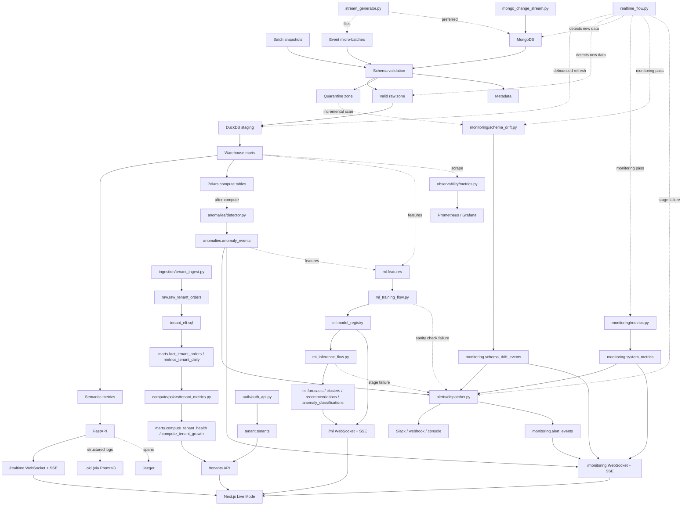

# Architecture

Phase 4 (`PHASE4-REALTIME&STREAMING.md`) adds the dashed edges: `stream_generator.py` produces events continuously (into Mongo or local files), `mongo_change_stream.py` watches MongoDB for changes in real time, `realtime_flow.py` detects new work from either path and triggers a debounced staging/marts/compute refresh, and `/realtime`'s WebSocket/SSE layer pushes the resulting ingestion/ELT/compute/lineage updates to the frontend's Live Mode.

Phase 5 (`PHASE5-MONITORING.md`) adds the monitoring layer, which rides along inside `realtime_flow.py`'s existing cycle rather than running as a separate process: after each successful refresh, a monitoring pass runs `monitoring/metrics.py` (ingestion/ELT/compute/streaming reliability metrics), `monitoring/schema_drift.py` (an incremental scan of the quarantine zone, classifying `jsonschema` validation errors into drift types), and, right after Polars compute, `anomalies/detector.py` (rolling mean+std, EWMA, percentile thresholds, and z-scores across GMV, order velocity, inventory, pricing, event lag, retailer health, ingestion volume, and quarantine rate - purely statistical, no ML yet at that phase). Each writes to its own warehouse table with a lineage edge (`monitoring_metric_recorded`, `schema_drift_detected`, `anomaly_detected`), and anything that crosses a threshold or represents a pipeline stage failure (`ingestion_failure` / `elt_failure` / `compute_failure`) routes through `alerts/dispatcher.py` (`alert_dispatched` edge), which always persists to `monitoring.alert_events` first and then best-effort delivers to whichever of Slack webhook / generic webhook / console is configured in `config/alerts.yaml`. `api/monitoring_api.py`'s `/monitoring` WebSocket/SSE layer pushes new anomalies, alerts, metrics, and drift events to the same Next.js Live Mode frontend, on the five `/monitoring/*` pages.

Phase 6 (`PHASE6-ML.md`) adds the ML layer on top of Phase 5's statistical monitoring, as two standalone entry points rather than another stage inside `realtime_flow.py`'s cycle (training is comparatively expensive - refitting several models - so it runs on its own cadence, not on every debounced refresh). `ml/features/build_features.py` reads `marts.*` and `anomalies.anomaly_events` into a shared `ml.features` store; `ml_training_flow.py` builds features, trains and evaluates all four model types (forecasting, clustering, recommendations, the anomaly classifier), and registers/promotes/rolls back versions in `ml.model_registry` (`ml/registry.py`) based on each type's eval metric versus the currently active version; `ml_inference_flow.py` loads whichever version is active per model type and refreshes `ml.forecasts` / `ml.clusters` / `ml.recommendations` / `ml.anomaly_classifications`, meant to run far more often than training since it's just inference, not a refit. Both flows isolate each model type in its own try/except (one bad model type never blocks the others) and dispatch `ml_training_failure`/`ml_inference_failure` alerts through the same `alerts/dispatcher.py` Phase 5 established. `api/ml_api.py`'s `/ml` WebSocket/SSE layer pushes new forecasts, clusters, recommendations, and anomaly classifications to the same Next.js Live Mode frontend, on the six `/ml/*` pages.

Phase 7 (`PHASE7-DEPLOYMENT.md`) adds two things that don't change any of the above: a parallel, opt-in tenant pipeline, and a deployment/observability layer around the whole app. `auth/auth_api.py` issues JWTs against `multi_tenant/tenant_manager.py`'s tenant registry; `ingestion/tenant_ingest.py` tags records with `tenant_id` generically across every entity type, but only `orders` is carried further, through `tenant_elt.sql` -> `compute/polars/tenant_metrics.py` -> the `/tenants` API `api/tenant_api.py` exposes (auth-gated, unlike every route above it). This is deliberately not a second copy of the Phase 3-6 pipeline - it's a narrower, orders-only path that coexists with the single-tenant one, which keeps running exactly as it did through Phase 6. Separately, `observability/metrics.py` exposes a `/observability/metrics` Prometheus endpoint (re-reading tables the pipeline above already populates, not a second collection layer), `observability/logging.py` structures every process's stdout as JSON for Loki/Promtail to scrape, and `observability/tracing.py` wraps OpenTelemetry (optional) around API requests, exporting to Jaeger. `infra/cloud/` packages all of the above - and everything from Phase 1 on - into Dockerfiles, Terraform, and platform-specific deploy manifests; none of it changes what runs when you follow this repo's own Quick Start.
