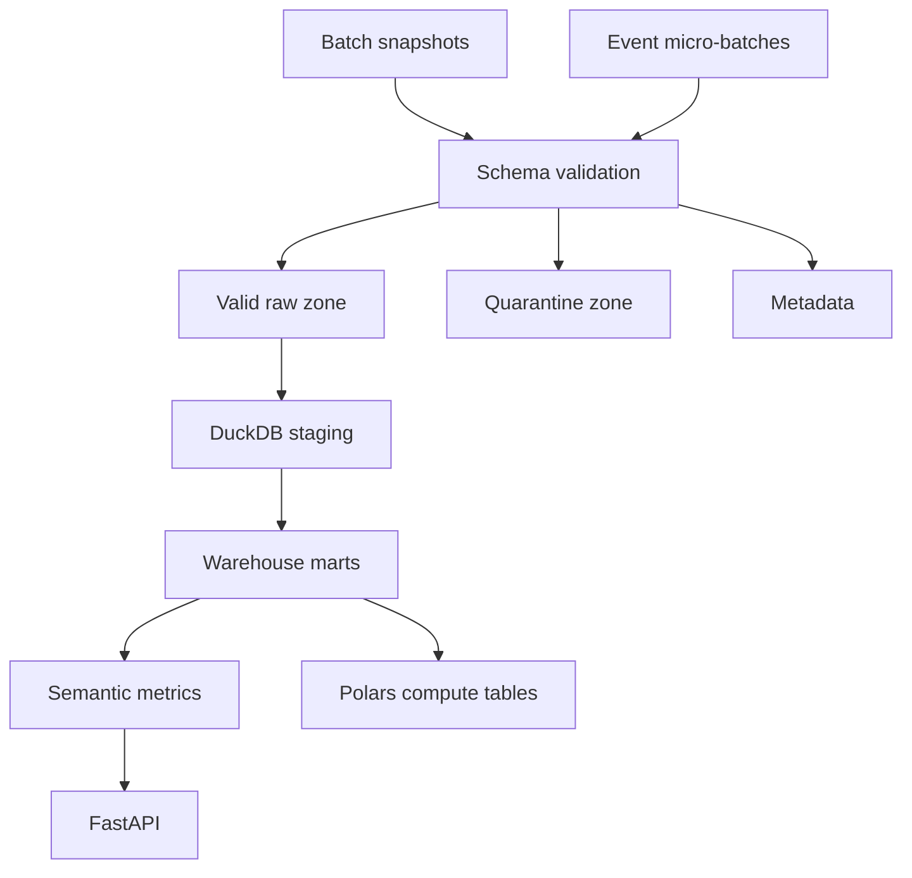

# Architecture

```mermaid
flowchart TD
  A["Batch snapshots"] --> B["Schema validation"]
  E["Event micro-batches"] --> B
  B --> C["Valid raw zone"]
  B --> D["Quarantine zone"]
  B --> M["Metadata"]
  C --> S["DuckDB staging"]
  S --> W["Warehouse marts"]
  W --> L["Semantic metrics"]
  W --> P["Polars compute tables"]
  L --> API["FastAPI"]
```

