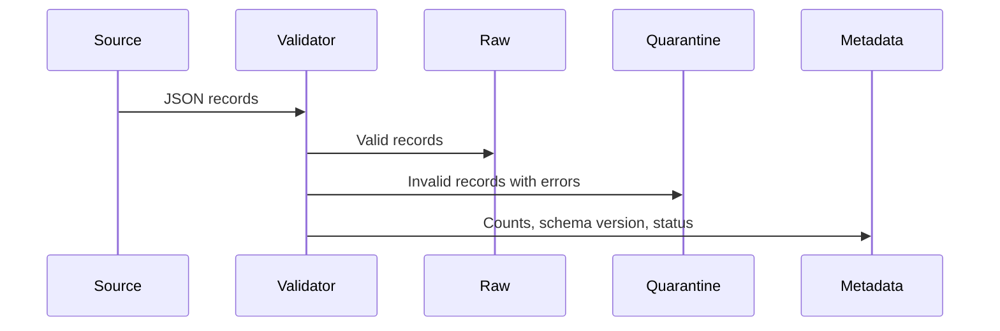

# Ingestion Flow

```mermaid
sequenceDiagram
  participant Source
  participant Validator
  participant Raw
  participant Quarantine
  participant Metadata
  Source->>Validator: JSON records
  Validator->>Raw: Valid records
  Validator->>Quarantine: Invalid records with errors
  Validator->>Metadata: Counts, schema version, status
```

