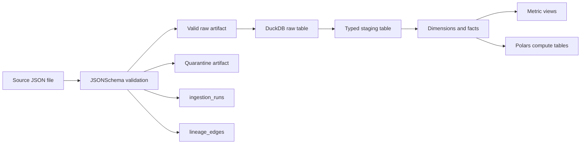

# Mini Faire Metadata And Lineage

This document describes how Mini Faire tracks ingestion metadata, lineage, and impact analysis across the local data platform. The design is intentionally lightweight, but it mirrors production data platform patterns: immutable source fingerprints, deterministic run IDs, path-level audit artifacts, table-level lineage, and queryable metadata in DuckDB.

## Metadata Contract

Each ingestion run writes one JSON metadata file and upserts the same record into DuckDB table `ingestion_runs`.

Metadata grain: one row per source file per entity or event type.

Primary key: `run_id`.

Deterministic run IDs:

- Batch: `batch_<entity>_<YYYY>_<MM>_<DD>_<file_stem>`
- Events: `event_<event_type>_<YYYY>_<MM>_<DD>_<HH>_<file_stem>`
- Mongo: `mongo_<entity>_<started_at_compact>` (one run per collection per poll/change-stream document; there is no source file, so the run ID is time-based rather than path-based)

Core fields:

- `run_id`: stable ingestion run identifier.
- `source`: `batch`, `events`, or `mongo`.
- `entity`: batch entity such as `retailers`, `products`, `orders`, or event type such as `order_created`, `order_paid`, `orders_shipped`, `inventory_updated`, `price_changed`. Mongo-sourced runs use the same entity names (`price_changed` has no Mongo collection mapping and is batch/event-only).
- `source_path`: original file path.
- `source_content_sha256`: SHA-256 fingerprint of the original file content.
- `partition_path`: source partition relative to the entity root.
- `contract_name`: JSONSchema contract used for validation.
- `valid_count` and `invalid_count`: validation outcomes.
- `valid_path`, `quarantine_path`, `metadata_path`: emitted audit artifacts.
- `started_at`, `completed_at`, `duration_ms`: timing metadata.
- `status`: `success` or `completed_with_quarantine`.

## Lineage Contract

Lineage is written to DuckDB table `lineage_edges`.

Lineage grain: one directed edge per run and transformation boundary.

Primary key: `(run_id, source_node, target_node, edge_type)`.

Edge types emitted by ingestion:

- `validated_to_valid_raw`: source file to valid raw JSON artifact.
- `validated_to_quarantine`: source file to quarantine artifact.
- `loaded_to_raw_table`: valid raw JSON artifact to DuckDB raw table.

Additional edge types emitted by the Phase 4 real-time layer (see "Phase 4 Real-Time Lineage" below):

- `streamed_from_generator`: `synthetic/stream_generator.py` to the event's file or Mongo document target.
- `change_stream_ingested`: a MongoDB change-stream insert/update/replace, on top of the normal `validated_to_valid_raw`/`loaded_to_raw_table` edges the same ingest call already emits.
- `change_stream_delete_observed`: a MongoDB change-stream delete (no document body to validate - see `ingestion/mongo_change_stream.py`).
- `realtime_orchestration_refresh`: `orchestration/realtime_flow.py` to `marts.*`, one per debounced rebuild+compute cycle.

Additional edge types emitted by the Phase 5 monitoring layer (see "Phase 5 Monitoring Lineage" below):

- `anomaly_detected`: the source metric/table (e.g. `marts.compute_retailer_health`) to `anomalies.anomaly_events`, one per detected anomaly.
- `schema_drift_detected`: the scanned quarantine zone to `monitoring.schema_drift_events`, one per scan that finds drift (not one per record - see below).
- `monitoring_metric_recorded`: the source system (`ingestion`, `elt`, `compute`, or `streaming`) to `monitoring.system_metrics`, one per metrics pass.
- `alert_dispatched`: the triggering event (an anomaly, a drift scan, a metrics threshold breach, or a pipeline failure) to `monitoring.alert_events`, one per dispatched alert.

Additional edge types emitted by the Phase 6 ML layer (see "Phase 6 ML Lineage" below):

- `ml_feature_built`: the source warehouse table(s) a feature group reads (e.g. `marts.metrics_retailer_daily`) to `ml.features`, one per feature group per `build_all_features()` call (not one per row - see `ml/features/build_features.py`'s module docstring).
- `ml_model_registered`: `ml_training://<model_name>` to `ml.model_registry`, one per `register_model()` call (i.e. one per trained version, whether or not it gets promoted).
- `ml_forecast_generated`: the source warehouse tables forecasting reads to `ml.forecasts`, one per `persist_forecasts()` call.
- `ml_cluster_assigned`: `ml.features` to `ml.clusters`, one per `persist_clusters()` call.
- `ml_recommendation_generated`: `marts.fact_orders` to `ml.recommendations`, one per `persist_recommendations()` call.
- `ml_anomaly_classified`: `anomalies.anomaly_events` to `ml.anomaly_classifications`, one per `persist_classifications()` call.

Additional edge types emitted by the Phase 8 simulation layer (see "Phase 8 Simulation & Digital Twin Lineage" below):

- `scenario_simulated`: the digital twin snapshot to `simulation.scenario_results`, one per `run_scenario()` call.
- `counterfactual_simulated`: `marts.fact_orders` to `simulation.counterfactual_results`, one per `run_counterfactual()` call.

Additional edge types emitted by the Phase 9 autonomy layer (see "Phase 9 Autonomy Lineage" below):

- `autonomy_agent_decided`: the digital twin snapshot plus the ML/anomaly tables it already carries, to one agent type's own `autonomy.<agent_type>_actions` table, one per agent type per round.
- `autonomy_conflict_resolved`: the five `autonomy.*_actions` tables to `autonomy.conflicts`, one per `run_agent_flow()` run that resolved at least one entity-level collision.

Static transformation lineage is encoded by repository SQL file names and the DAG/flow definitions:

- `raw.raw_retailers` -> `staging.stg_retailers` -> `marts.dim_retailer`
- `raw.raw_products` -> `staging.stg_products` -> `marts.dim_product`
- `raw.raw_orders` -> `staging.stg_orders` -> `marts.fact_orders`
- `raw.raw_order_created_events` -> `staging.stg_order_created_events` -> `marts.fact_orders_events`
- `raw.raw_order_paid_events` + `raw.raw_orders` -> `staging.stg_order_paid_events` -> `marts.fact_orders_events`
- `raw.raw_orders_shipped_events` + `raw.raw_orders` -> `staging.stg_orders_shipped_events` -> `marts.fact_orders_events`
- `raw.raw_inventory_updated_events` -> `staging.stg_inventory_updated_events` -> `marts.fact_product_events`
- `raw.raw_price_changed_events` -> `staging.stg_price_changed_events` -> `marts.fact_product_events`
- `marts.fact_orders` -> `marts.metrics_retailer_daily`
- `marts.fact_orders` and `marts.dim_product` -> `marts.metrics_product_velocity`
- `marts.fact_orders` -> `marts.metrics_order_profitability`
- `marts.fact_orders` -> `marts.compute_retailer_health`
- `marts.fact_orders_events` -> `marts.compute_event_microbatch_summary`
- `marts.dim_product` and `marts.fact_orders` -> `marts.compute_product_reorder_risk`
- `marts.dim_product` and `marts.fact_orders` -> `marts.compute_brand_contribution`
- `marts.dim_retailer` and `marts.fact_orders` -> `marts.compute_retailer_cohort_retention`
- `marts.fact_orders_events` -> `marts.compute_event_lag_summary`
- `marts.fact_product_events` and `marts.dim_product` -> `marts.compute_inventory_movement`
- `marts.fact_orders_events` -> `marts.compute_order_lifecycle`

Mongo is an additional upstream for the batch entities and the full event chain, including `price_changed` (added in Phase 4 - see config/mongo.yaml). Its valid artifacts land in the same flat raw zone globbed by `ingestion/load_duckdb.py`'s `RAW_TABLE_SOURCES` alongside the batch/event zones, so `raw.raw_retailers` etc. are a union of whichever upstream(s) produced valid records - lineage still traces back through `lineage_edges` by `run_id` and `source_node` (`mongo://rmap.<collection>` for Mongo-sourced rows vs. a file path for batch/event rows).

## End-To-End Flow



## Batch Snapshot Lineage

`data/batch/retailers/YYYY/MM/DD/retailers.json`
-> `data/raw/batch/retailers/YYYY/MM/DD/<run_id>/valid/retailers.json`
-> `raw.raw_retailers`
-> `staging.stg_retailers`
-> `marts.dim_retailer`
-> `marts.metrics_retailer_daily`

`data/batch/products/YYYY/MM/DD/products.json`
-> `data/raw/batch/products/YYYY/MM/DD/<run_id>/valid/products.json`
-> `raw.raw_products`
-> `staging.stg_products`
-> `marts.dim_product`
-> `marts.metrics_product_velocity`

`data/batch/orders/YYYY/MM/DD/orders.json`
-> `data/raw/batch/orders/YYYY/MM/DD/<run_id>/valid/orders.json`
-> `raw.raw_orders`
-> `staging.stg_orders`
-> `marts.fact_orders`
-> `marts.metrics_retailer_daily`
-> `marts.metrics_order_profitability`
-> `marts.compute_retailer_health`
-> `marts.compute_product_reorder_risk`
-> `marts.compute_brand_contribution`

## Event Micro-Batch Lineage

`data/events/order_created/YYYY/MM/DD/HH/events.json`
-> `data/raw/events/order_created/YYYY/MM/DD/HH/<run_id>/valid/events.json`
-> `raw.raw_order_created_events`
-> `staging.stg_order_created_events`
-> `marts.fact_orders_events`
-> `marts.compute_event_microbatch_summary`
-> `marts.compute_event_lag_summary`

`data/events/inventory_updated/YYYY/MM/DD/HH/events.json`
-> `data/raw/events/inventory_updated/YYYY/MM/DD/HH/<run_id>/valid/events.json`
-> `raw.raw_inventory_updated_events`
-> `staging.stg_inventory_updated_events`
-> `marts.fact_product_events`
-> `marts.compute_inventory_movement`

## MongoDB Ingestion Lineage

Every document pulled from MongoDB (`ingestion/mongo_ingest.py`) or received via a change stream (`ingestion/mongo_ingest_change_stream.py`) is written to its own file and validated individually, since a Mongo pull has no single source file to point `source_path` at:

`mongo://rmap.retailers` (one document)
-> `data/raw/retailers/<run_id>/source/<uuid>.json` (pre-validation copy, `_id`/`updated_at` stripped before validation)
-> `data/raw/retailers/<run_id>/valid/<uuid>.json` or `data/raw/retailers/<run_id>/quarantine/<uuid>.json`
-> `raw.raw_retailers` (unioned with any batch-sourced valid files by `ingestion/load_duckdb.py`)
-> `staging.stg_retailers`
-> `marts.dim_retailer`

The event-chain collections (`order_created`, `order_paid`, `orders_shipped`, `inventory_updated`, `price_changed`) follow the same per-document pattern into `data/raw/<event_type>/<run_id>/...` and from there into `raw.raw_<event_type>_events`, unioned with their batch/event-file counterparts.

`ingestion/mongo_ingest.py` tracks a per-collection high watermark (the `updated_at` field, configured in `config/mongo.yaml`) in `data/raw/_mongo_watermarks.json` so repeated polls only pull new/changed documents. `synthetic/write_mongo.py` can stamp and insert synthetic records directly into these collections so the whole Mongo path - pull or change stream - can be exercised end to end without a real external writer.

## Synthetic Data Lineage

`synthetic/generator.py` produces the same shape of records as the hand-written sample data (including a configurable rate of deliberately-invalid records, see `config/synthetic.yaml`'s `anomalies.invalid_record_rate`). `orchestration/synthetic_flow.py` writes them through `synthetic/write_raw.py` into the normal `data/batch/**` / `data/events/**` source zones and then calls the same `ingest_all_batches()` / `ingest_all_events()` / `rebuild_warehouse()` / `persist_compute_metrics()` sequence as `scripts/run_demo.py`, so synthetic runs get identical `run_id`s, metadata, and lineage edges to hand-authored files - there is no separate "synthetic" edge type or table.

## Phase 4 Real-Time Lineage

Three long-lived services (`synthetic/stream_generator.py`, `ingestion/mongo_change_stream.py`, `orchestration/realtime_flow.py`) extend the same pipeline into near-real time. Each streamed event still goes through the identical validate -> quarantine -> metadata -> lineage path as a batch/event file or a Mongo poll - streaming changes *when* and *how often* ingestion runs, not the contract each record is checked against.

`synthetic/stream_generator.py` (files sink):

`synthetic/stream_generator.py` (heartbeat tick)
-> `data/events/<event_type>/YYYY/MM/DD/HH/<uuid>.json`
-> `ingestion/event_ingestion.py`'s normal per-file ingest (`validated_to_valid_raw` / `validated_to_quarantine` / `loaded_to_raw_table`)
-> an additional `streamed_from_generator` edge tagging the run as streaming-sourced
-> `raw.raw_<event_type>_events` -> ... (same as the Event Micro-Batch Lineage above)

`synthetic/stream_generator.py` (mongo sink, the spec's preferred path):

`synthetic/stream_generator.py` -> `mongo://rmap.<collection>` (one inserted document)
-> (by default, immediately) `ingestion/mongo_ingest.py`'s per-document ingest, exactly as a poll would produce
-> an additional `streamed_from_generator` edge
-> `raw.raw_<event_type>_events` -> ...

`ingestion/mongo_change_stream.py` independently watches the same collections and can pick up the identical insert via its own change-stream subscription - producing a second `ingestion_runs` row (different `run_id`, since Mongo watermarks/run IDs are time-based) plus a `change_stream_ingested` edge. This is expected, not a bug: `ingestion_runs` is keyed by `run_id` so both rows persist for audit, and `marts.*` tables delete-insert by natural/event key so re-ingesting the same document is a no-op downstream. Deletes have no document body to validate, so they get a `change_stream_delete_observed` edge plus a small audit-only JSON artifact under `data/raw/<entity>/<run_id>/deletes/` instead of going through the validate/quarantine path.

`orchestration/realtime_flow.py` polls for new source files and new Mongo change-stream events, debounces bursts, and - once triggered - runs the exact same `ingest_all_batches()` / `ingest_all_events()` / `rebuild_warehouse()` / `persist_compute_metrics()` sequence as `scripts/run_demo.py`, then emits one `realtime_orchestration_refresh` edge (`orchestration://realtime_flow` -> `marts.*`) per cycle so it's visible which warehouse refreshes were triggered by the real-time layer versus a manual `run_demo.py` invocation.

Each of the three services writes a small heartbeat JSON file under `data/state/` (`ingestion/heartbeat.py`) so `api/realtime_api.py`'s `/realtime/health` can report whether each is actually running - they run as separate OS processes, so there's no in-process object the API server could otherwise ask.

## Phase 5 Monitoring Lineage

The monitoring layer (`anomalies/detector.py`, `monitoring/metrics.py`, `monitoring/schema_drift.py`, `alerts/dispatcher.py`) watches the warehouse and the pipeline itself rather than an upstream source, so its lineage edges point from an internal system/table to a monitoring artifact instead of from a source file to a raw table.

**Anomaly detection** (`anomalies/detector.py`, run after each compute pass - see "Integration with realtime_flow.py" below):

`marts.compute_retailer_health` / `marts.fact_orders` / `marts.fact_orders_events` / `marts.fact_product_events` / `ingestion_runs` / quarantine zone (whichever the detector reads for that anomaly type)
-> rolling mean+std / EWMA / percentile / z-score check against a baseline (`data/state/_anomaly_baseline.json` for the EWMA retailer-health baseline; the rest recompute their window each pass)
-> `anomalies.anomaly_events` (one row per anomaly, `anomaly_detected` edge)
-> (unless `dispatch=False`) `alerts/dispatcher.py`'s `dispatch_alert("anomaly_detected", ...)` -> `monitoring.alert_events` (`alert_dispatched` edge) -> configured channels (Slack / generic webhook / console)

**System metrics** (`monitoring/metrics.py`, run after ingestion/ELT/compute and on its own pass over streaming heartbeats):

`ingestion_runs` / `elt_model_runs` / `marts.compute_model_runs` / `data/state/*.json` heartbeats
-> per-category aggregation (ingestion latency/throughput/error rate/quarantine rate/schema-drift frequency/change-stream lag; ELT run duration/failure rate/incremental volume/watermark lag; compute run duration/failure rate/incremental volume; streaming event rates/backlog/lag, the last diffed against `data/state/_monitoring_metrics_baseline.json`'s cumulative counters)
-> `monitoring.system_metrics` (one row per metric, `monitoring_metric_recorded` edge)
-> threshold checks (`config/alerts.yaml`'s `thresholds:` block) and heartbeat-staleness checks -> `dispatch_alert()` for `ingestion_latency_threshold_exceeded`, `quarantine_rate_spike`, `mongo_change_stream_disconnect`, `synthetic_generator_failure` as applicable -> `monitoring.alert_events`

**Schema drift** (`monitoring/schema_drift.py`, incremental scan of the quarantine zone via `data/state/_schema_drift_seen.json`, a path -> mtime map so already-scanned quarantine files aren't re-classified):

quarantine artifact (`errors` array from the original JSONSchema `ValidationError`)
-> classification into missing field / new field / type mismatch / enum violation / timestamp format issue, via `jsonschema.ValidationError.validator`/`.validator_value`/`.path`/`.message` (no new dependency - this reads the error object jsonschema already produces)
-> `monitoring.schema_drift_events` (one row per classified drift, `schema_drift_detected` edge)
-> at most one summary `dispatch_alert("schema_drift_detected", ...)` per scan call (not one per record - the synthetic generator's ~20% invalid rate would otherwise flood every channel) -> `monitoring.alert_events`

**Alert dispatch** (`alerts/dispatcher.py`, the single entry point every module above calls):

Every `dispatch_alert()` call always persists to `monitoring.alert_events` first (`alert_dispatched` edge from the triggering source to the alert row), then attempts delivery through whichever channels `config/alerts.yaml` enables (Slack webhook, generic webhook, console fallback) at or above `minimum_severity`, and never raises - a delivery failure is recorded in the persisted row's `dispatched_channels` rather than interrupting the caller. `orchestration/realtime_flow.py` also calls `dispatch_alert()` directly for `ingestion_failure`/`elt_failure`/`compute_failure` (the only place with direct visibility into an in-progress pipeline stage failing), so those three alert types have no separate detector module - the edge's source node is `orchestration://realtime_flow` rather than a warehouse table.

Every monitoring/alerting table is created defensively (`create schema if not exists` / `create table if not exists`) by its owning module the first time it runs, same as `marts.compute_model_runs` in `compute/polars/compute_metrics.py` - see `governance/monitoring.sql` for a documentation-only mirror of the DDL and `warehouse/duckdb/init.sql` for the `anomalies`/`monitoring` schema declarations.

## Phase 6 ML Lineage

The ML layer (`ml/features/build_features.py`, `ml/models/*.py`, `ml/registry.py`) reads the warehouse and Phase 5's anomaly table as training/inference input rather than an upstream source, so - like Phase 5's monitoring lineage - its edges point from an internal system/table to an ML artifact rather than from a source file to a raw table. Every table lives in the `ml` schema (`ml.features`, `ml.model_registry`, `ml.forecasts`, `ml.clusters`, `ml.recommendations`, `ml.anomaly_classifications`), each created defensively by its owning module on first use, same convention as the `monitoring`/`anomalies` schemas.

**Feature engineering** (`ml/features/build_features.py`'s `build_all_features()`, called once per `orchestration/ml_training_flow.py` run - every model type reads from the same snapshot):

`marts.metrics_retailer_daily` / `marts.fact_orders` / `marts.fact_orders_events` / `marts.fact_product_events` / `marts.dim_product` / `marts.compute_product_reorder_risk` / `anomalies.anomaly_events` (whichever a feature group reads)
-> retailer / product / order / event feature builders
-> `ml.features` (one `ml_feature_built` edge per feature group, not per row)

**Model training** (`orchestration/ml_training_flow.py`, one isolated pass per model type - forecasting, clustering, recommendations, anomaly_classifier):

`ml.features` (plus `anomalies.anomaly_events` directly, for the anomaly classifier - see `ml/models/anomaly_classifier.py`)
-> `evaluate_*()` (backtest MAE for forecasting, silhouette score for clustering, held-out accuracy/F1 for the anomaly classifier, a coverage metric with no promotion gate for recommendations)
-> `ml/registry.py`'s `register_model()` (new version, `status='inactive'`) -> `ml.model_registry` (`ml_model_registered` edge)
-> promotion gate (`_is_improvement()`: beats the active version's eval metric by `config/ml.yaml`'s `model_promotion.min_relative_improvement`, or there is no active version yet) -> `activate_model()` if promoted, demoting the previously active version to `status='superseded'`
-> post-activation sanity check: run the newly-activated version's real inference function and persist the result; on failure, `rollback_model()` reactivates the last genuinely-active version (`status='rolled_back'` on the one that just failed) and dispatches `ml_training_failure` via `alerts/dispatcher.py`
-> one `elt_model_runs` row per model type per training run (`load_strategy='ml_training'`, status one of `success` / `not_promoted` / `rolled_back` / `sanity_check_failed_no_rollback_target` / `skipped_insufficient_data`)

**Model inference** (`orchestration/ml_inference_flow.py`, run more often than training - each of the four model types isolated in its own try/except):

`ml.model_registry` (`get_active_model()` per model_name)
-> refit-from-warehouse (forecasting/clustering/recommendations) or load the pickled artifact via `load_artifact()` (anomaly classifier - the only model type with a persisted estimator, see `ml/models/anomaly_classifier.py`'s module docstring)
-> `ml.forecasts` (`ml_forecast_generated` edge) / `ml.clusters` (`ml_cluster_assigned` edge) / `ml.recommendations` (`ml_recommendation_generated` edge) / `ml.anomaly_classifications` (`ml_anomaly_classified` edge)
-> on failure, `alerts/dispatcher.py`'s `dispatch_alert("ml_inference_failure", ...)`, and that model type's predictions are simply left stale until the next successful pass

Forecast/cluster/recommendation/classification rows use deterministic entity-keyed IDs (e.g. `forecast_{forecast_type}_{entity_id}_{target_date}`, `cluster_{entity_type}_{entity_id}`) and `insert or replace`, so each inference pass updates the current prediction rather than accumulating history - unlike `ml.features`, `ml.model_registry`, `anomalies.anomaly_events`, and `monitoring.alert_events`, which all intentionally keep every row.

`api/ml_api.py`'s `/ml` WebSocket/SSE layer diff-polls the four prediction tables (not `ml.model_registry` or `ml.features` - registry changes are infrequent and already visible via a REST refetch, and features are an internal input rather than something a dashboard live-tails) and pushes new rows to the frontend's six `/ml/*` pages, same diff-poll pattern as `/realtime/ws` and `/monitoring/ws`.

## Phase 7 Tenant & Deployment Lineage

Phase 7 (`PHASE7-DEPLOYMENT.md`) adds a tenant-scoped lineage path that runs alongside the single-tenant lineage above, not in place of it - every edge type described earlier in this document still applies unchanged to the non-tenant pipeline. Every table below lives in either the `tenant` schema (`tenant.tenants`, created by `multi_tenant/tenant_manager.py`) or under the tenant-prefixed names `warehouse/duckdb/tenant_elt.sql` / `compute/polars/tenant_metrics.py` create, same defensive-create-on-first-use convention as the `monitoring`/`anomalies`/`ml` schemas before it.

**Tenant provisioning** (`auth/auth_api.py`'s `signup()`, one-time per new tenant):

`POST /auth/signup` -> `multi_tenant/tenant_manager.py`'s `generate_tenant_id()` + `create_tenant()` (`tenant_created` edge) -> `tenant.tenants` -> `auth/auth_models.py`'s `create_user()` creates the signing-up user as that tenant's first `tenant_admin` -> `auth.users`

**Tenant-aware ingestion** (`ingestion/tenant_ingest.py`, generic across every entity type - see that module's docstring for why only `orders` continues past this stage):

Source file (any entity, any tenant) -> `ingest_tenant_file()` validates via the same `contracts/*.json`/`ingestion/validate.py` every non-tenant ingestion path uses -> tenant-tagged valid/quarantine records under `data/raw/tenants/<tenant_id>/<entity>/<run_id>/` -> `ingestion_runs` + `lineage_edges` (`tenant_ingestion_run` edge), same metadata contract as the rest of this document, plus a `tenant_id` column

**Tenant ELT & compute** (orders only - `warehouse/duckdb/tenant_elt.sql`, `compute/polars/tenant_metrics.py`):

`ingestion/tenant_ingest.py`'s `refresh_tenant_raw_tables()` -> `raw.raw_tenant_orders` (every tenant's ingested order files, unioned)
-> `staging.stg_tenant_orders` (dedup by `tenant_id, order_id`)
-> `marts.fact_tenant_orders` (incremental delete-insert by `tenant_id, order_id` - same strategy as `marts.fact_orders`, see "Incremental ELT" below, just keyed with `tenant_id` in front)
-> `marts.metrics_tenant_daily` (view: per-tenant daily order count/GMV/net revenue/AOV)
-> `compute/polars/tenant_metrics.py`'s `tenant_health_frame()` / `tenant_growth_frame()` -> `marts.compute_tenant_health` / `marts.compute_tenant_growth` (`elt_model_runs` rows, `model_name='tenant_health'`/`'tenant_growth'`, same `insert_compute_audit()` bookkeeping every other Polars compute model uses)

**Tenant forecasting** (`ml/tenant_models/tenant_forecasting.py`, the tenant counterpart of Phase 6's per-retailer GMV forecast):

`marts.metrics_tenant_daily` -> `forecast_tenant_gmv()` -> `ml.model_registry` (`model_name` per tenant, via `tenant_forecasting_model_name()`) -> `ml.forecasts` (`forecast_type='tenant_gmv_daily'`, `entity_type='tenant'`) - same registry/promotion machinery Phase 6 established, not a parallel system.

**Serving** (`api/tenant_api.py`, auth-gated via `require_tenant()` - the first lineage-adjacent surface in this document that isn't open by default):

`tenant.tenants` / `marts.compute_tenant_health` / `marts.compute_tenant_growth` / `marts.metrics_tenant_daily` -> `GET /tenants`, `/tenants/{tenant_id}`, `/tenants/{tenant_id}/health`, `/tenants/{tenant_id}/growth`, `/tenants/{tenant_id}/daily` -> the frontend's `/tenants` page (`frontend/lib/api.ts`'s `authApi`, `frontend/lib/auth.ts`, `frontend/lib/tenant.ts`)

**What does not carry a `tenant_id`.** Every mart from Phase 1-6 (`marts.metrics_retailer_daily`, `marts.compute_retailer_health`, `marts.compute_product_reorder_risk`, `anomalies.anomaly_events`, `ml.forecasts` for non-tenant entity types, and so on) was built before tenancy existed and has no `tenant_id` column. This is a deliberate scope boundary, not an oversight: retrofitting one would mean either fabricating a tenant assignment for historical rows that were never tenant-scoped, or silently returning nothing. `frontend/app/tenants/page.tsx`'s header comment documents the same boundary on the frontend side.

**Observability lineage** (`observability/metrics.py`, `observability/logging.py`, `observability/tracing.py` - read-only with respect to everything above):

`monitoring.system_metrics` / `elt_model_runs` / `anomalies.anomaly_events` / `marts.compute_tenant_health` -> `refresh_from_warehouse()` (re-exposes existing values, does not recompute them) -> `GET /observability/metrics` (Prometheus exposition format) -> Prometheus -> Grafana. Every process's stdout (JSON, via `configure_json_logging()`) -> Promtail -> Loki -> Grafana. `api/metrics_api.py` request spans (via `observability/tracing.py`'s middleware, when the `observability` extra is installed) -> Jaeger.

## Phase 8 Simulation & Digital Twin Lineage

Phase 8 (`PHASE8-SIMULATION.md`) adds a simulation layer that reads the warehouse/anomaly/ML tables every earlier phase already builds as its input snapshot, the same "read existing state as input, don't duplicate it" posture Phase 6's ML lineage takes toward the warehouse. Both new tables live in the `simulation` schema (`simulation.scenario_results`, `simulation.counterfactual_results`), created defensively by their owning module on first use, same convention as `monitoring`/`anomalies`/`ml`/`tenant`.

**Digital twin snapshot** (`simulation/digital_twin.py`'s `load_digital_twin()`, called at the start of every scenario/counterfactual/orchestrated run - never persisted itself, purely an in-memory read):

`marts.dim_retailer` / `marts.dim_product` / `marts.compute_retailer_health` / `marts.compute_product_reorder_risk` / `anomalies.anomaly_events` / `ml.forecasts` / `ml.clusters` / `ml.recommendations` / `ml.anomaly_classifications` (classic twin, `tenant_id=None`) or `marts.fact_tenant_orders` / `marts.metrics_tenant_daily` / `marts.compute_tenant_health` / `marts.compute_tenant_growth` (tenant twin, `tenant_id=<id>`, narrower - see that module's docstring for which fields go `None` rather than fabricated)
-> `DigitalTwinState` (in-memory only; `clone()` deep-copies for any downstream mutation)

**Agent construction** (`simulation/scenario_engine.py`'s `build_agents()`, called fresh inside every single run - agents are never persisted, so there is no `agent_built`-style table or lineage edge for this step, only the scenario/counterfactual edges below that consume the agents' output):

`DigitalTwinState` + `marts.fact_orders`/`marts.fact_tenant_orders` (retailer-product order history, to wire each `RetailerAgent` to the products it actually carries)
-> one `MarketplaceAgent`, one `RetailerAgent` per retailer, one `ProductAgent` per product (`simulation/agents/*.py`), each with its own `random.Random` seeded from the run's seed

**Scenario simulation** (`simulation/scenario_engine.py`'s `run_scenario()`, one of nine `SCENARIO_TYPES`):

`DigitalTwinState.clone()` x2 (baseline branch, scenario branch, same seed) -> scenario mutation applied to the scenario branch only (`_apply_scenario_setup()`) -> both branches run forward identically via `_run_ticks()` -> diff (GMV/velocity/inventory/retailer health, plus the two documented heuristic proxies `_cluster_movement()`/`_predicted_recommendations()` - not re-fits of `ml/models/clustering.py`/`recommendations.py`) -> `ScenarioResult` -> `persist_scenario_result()` -> `simulation.scenario_results` (`scenario_simulated` edge)

**Counterfactual replay** (`simulation/counterfactuals.py`'s `run_counterfactual()`, one of four `COUNTERFACTUAL_TYPES`):

`marts.fact_orders` (real historical rows, optionally date-windowed) -> `_apply_counterfactual_filter()` (remove/modify, never mutates the source rows) -> `_aggregate_retailers()`/`_aggregate_products()` (actual vs. counterfactual) -> `_diff_retailer_aggregates()`/`_diff_product_aggregates()` -> `_build_twin_from_aggregates()` x2 (joined onto `marts.dim_retailer`/`dim_product` for descriptive fields; each product's `inventory_count` held at today's current value - a documented simplification, not retroactive reconstruction) -> both twins replayed forward via `scenario_engine.build_agents()`/`_run_ticks()` -> `CounterfactualResult` -> `persist_counterfactual_result()` -> `simulation.counterfactual_results` (`counterfactual_simulated` edge)

**Orchestration** (`orchestration/simulation_flow.py`'s `run_simulation_flow()` - the `python orchestration/simulation_flow.py` entry point Section 8 asks for):

`load_digital_twin()` -> agent preview (count only, not reused for the runs below) -> `scenario_engine.run_baseline_projection()` (a plain seeded forward projection, no scenario mutation - not persisted, logged only) -> a batch of `run_scenario()` calls (data-derived defaults, or explicit specs from a caller) -> a batch of `run_counterfactual()` calls (same) -> one `elt_model_runs` row per scenario/counterfactual attempt regardless of outcome (`load_strategy='simulation_scenario'`/`'simulation_counterfactual'`, `model_name`=the specific scenario_type/counterfactual_type) -> on any individual spec's failure, `simulation_scenario_failure`/`simulation_counterfactual_failure` dispatched through `alerts/dispatcher.py` (the same one every earlier phase uses), without blocking the rest of the batch

**Serving** (`api/simulation_api.py`, open by default like `/ml`/`/monitoring`/`/realtime` - `api/tenant_api.py`'s docstring already notes those three stay open):

`simulation.scenario_results` / `simulation.counterfactual_results` -> `GET /simulation/results`, `/simulation/results/scenario/{id}`, `/simulation/results/counterfactual/{id}` -> the frontend's `/simulation/results` page. `POST /simulation/scenarios` / `/simulation/counterfactuals` -> `run_scenario()`/`run_counterfactual()` directly (the interactive, single-run counterpart to `/simulation/run`'s batch). `/simulation/ws` / `/simulation/stream` diff-poll both result tables by `completed_at` every 2s (same pattern as `/realtime/ws`/`/monitoring/ws`/`/ml/ws`) and push new rows to the frontend's five `/simulation/*` pages - progress push is row-arrival granularity (a completed run shows up), not a true intra-run percentage, since each run resolves in one synchronous call with no natural mid-run checkpoint to report.

## Phase 9 Autonomy Lineage

Phase 9 (`PHASE9-AUTONOMY.md`) adds an autonomous-agent decision layer that reads the digital twin plus the ML/anomaly/monitoring tables every earlier phase already builds - the same "read existing state as input, don't duplicate it" posture Phase 6's ML lineage and Phase 8's simulation lineage both already take. Every table lives in the `autonomy` schema (`autonomy.pricing_actions`, `autonomy.inventory_actions`, `autonomy.demand_actions`, `autonomy.anomaly_actions`, `autonomy.retailer_strategy_actions`, `autonomy.conflicts`), each created defensively by its owning module on first use, same convention as `monitoring`/`anomalies`/`ml`/`tenant`/`simulation`. Unlike every schema before it, this is also the first layer whose lineage terminates by writing BACK into `simulation`'s own state (`DigitalTwinState`) rather than only producing new downstream tables - see "Decision application" below.

**Agent decision** (`autonomy/agent_framework.py`'s `BaseAutonomousAgent.decide()`, one call per agent type per round - never mutates the twin itself, only proposes):

`simulation/digital_twin.py`'s `DigitalTwinState` (already carrying `ml.forecasts`/`ml.clusters`/`ml.recommendations`/`ml.anomaly_classifications` and `anomalies.anomaly_events` - see `load_digital_twin()`) + `AgentContext.pipeline_healthy` (`monitoring.alert_events`, read directly since it's the one signal `DigitalTwinState` doesn't already carry)
-> each of the five agent modules' `_decide_one()`/`_decide_operational()` decision ladders
-> a list of `AgentAction` (`status='proposed'`, in-memory only at this point)

**Conflict resolution & application** (`orchestration/agent_flow.py`'s `_resolve_and_apply()`, one call per round):

proposed `AgentAction`s, sorted by the fixed `AGENT_TYPE_PRIORITY` order (`anomaly_response > inventory > pricing > retailer_strategy > demand`) and confidence
-> each agent's `enforce_constraints()` (safety-limit clamping, and the cooldown-entity check that rejects every later proposal for an entity a higher-priority agent already claimed - the conflict itself)
-> survivors: each agent's `act()` -> real `DigitalTwinState` mutation (`apply_price_change()`/`apply_inventory_delta()` for most action types; `retailer_strategy_agent.py`'s four operational action types instead call `scenario_engine.advance_twin(..., retailer_strategy_overrides={...})`, since `RetailerStrategy` has no twin field of its own to mutate directly; `anomaly_response_agent.py`'s two trigger action types call `scenario_engine.run_scenario()`/`counterfactuals.run_counterfactual()` directly, each producing its own ordinary `scenario_simulated`/`counterfactual_simulated` edge on top of this section's edges)
-> rejected proposals recorded as `status='rejected'`, each contested entity producing one conflict record (`conflict_id`/`run_id`/entity/winning action/rejected action)

**Persistence** (`orchestration/agent_flow.py`'s `_persist_round()`/`_persist_conflicts()`, once per round):

resolved `AgentAction`s (applied, advisory, and rejected alike - a rejected action is as much a real audit-trail row as an applied one) -> `persist_actions()` -> `autonomy.<agent_type>_actions` (`autonomy_agent_decided` edge, `simulation.digital_twin,ml.forecasts,ml.clusters,ml.recommendations,anomalies.anomaly_events` -> `autonomy.<agent_type>_actions`)
conflict records -> `_persist_conflicts()` -> `autonomy.conflicts` (`autonomy_conflict_resolved` edge, the five `autonomy.*_actions` tables -> `autonomy.conflicts`)
-> one `elt_model_runs` row per agent_type per round (`load_strategy='autonomy_agent'`, `model_name`=agent_type), same audit convention as every other flow in this repo
-> on any individual agent's `decide()` raising, `autonomy_agent_failure` dispatched through `alerts/dispatcher.py` (the same one every earlier phase uses) without blocking the other four agents' rounds

**Reward attribution** (`orchestration/agent_flow.py`'s `run_agent_flow()`, once per whole run - not per round):

`scenario_engine.run_baseline_projection()` before the run's first round and after its last round (`gmv_before`/`gmv_after`) -> `reward = gmv_after - gmv_before`, attributed identically via `agent.score_reward()` to every non-rejected action from the entire run - except `anomaly_response_agent.py`'s `trigger_simulation_scenario`/`trigger_counterfactual_analysis` action types, whose `score_reward()` override substitutes the triggered scenario/counterfactual's own exact `predicted_gmv_delta`/`counterfactual_gmv_delta` (stashed onto `action.params["result_gmv_delta"]` during `_apply_one()`) instead of this run-level approximation

**Serving** (`api/autonomy_api.py`, open by default like `/ml`/`/monitoring`/`/simulation`):

`autonomy.<agent_type>_actions` (all five, Python-merged rather than SQL `UNION ALL` - see that module's `_read_all_actions()` docstring for why a union would fail closed for every table the instant even one doesn't exist yet) -> `GET /autonomy/actions`, `/autonomy/pricing`, `/inventory`, `/demand`, `/anomalies`, `/retailer-strategy` -> the frontend's `/autonomy/decisions` page. `autonomy.conflicts` -> `GET /autonomy/conflicts` -> `/autonomy/conflicts`. `POST /autonomy/run` -> `run_agent_flow()` directly (the interactive, on-demand counterpart to `python orchestration/agent_flow.py`). `/autonomy/ws` / `/autonomy/stream` diff-poll all five action tables plus `autonomy.conflicts` by `created_at` every 2s (same pattern as `/realtime/ws`/`/monitoring/ws`/`/ml/ws`/`/simulation/ws`), attaching a freshly-recomputed `performance` snapshot to every non-empty update rather than treating "resolutions" as a seventh topic (every `autonomy.conflicts` row already names both the winning and rejected action, so it already is a resolution record).

## Quarantine Handling

Invalid records are never dropped. They are written to the matching quarantine path with:

- `record_index`: source record offset within the file.
- `record`: original invalid payload.
- `errors`: JSONSchema validation errors with path and message.

Operational rule: a run with invalid records can still complete as `completed_with_quarantine`, but downstream raw loads only read `valid` artifacts.

## Useful Audit Queries

Recent ingestion runs:

```sql
select
  run_id,
  source,
  entity,
  valid_count,
  invalid_count,
  duration_ms,
  status,
  completed_at
from ingestion_runs
order by completed_at desc;
```

Files loaded into raw tables:

```sql
select
  run_id,
  entity,
  source_node as valid_artifact,
  target_node as raw_table,
  created_at
from lineage_edges
where edge_type = 'loaded_to_raw_table'
order by created_at desc;
```

Quarantine summary:

```sql
select
  entity,
  count(*) as runs_with_quarantine,
  sum(invalid_count) as invalid_records
from ingestion_runs
where invalid_count > 0
group by entity
order by invalid_records desc;
```

Impact analysis for order data:

```sql
select *
from lineage_edges
where entity in ('orders', 'order_created')
order by run_id, edge_type;
```

## Data Quality Checks

Minimum ingestion checks:

- `invalid_count = 0` for strict production-like runs.
- `source_content_sha256` unchanged on retry for deterministic reruns.
- `valid_count + invalid_count` equals the number of source records.
- `duration_ms` remains within expected local demo bounds.
- `lineage_edges` contains `validated_to_valid_raw`, `validated_to_quarantine`, and `loaded_to_raw_table` for each run.

Warehouse checks:

- Staging tables deduplicate by natural key or event ID.
- Facts preserve source natural keys for traceability.
- Metrics are views over marts, not independent copies.

## Incremental ELT

Mini Faire uses a pragmatic local-demo incremental strategy:

- Raw tables are recreated from valid raw artifacts on each run.
- Staging tables are recreated from raw tables with type casting and deduplication.
- Mart tables are persistent and updated incrementally.
- Metric views are recreated because they are lightweight semantic projections over marts.

Dimension strategy:

- `marts.dim_retailer`: delete and reinsert rows matching `retailer_id`.
- `marts.dim_product`: delete and reinsert rows matching `product_id`.

Fact strategy:

- `marts.fact_orders`: read staging rows where `order_ts` is at or beyond the last successful `fact_orders` high watermark, delete matching `order_id`, then insert the delta.
- `marts.fact_orders_events`: read staging rows where `event_ts` is at or beyond the last successful `fact_orders_events` high watermark, delete matching `event_id`, then insert the delta.

The high-watermark comparison is inclusive. That means retrying the same maximum timestamp reprocesses the boundary records, and the delete-insert business-key step prevents duplicates.

Each SQL model run appends one row to `elt_model_runs`. As of Phase 4, every Polars compute model (`compute/polars/compute_metrics.py`'s `insert_compute_audit()`) also appends a row - `load_strategy = 'polars_full_refresh'`, `business_key = 'n/a'`, `high_watermark = null` (compute models recompute fully from marts each run rather than watermark-filtering, and have no natural key of their own) - so the frontend's ELT Model Runs table/API (which only ever read `elt_model_runs`) reflects Polars compute activity too, not only DuckDB SQL model runs. `marts.compute_model_runs` is unaffected and still gets its own richer row (row/column counts, source tables) per model.

```sql
select
  model_name,
  target_table,
  load_strategy,
  business_key,
  source_row_count,
  affected_key_count,
  target_row_count,
  high_watermark,
  completed_at,
  status
from elt_model_runs
order by completed_at desc;
```

Incremental correctness checks:

- Re-running the pipeline should not increase mart row counts unless source data changed.
- `affected_key_count` should reflect only the current model delta.
- `target_row_count` should remain stable on retries.
- `high_watermark` should move forward only when newer fact/event timestamps arrive.

## Ownership

- Contracts: `contracts/*.schema.json`, `contracts/events/*.schema.json`
- Ingestion metadata writer: `ingestion/metadata.py`
- Batch ingestion: `ingestion/batch_ingestion.py`
- Event ingestion: `ingestion/event_ingestion.py`
- MongoDB ingestion (poll): `ingestion/mongo_ingest.py`, `config/mongo.yaml`
- MongoDB ingestion (change stream, Phase 3, bounded demo watch): `ingestion/mongo_ingest_change_stream.py`
- MongoDB ingestion (change stream, Phase 4, long-lived with resume tokens + backoff): `ingestion/mongo_change_stream.py`, `config/mongo.yaml`'s `change_streams:` block
- Synthetic data generation (batch): `synthetic/generator.py`, `synthetic/write_raw.py`, `synthetic/write_mongo.py`, `config/synthetic.yaml`
- Synthetic data generation (continuous streaming): `synthetic/stream_generator.py`, `config/synthetic.yaml`'s `streaming:` block
- Orchestration entry points: `orchestration/synthetic_flow.py`, `orchestration/mongo_flow.py`, `orchestration/realtime_flow.py`
- Warehouse load and ELT: `ingestion/load_duckdb.py`
- Streaming service health: `ingestion/heartbeat.py`, `data/state/*.json`, `api/realtime_api.py`'s `/realtime/health`
- Governance DDL: `governance/ingestion_runs.sql`
- Runtime metadata tables: `ingestion_runs`, `lineage_edges`, `elt_model_runs`
- Anomaly detection (Phase 5): `anomalies/detector.py`, baseline state in `data/state/_anomaly_baseline.json`
- Monitoring metrics (Phase 5): `monitoring/metrics.py`, baseline state in `data/state/_monitoring_metrics_baseline.json`
- Schema drift detection (Phase 5): `monitoring/schema_drift.py`, incremental scan state in `data/state/_schema_drift_seen.json`
- Alert dispatch (Phase 5): `alerts/dispatcher.py`, `config/alerts.yaml`
- Monitoring/alerts API (Phase 5): `api/monitoring_api.py`
- Governance DDL (Phase 5): `governance/monitoring.sql`
- Runtime monitoring tables (Phase 5): `anomalies.anomaly_events`, `monitoring.system_metrics`, `monitoring.schema_drift_events`, `monitoring.alert_events`
- Model registry (Phase 6): `ml/registry.py`, `config/ml.yaml` / `ml/config.py`, pickled artifacts in `data/ml_models/` (`ingestion/paths.py`'s `ML_MODELS_DIR`)
- Feature engineering (Phase 6): `ml/features/build_features.py`
- Forecasting / clustering / recommendations / anomaly classification models (Phase 6): `ml/models/forecasting.py`, `ml/models/clustering.py`, `ml/models/recommendations.py`, `ml/models/anomaly_classifier.py`
- ML orchestration (Phase 6): `orchestration/ml_training_flow.py`, `orchestration/ml_inference_flow.py`
- ML API (Phase 6): `api/ml_api.py`
- Runtime ML tables (Phase 6): `ml.features`, `ml.model_registry`, `ml.forecasts`, `ml.clusters`, `ml.recommendations`, `ml.anomaly_classifications`
- Digital twin (Phase 8): `simulation/digital_twin.py`
- Agent-based modeling (Phase 8): `simulation/agents/marketplace_agent.py`, `simulation/agents/retailer_agent.py`, `simulation/agents/product_agent.py`
- Scenario engine (Phase 8): `simulation/scenario_engine.py`
- Counterfactual engine (Phase 8): `simulation/counterfactuals.py`
- Simulation orchestration (Phase 8): `orchestration/simulation_flow.py`
- Simulation API (Phase 8): `api/simulation_api.py`
- Runtime simulation tables (Phase 8): `simulation.scenario_results`, `simulation.counterfactual_results`
- Simulation frontend (Phase 8): `frontend/app/simulation/`, `frontend/components/simulation/`, `frontend/lib/simulationRealtime.ts`
- Agent framework (Phase 9): `autonomy/agent_framework.py`
- Autonomous agents (Phase 9): `autonomy/pricing_agent.py`, `autonomy/inventory_agent.py`, `autonomy/demand_agent.py`, `autonomy/anomaly_response_agent.py`, `autonomy/retailer_strategy_agent.py`
- Autonomy orchestration (Phase 9): `orchestration/agent_flow.py`
- Autonomy API (Phase 9): `api/autonomy_api.py`
- Runtime autonomy tables (Phase 9): `autonomy.pricing_actions`, `autonomy.inventory_actions`, `autonomy.demand_actions`, `autonomy.anomaly_actions`, `autonomy.retailer_strategy_actions`, `autonomy.conflicts`
- Autonomy frontend (Phase 9): `frontend/app/autonomy/`, `frontend/components/autonomy/`, `frontend/lib/autonomyRealtime.ts`
