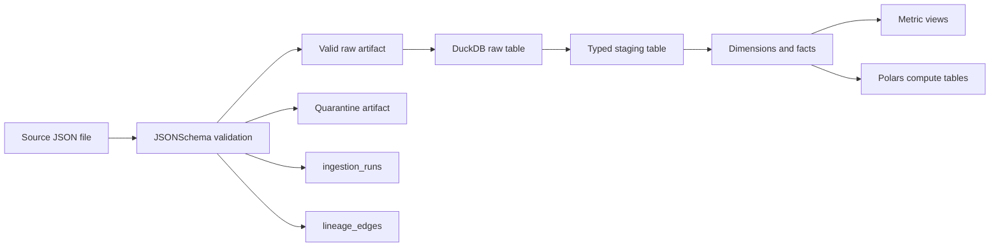

# Mini Faire Metadata And Lineage

This document describes how Mini Faire tracks ingestion metadata, lineage, and impact analysis across the local data platform. The design is intentionally lightweight, but it mirrors production data platform patterns: immutable source fingerprints, deterministic run IDs, path-level audit artifacts, table-level lineage, and queryable metadata in DuckDB.

## Metadata Contract

Each ingestion run writes one JSON metadata file and upserts the same record into DuckDB table `ingestion_runs`.

Metadata grain: one row per source file per entity or event type.

Primary key: `run_id`.

Deterministic run IDs:

- Batch: `batch_<entity>_<YYYY>_<MM>_<DD>_<file_stem>`
- Events: `event_<event_type>_<YYYY>_<MM>_<DD>_<HH>_<file_stem>`

Core fields:

- `run_id`: stable ingestion run identifier.
- `source`: `batch` or `events`.
- `entity`: batch entity such as `retailers`, `products`, `orders`, or event type such as `order_created`.
- `source_path`: original file path.
- `source_content_sha256`: SHA-256 fingerprint of the original file content.
- `partition_path`: source partition relative to the entity root.
- `contract_name`: JSONSchema contract used for validation.
- `valid_count` and `invalid_count`: validation outcomes.
- `valid_path`, `quarantine_path`, `metadata_path`: emitted audit artifacts.
- `started_at`, `completed_at`, `duration_ms`: timing metadata.
- `status`: `success` or `completed_with_quarantine`.

## Lineage Contract

Lineage is written to DuckDB table `lineage_edges`.

Lineage grain: one directed edge per run and transformation boundary.

Primary key: `(run_id, source_node, target_node, edge_type)`.

Edge types emitted by ingestion:

- `validated_to_valid_raw`: source file to valid raw JSON artifact.
- `validated_to_quarantine`: source file to quarantine artifact.
- `loaded_to_raw_table`: valid raw JSON artifact to DuckDB raw table.

Static transformation lineage is encoded by repository SQL file names and the DAG/flow definitions:

- `raw.raw_retailers` -> `staging.stg_retailers` -> `marts.dim_retailer`
- `raw.raw_products` -> `staging.stg_products` -> `marts.dim_product`
- `raw.raw_orders` -> `staging.stg_orders` -> `marts.fact_orders`
- `raw.raw_order_created_events` -> `staging.stg_order_created_events` -> `marts.fact_orders_events`
- `marts.fact_orders` -> `marts.metrics_retailer_daily`
- `marts.fact_orders` and `marts.dim_product` -> `marts.metrics_product_velocity`
- `marts.fact_orders` -> `marts.metrics_order_profitability`
- `marts.fact_orders` -> `marts.compute_retailer_health`
- `marts.fact_orders_events` -> `marts.compute_event_microbatch_summary`
- `marts.dim_product` and `marts.fact_orders` -> `marts.compute_product_reorder_risk`
- `marts.dim_product` and `marts.fact_orders` -> `marts.compute_brand_contribution`
- `marts.dim_retailer` and `marts.fact_orders` -> `marts.compute_retailer_cohort_retention`
- `marts.fact_orders_events` -> `marts.compute_event_lag_summary`

## End-To-End Flow



## Batch Snapshot Lineage

`data/batch/retailers/YYYY/MM/DD/retailers.json`
-> `data/raw/batch/retailers/YYYY/MM/DD/<run_id>/valid/retailers.json`
-> `raw.raw_retailers`
-> `staging.stg_retailers`
-> `marts.dim_retailer`
-> `marts.metrics_retailer_daily`

`data/batch/products/YYYY/MM/DD/products.json`
-> `data/raw/batch/products/YYYY/MM/DD/<run_id>/valid/products.json`
-> `raw.raw_products`
-> `staging.stg_products`
-> `marts.dim_product`
-> `marts.metrics_product_velocity`

`data/batch/orders/YYYY/MM/DD/orders.json`
-> `data/raw/batch/orders/YYYY/MM/DD/<run_id>/valid/orders.json`
-> `raw.raw_orders`
-> `staging.stg_orders`
-> `marts.fact_orders`
-> `marts.metrics_retailer_daily`
-> `marts.metrics_order_profitability`
-> `marts.compute_retailer_health`
-> `marts.compute_product_reorder_risk`
-> `marts.compute_brand_contribution`

## Event Micro-Batch Lineage

`data/events/order_created/YYYY/MM/DD/HH/events.json`
-> `data/raw/events/order_created/YYYY/MM/DD/HH/<run_id>/valid/events.json`
-> `raw.raw_order_created_events`
-> `staging.stg_order_created_events`
-> `marts.fact_orders_events`
-> `marts.compute_event_microbatch_summary`
-> `marts.compute_event_lag_summary`

## Quarantine Handling

Invalid records are never dropped. They are written to the matching quarantine path with:

- `record_index`: source record offset within the file.
- `record`: original invalid payload.
- `errors`: JSONSchema validation errors with path and message.

Operational rule: a run with invalid records can still complete as `completed_with_quarantine`, but downstream raw loads only read `valid` artifacts.

## Useful Audit Queries

Recent ingestion runs:

```sql
select
  run_id,
  source,
  entity,
  valid_count,
  invalid_count,
  duration_ms,
  status,
  completed_at
from ingestion_runs
order by completed_at desc;
```

Files loaded into raw tables:

```sql
select
  run_id,
  entity,
  source_node as valid_artifact,
  target_node as raw_table,
  created_at
from lineage_edges
where edge_type = 'loaded_to_raw_table'
order by created_at desc;
```

Quarantine summary:

```sql
select
  entity,
  count(*) as runs_with_quarantine,
  sum(invalid_count) as invalid_records
from ingestion_runs
where invalid_count > 0
group by entity
order by invalid_records desc;
```

Impact analysis for order data:

```sql
select *
from lineage_edges
where entity in ('orders', 'order_created')
order by run_id, edge_type;
```

## Data Quality Checks

Minimum ingestion checks:

- `invalid_count = 0` for strict production-like runs.
- `source_content_sha256` unchanged on retry for deterministic reruns.
- `valid_count + invalid_count` equals the number of source records.
- `duration_ms` remains within expected local demo bounds.
- `lineage_edges` contains `validated_to_valid_raw`, `validated_to_quarantine`, and `loaded_to_raw_table` for each run.

Warehouse checks:

- Staging tables deduplicate by natural key or event ID.
- Facts preserve source natural keys for traceability.
- Metrics are views over marts, not independent copies.

## Incremental ELT

Mini Faire uses a pragmatic local-demo incremental strategy:

- Raw tables are recreated from valid raw artifacts on each run.
- Staging tables are recreated from raw tables with type casting and deduplication.
- Mart tables are persistent and updated incrementally.
- Metric views are recreated because they are lightweight semantic projections over marts.

Dimension strategy:

- `marts.dim_retailer`: delete and reinsert rows matching `retailer_id`.
- `marts.dim_product`: delete and reinsert rows matching `product_id`.

Fact strategy:

- `marts.fact_orders`: read staging rows where `order_ts` is at or beyond the last successful `fact_orders` high watermark, delete matching `order_id`, then insert the delta.
- `marts.fact_orders_events`: read staging rows where `event_ts` is at or beyond the last successful `fact_orders_events` high watermark, delete matching `event_id`, then insert the delta.

The high-watermark comparison is inclusive. That means retrying the same maximum timestamp reprocesses the boundary records, and the delete-insert business-key step prevents duplicates.

Each model run appends one row to `elt_model_runs`:

```sql
select
  model_name,
  target_table,
  load_strategy,
  business_key,
  source_row_count,
  affected_key_count,
  target_row_count,
  high_watermark,
  completed_at,
  status
from elt_model_runs
order by completed_at desc;
```

Incremental correctness checks:

- Re-running the pipeline should not increase mart row counts unless source data changed.
- `affected_key_count` should reflect only the current model delta.
- `target_row_count` should remain stable on retries.
- `high_watermark` should move forward only when newer fact/event timestamps arrive.

## Ownership

- Contracts: `contracts/*.schema.json`
- Ingestion metadata writer: `ingestion/metadata.py`
- Batch ingestion: `ingestion/batch_ingestion.py`
- Event ingestion: `ingestion/event_ingestion.py`
- Warehouse load and ELT: `ingestion/load_duckdb.py`
- Governance DDL: `governance/ingestion_runs.sql`
- Runtime metadata tables: `ingestion_runs`, `lineage_edges`
